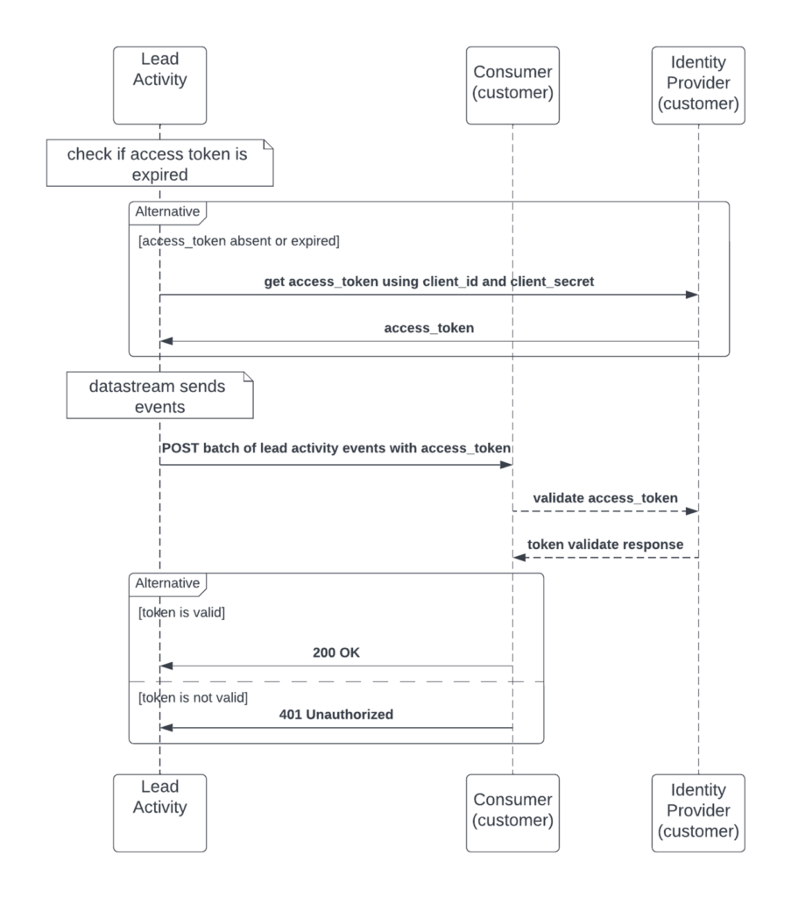

# 資料串流

>[!NOTE]
> 在[使用資料串流](https://developer.adobe.com/events/docs/guides/using/marketo/marketo-data-streams/)找到目前關於資料串流的資訊。
>

我們客戶的行銷組織仰賴及時且重點突出的行銷活動，以掌握業務優勢並維持競爭力。 為了支援快節奏的決策並快速啟用策略變更，擁有資料以支援並推進那些提供重點且目標明確之行銷活動的關鍵決策非常重要。 還有一些客戶在Marketo Engage內外的客戶區段層級執行行銷工作。 為了支援這些不同的工作，Marketo已建立透過資料串流以近乎即時的方式取得大量資料的能力。

除了具備近乎即時資料的好處外，產品相關優勢如下：

- 由於改為使用串流，因此可緩解API限制的瓶頸。
- 減少API限制的情況，產生較少的警報訊息。
- 由於資料串流功能，任何專案都必須執行大量匯出才能擷取資料。

已購買[Marketo Engage效能層套件](https://nation.marketo.com/t5/product-documents/marketo-engage-performance-tiers/ta-p/328835)的使用者可使用資料串流。

## 潛在客戶活動資料串流概觀

潛在客戶活動資料流提供稽核追蹤潛在客戶活動的近乎即時串流，其中可以將大量潛在客戶活動傳送到客戶的外部系統。 串流可讓客戶有效稽核銷售線索相關事件、使用模式、提供銷售線索變更的檢視，以及根據不同型別銷售線索事件觸發流程和工作流程。 有超過144種活動型別可以訂閱並透過資料流傳送。

串流的潛在客戶資料型別：

1. 銷售機會變更 — 所有欄位和新銷售機會的所有變更
1. 潛在客戶活動 — 檔案中說明的所有潛在客戶活動型別
1. 已刪除的銷售機會
1. 潛在客戶的所有自訂物件（若有要求）。 目前完全或完全沒有。

透過提供潛在客戶變更的檢視，這可讓客戶更快決定其整體行銷策略，並建立更聚焦的目標行銷活動。 一些常見的使用案例是：

- 自訂警報：當發現某些銷售機會具有不一致的條件時，可以將他們新增到清單中。 活動資料流可以挑選這些專案，並推送「新增至清單」活動給客戶以後續動作。
- 推動ML模型：有些客戶計畫建立評分模型，這些模型會使用活動深入分析，然後回饋給Marketo，或視需要用於其內部評分模型。 透過對銷售機會進行評分，客戶可以告知Marketo將客戶新增到Nurture行銷活動，以提升其評分。

串流活動清單：

| AchieveGoalInReferral | ClickPredictiveContent | ReceivedForwardToFriendEmail |
|--- |--- |--- |
| AddToList | ClickRTPCallToAction | ReceiveSalesEmail |
| AddToNurture | ClickSalesEmail | ReferToSocialApp |
| AddToOpportunity | ClickShareLink | RemoveFromList |
| AddToSalesCampaign | 轉換潛在客戶 | RemoveFromOpportunity |
| CallWebhook | 刪除銷售機會 | RequestCampaign |
| 變更資料值 | 取消抽獎資格 | 銷售電子郵件已退回 |
| ChangeLeadPartition | EarnEntryInSocialApp | 傳送警報 |
| ChangeNurtureCadence | 電子郵件已退回 | SendEmail |
| ChangeNurtureTrack | EmailBouncedSoft | SendSalesEmail |
| ChangeOwner | EmailDelivered | SentForwardToFriendEmail |
| ChangeProgramData | ExtensiveWithDataDotCom | SFDCA活動 |
| ChangeProgramMemberData | EnterSweepstackes | Sharecontent |
| ChangeRevenueStage | FillOutFacebookLeadAdsForm | SignupForReferralOffer |
| ChangeRevenueStageManually | 填寫表單 | SyncLeadToMicrosoft |
| ChangeScore | InterestedMoment | SyncLeadToSFDC |
| ChangeSegment | MergeLead | UnsubscribeEmail |
| ChangeStatusInProgress | NewLead | 更新機會 |
| ChangeStatusInSalesCampaign | OpenEmail | VisitWebpage |
| Clickemail | OpenSalesEmail | VoteInPoll |
| ClickLink | PushLeadToMarketo | WinSweepstackes |

請注意，如果自訂物件應該串流處理，則必須是所有與銷售機會相關的自訂物件。 目前無法選取所要的專案。

## 使用者稽核資料流概觀

使用者稽核資料流可提供使用者對資產變更的近乎即時稽核追蹤&#x200B;。 這可讓客戶有效稽核資產事件、提供使用者變更的檢視，以及根據稽核事件的不同型別觸發流程或工作流程。 近乎即時資產變更會透過Adobe I/O事件傳送至可設定的端點。 稽核事件會依資產型別劃分，並可訂閱對其而言重要的稽核事件。

訂閱此資料流的適合使用案例是：

- 使用多個行銷系統時追蹤變更：有些客戶也會在其他系統(例如CRM (例如Salesforce)中執行某個層級的行銷活動，然後將銷售機會傳遞至Marketo。 Lead有時會更新並前後同步，因此必須追蹤哪個系統最近進行了變更。

串流使用者稽核事件清單：

| 元件 | 事件型別清單 |
|--- |--- |
| 預設方案 | 原地複製、建立、刪除、編輯頻道、匯出、修改程式設定、修改程式權杖、重新命名 |
| 電子郵件 | 核准、原地複製、建立、刪除、編輯、移動、重新命名、取消核准 |
| 電子郵件批次程式 | 核准，子更新，複製，建立，刪除，編輯，編輯頻道，修改方案排程，修改方案設定，修改方案權杖，重新命名，取消核准 |
| 電子郵件範本 | 核准、複製、建立、刪除、草稿建立、草稿捨棄、編輯、重新命名、取消核准 |
| 參與方案 | 複製、建立、刪除、編輯頻道、修改程式設定、修改程式流、修改程式權杖、重新命名 |
| 事件方案 | 複製、建立、刪除、編輯頻道、修改方案排程、修改方案設定、修改方案權杖、重新命名 |
| 資料夾 | 建立、刪除、編輯、重新命名 |
| 表單 | 核准、複製、建立、刪除、草稿建立、編輯、移動、重新命名 |
| 表單 — >登陸頁面表單 | 建立、複製、編輯、刪除、核准、重新命名 |
| 登陸頁面 | 核准，複製，建立，刪除，草稿捨棄，編輯，重新命名，取消核准 |
| 登陸頁面範本 | 核准、複製、建立、刪除、草稿建立、草稿捨棄、編輯、重新命名、取消核准 |
| 智慧清單 | 原地複製、建立、刪除、編輯、匯出、修改智慧清單設定、重新命名 |
| 行銷資料夾 | 建立、編輯、刪除 |
| 培養方案 | 複製、建立、刪除、編輯頻道、修改方案設定、修改方案流、修改方案權杖、重新命名 |
| 區段 | 建立、刪除、編輯、重新命名 |
| 細分 | 核准、建立、刪除、draftCreated、draftDiscarded、重新命名、取消核准 |
| 智慧行銷活動 | 中止、啟動、複製、建立、停用、刪除、編輯、修改行銷活動排程、修改流程步驟動作、修改智慧列示設定、移動、重新命名 |
| 程式碼片段 | 核准、核准且無草稿、複製、建立、刪除、編輯、重新命名、取消核准 |
| 管理UI -> Launchpoint ->整合 | 建立、刪除、編輯 |
| 管理員UI ->使用者 | 建立、編輯、刪除（僅適用於API使用者） |
| 管理員登入 — >使用者 | 登入成功，登入失敗 |
| 程式 — >電子郵件批次程式 | 編輯（用於變更選取的電子郵件地址）資產API |
| 方案 — >行銷方案 | 建立，原地複製 |

使用者稽核事件範例：

```json
{
    "event_id": "a1b2c3d4-zyxw-9876-9z8y-a1b2c3d4e5f6",
    "event": {
        "specversion": "1.0",
        "id": "b77c743a-8e28-40f2-8aab-9541bbc85e68",
        "type": "com.adobe.platform.marketo.audit.user.email",
        "source": "https://www.marketo.com",
        "time": "2020-05-28T19:20:47.28Z",
        "datacontenttype": "application/json",
        "dataschema": "V1.0",
        "data": {
            "componentId": 232459,
            "componentType": "Email",
            "eventAction": "approve",
            "munchkinId": "123-ABC-456",
            "imsOrgId": "ADOBEORGID@AdobeOrg",
            "user": 253,
            "userId": "example@marketo.com"
        }
    }
}
```

## 通知資料流總覽

通知資料流是Marketo Engage效能等級產品的一部分。

目前，Marketo中的通知中心可設定為傳送通知至電子郵件地址。 通知資料流可讓通知透過Adobe I/O事件直接傳送至可設定的端點。 今天，通知會透過UI提供，並且可供熒幕右上角的橘色鈴鐺參考，此資料流會接收這些通知並將其透過資料流傳送。

通知事件清單：

| 元件 | 事件型別清單 |
|--- |--- |
| 通知 | campaign中止、campaign失敗、nurture （程式已耗盡）、salesforce同步失敗、測試群組（A/B測試結果）、網站服務（每日配額） |

通知事件範例：

```json
{
    "event_id": "a1b2c3d4-zyxw-9876-9z8y-a1b2c3d4e5f6",
    "event": {
        "specversion": "1.0",
        "type": "com.adobe.platform.marketo.notification.campaign_abort",
        "source": "https://www.marketo.com",
        "time": "2021-05-27T10:22:37.489-5:00",
        "datacontenttype": "application/json",
        "dataschema": "V1.0",
        "data": {
            "componentType": "campaign_abort",
            "subType": "user_campaign_abort",
            "eventAction": {
                "campaignId":1234,
                "userId":"example@marketo.com",
            }
            "imsOrgId":"ADOBEORGID@AdobeOrg",
            "munchkinId":"123-ABC-456"
        }
    }
}
```

## 技術細節

本節提供所需內容、如何連線及接收每個串流的串流資料的准則。 每個檔案都包含一定程度的編碼和設定。

### 潛在客戶活動資料流

潛在客戶活動串流提供Marketo潛在客戶活動事件的近乎即時串流，並傳送具有可設定屬性的訂閱活動型別變更：

- 預設為每2秒推播一次資料的頻率。
- 每個訂閱從100到500的批次。
- 客戶REST服務的逾時為20秒，每3分鐘重試3次，並在成功後自動啟用。 否則，在此之後會暫停。 暫停後，服務會每三分鐘重試一次，以嘗試重新啟用，除非手動解除布建。
- 資料在佇列中保留最多7天。

若要實施銷售機會活動資料流，以下是客戶應遵循的步驟：

1. 公開可從公用網際網路接收含JSON內文之POST請求的HTTP端點。 活動推送資料流傳送請求至：
1. 為Adobe提供下列功能：
   1. 適用於其訂閱的Marketo Munchkin ID
   1. 步驟1中的端點URL
   1. 他們想要收到的活動型別（以上完整的清單）
   1. 一種驗證方法，可讓客戶驗證請求是否合法。 可以：
      1. OAuth [使用者端認證驗證](https://www.oauth.com/oauth2-servers/access-tokens/client-credentials/)的身分提供者URL、使用者端識別碼和使用者端密碼
      1. API權杖，可包含在授權http標頭中，由潛在客戶活動資料流傳送的請求中

然後Adobe會啟用資料串流，客戶從此時開始接收資料。

典型潛在客戶活動資料流呼叫的UML圖表：



URL端點建立範例：

```javascript
/*
Copyright 2022 Adobe
All Rights Reserved.

NOTICE: Adobe permits you to use, modify, and distribute this file in
accordance with the terms of the Adobe license agreement accompanying
it.
*/
constexpress=require('express')
constwinston=require('winston');
constport=3000

constapp=express().use(express.json())

constlogger=winston.createLogger({
  level: 'info',
  format: winston.format.json(),
  defaultMeta: {service: 'activity-stream-consumer-example'},
  transports: [
    // - Write all logs with level `error` and below to `error.log`
    newwinston.transports.File({filename: 'error.log',level: 'error'}),
    // - Write all logs with level `info` and below to `combined.log`
    newwinston.transports.File({filename: 'combined.log'}),
    newwinston.transports.Console({format: winston.format.simple()})
  ],
});

app.get('/',(req,res)=>{
  logger.info(JSON.stringify(req.query))
  res.sendStatus(200)
})

app.post('/',(req,res)=>{
  logger.info(JSON.stringify(req.body))
  res.sendStatus(200)
})

app.listen(port,()=>{
  logger.info(`app listening on port ${port}`)
})
```

使用Marketo銷售機會活動資料流的應用程式程式碼範例可以在[這裡](https://github.com/ihgrant/activity-stream-consumer-example)找到。

### 使用者稽核資料流和通知資料流

使用者稽核事件會傳送至Adobe IO，並可透過Adobe ID登入來使用。 以下是需遵循的步驟：

1. 客戶向Adobe提供下列功能：
   1. Adobe ID
   1. 適用於其訂閱的Marketo Munchkin ID
1. 客戶公開REST端點，以正常使用webhook形式的事件。
1. 提供後，Adobe就會啟用客戶訂閱的資料流。
1. 客戶然後在Adobe IO中設定資料流（需提供指示）
   1. 此步驟需要Adobe組織
   1. 需要Adobe組織使用者擁有開發人員或系統管理員角色

若要設定Adobe IO，請參閱公開檔案區段中的[使用Adobe IO設定Marketo使用者稽核資料串流](https://developer.adobe.com/events/docs/guides/using/marketo/marketo-user-audit-data-stream-setup/)。

### 在Marketo中設定使用者稽核資料流

「使用者稽核資料流」目前可與其他3個「資料流」一起作為「效能」套裝程式的一部分使用。 如需封裝的詳細資訊，請參閱[產品說明頁面](https://helpx.adobe.com/tw/legal/product-descriptions/adobe-marketo-engage---product-description.html)以瞭解產品限制和功能。

### 設定Adobe I/O

[請參閱Adobe I/O Events快速入門](https://developer.adobe.com/runtime/docs/guides/getting-started/)

如需此使用案例的基本指示，請從[console.adobe.io](https://developer.adobe.com/console)開始：

出現提示時，請選取&#x200B;**[!UICONTROL Create New Project]**&#x200B;或&#x200B;**[!UICONTROL Add Event]**。

### 開始使用您的新專案

若要開始使用Adobe服務、新增API、事件或執行階段，請檢視我們的[檔案](https://developer.adobe.com/runtime/docs/)。

## 公開檔案

- [Marketo資料串流](https://developer.adobe.com/events/docs/guides/using/marketo/marketo-data-streams/)
- [Adobe IO活動與Webhook簡介](https://developer.adobe.com/events/docs/guides/)
- [資料串流部落格](https://blog.developer.adobe.com/introducing-the-adobe-marketo-engage-data-streams-61198b567fbb)
