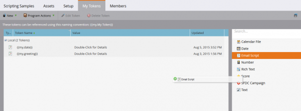
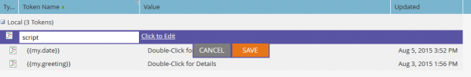
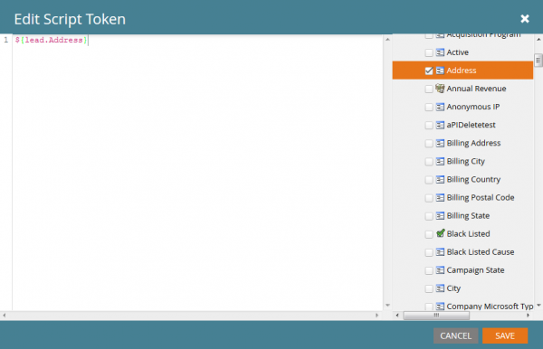
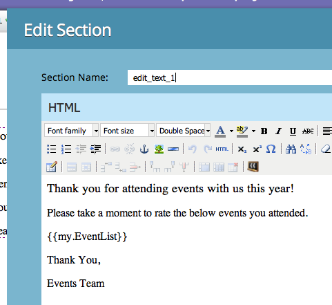
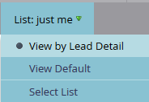

# 電子郵件指令碼

注意：強烈建議您閱讀 [Velocity使用手冊](https://velocity.apache.org/engine/devel/user-guide.html) 以深入探討Velocity範本語言的行為。

[Apache Velocity](https://velocity.apache.org/) 是以Java為基礎的語言，專為範本化和指令碼HTML內容而設計。 Marketo可讓您使用指令碼代號，將其用於電子郵件內容中。 如此可存取儲存在「機會」和「自訂物件」中的資料，並可在電子郵件中建立動態內容。 Velocity提供標準高階控制流程，其中包含if/else、for和for each ，以允許對內容進行條件式和反複式操控。 以下是一個列印問候語和正確問候語的簡單範例：

```java
//check if the lead is male
if(${lead.MarketoSocialGender} == "Male")
    if the lead is male, use the salutation 'Mr.'
    set($greeting = "Dear Mr. ${lead.LastName},")
//check is the lead is female
elseif(${lead.MarketoSocialGender} == "Female")
    if female, use the salutation 'Ms.'
    set($greeting = "Dear Ms. ${lead.LastName},")
else
    //otherwise, use the first name
    set($greeting = "Dear ${lead.FirstName},")
end
print the greeting and some content
${greeting}

    Lorem ipsum dolor sit amet...
```

## 變數

變數一律以「$」為前置詞，並使用#set進行設定和更新：

```
#set($variable = "value")
```

接著，您就可以透過具有不同行為的多種不同參照型別來擷取其值：

```
$variable ##outputs 'value'
$variablename ##outputs '$variablename'
${variable}name ##outputs 'valuename'
```

也有安靜的參考標籤法，其中有 `!` 包含在 `$`. 通常，當velocity遇到未定義的參照時，代表該參照的字串會保留在原處。 使用安靜參照標籤法，如果遇到未定義的參照，則不會發出任何值：

```
##Defined Reference

#set($foo = "bar")
$foo ##outputs "bar"

##Undefined Reference

##normal
$baz ##outputs "$baz"

##quiet
$!baz ##outputs nothing
```

如需如何參考變數的詳細資訊，請參閱 [Apache使用手冊](https://velocity.apache.org/engine/devel/user-guide.html#formal-reference-notation).

## Velocity工具

Apache Velocity專案可透過以下方式提供功能： [Velocity工具](https://velocity.apache.org/tools/devel/apidocs/overview-summary.html). 這些只是Java物件的包裝函式，並透過可供所有指令碼使用的全域變數公開其方法。

- [AlternatorTool](https://velocity.apache.org/tools/devel/apidocs/org/apache/velocity/tools/generic/AlternatorTool.html)
- [Comparisondatetool](https://velocity.apache.org/tools/devel/apidocs/org/apache/velocity/tools/generic/ComparisonDateTool.html)
- [ConversionTool](https://velocity.apache.org/tools/devel/apidocs/org/apache/velocity/tools/generic/ConversionTool.html)
- [日期工具](https://velocity.apache.org/tools/devel/apidocs/org/apache/velocity/tools/generic/DateTool.html)
- [顯示工具](https://velocity.apache.org/tools/devel/apidocs/org/apache/velocity/tools/generic/DisplayTool.html)
- [MathTool](https://velocity.apache.org/tools/devel/apidocs/org/apache/velocity/tools/generic/MathTool.html)
- [數字工具](https://velocity.apache.org/tools/devel/apidocs/org/apache/velocity/tools/generic/NumberTool.html)
- [EscapeTool](https://velocity.apache.org/tools/devel/apidocs/org/apache/velocity/tools/generic/EscapeTool.html)
- [回圈工具](https://velocity.apache.org/tools/devel/apidocs/org/apache/velocity/tools/generic/LoopTool.html)

例如，若要使用來自的方法 `ComparisonDateTool`，存取(如果來自 `$date` 指令碼權杖中的變數：

```
#set($birthday = $convert.parseDate("2015-08-07","yyyy-MM-dd"))
##use whenIs to determine how many days away it is
$date.whenIs($birthday).days ##outputs 1
```

## 建立指令碼Token

使用電子郵件指令碼Token時，電子郵件中會包含Velocity指令碼。 您可以在行銷資料夾或方案的行銷活動中建立這些檔案。 對於要在電子郵件內使用的權杖，電子郵件必須是擁有權杖或從行銷資料夾繼承權杖之計畫的子項。 若要建立Token，請導覽至資料夾或程式，然後選取 [!UICONTROL My Tokens] 標籤。 從右側選單將「電子郵件指令碼」選項拖曳到權杖清單中



從這裡，您可以編輯權杖的名稱，並透過按一下以編輯選項開啟編輯器：



進入編輯器後，您可以建立指令碼，以在指令碼可存取的物件中存取所有變數。 若要從物件取得欄位參考，請從右側樹狀結構將其拖曳到您的指令碼中：



## 指令碼內嵌和測試

在計畫「我的Token」中定義指令碼後，您就可以使用Marketo電子郵件編輯器，在指定的電子郵件中參考該指令碼。



您可以使用Marketo電子郵件設計工具中的「傳送範例電子郵件」電子郵件動作來測試指令碼。 若要讓指令碼正確處理，您必須在「銷售機會」欄位中選取要模擬的現有銷售機會。 如果您使用進行測試 `$TriggerObject`，您可以透過「觸發器」引數選取觸發物件。 這會使用該型別之最近更新物件的資料作為 `$TriggerObject` 變數中。


您也可以使用電子郵件預覽來測試指令碼。 若要這麼做，您必須選取「檢視方式：銷售機會詳細資訊」，然後從可用的靜態清單中選取銷售機會。 這樣做的另一個好處是，可輸出指令碼執行期間可能發生的任何例外狀況：



## 實用提示

指定電子郵件中所有電子郵件指令碼Token的合併長度不得超過100,000個位元組。 此限制與權杖字串本身的總長度有關（而非權杖展開後的總長度）。

- 電子郵件指令碼中參照的變數必須存在於Marketo中指令碼可用的其中一個物件上。
- 您可以參考源自您原生整合的CRM的第一層和第二層自訂物件，這些自訂物件直接連線至銷售機會或連絡人，但不包括第三層自訂物件。 自訂物件可能不是潛在客戶或公司的父級
- 對於Marketo自訂物件，您可以參照具有父子關係的第二層自訂物件。 例如 `Lead <- Parent <- Child`. 您無法參考具有Edge-Bridge關係的第二層自訂物件。 例如，  `Lead <- Bridge -> Edge`
- 您可以參照連線至Lead、Contact或Account的自訂物件，但不能參照多個物件。
- 自訂物件只能透過單一連線、銷售機會、連絡人或帳戶參照
- 您必須在指令碼編輯器中勾選目前使用之欄位的方塊，否則這些欄位將不會處理
- 對於每個自訂物件，每個人員/連絡人最近更新的10筆記錄可在執行階段使用，並依照最近更新（於0）到最舊更新（於9）的順序排列。 您可以透過以下方式增加可用記錄數量： [依照指示進行](https://experienceleague.adobe.com/en/docs/marketo/using/product-docs/administration/email-setup/change-custom-object-retrieval-limits-in-velocity-scripting).
- 如果您在電子郵件中包含多個電子郵件指令碼，這些指令碼會由上到下執行。 第一個要執行的指令碼中所定義的變數範圍，可在後續指令碼中使用。
- 工具參考資料： [https://velocity.apache.org/tools/2.0/index.html](https://velocity.apache.org/tools/2.0/index.html)
- 有關包含新行字元「\\n」或「\\r\\n」的權杖的備註。 當透過傳送範例或批次促銷活動傳送電子郵件時，代號中的新行字元會被替換為空格。 透過「觸發器促銷活動」傳送電子郵件時，新行字元保持不變。
- 為確保正確剖析URL，應將整個路徑設定為變數，然後列印，而且變數不應在URL參照內列印。 必須包含通訊協定(http://或https://)，且必須與URL的其餘部分分開。 URL也必須屬於完整格式的錨點(<a>)標籤。 指令碼必須輸出完整格式的錨點標籤，才能追蹤連結。 如果連結是從for或foreach回圈中輸出，則不會追蹤連結。

```html
<!-- Correct -->
#set($url = "www.example.com/${object.id}")
<a href="http://${url}">Link Text</a>

<!-- Correct -->
<a href="http://www.example.com/${object.id}">Link Text</a>

<!-- Incorrect -->
<a href="${url}">Link Text</a>

<!-- Incorrect -->
<a href="{{my.link}}">Link Text</a>

<!-- Incorrect -->
<a href="http://{{my.link}}">Link Text</a>
```
