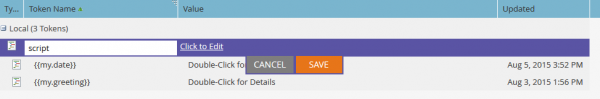

# 電子郵件指令碼

閱讀[Velocity使用手冊](https://velocity.apache.org/engine/devel/user-guide.html)，瞭解Velocity範本語言行為的詳細說明。

[Apache Velocity](https://velocity.apache.org/)是一種以Java為基礎的語言，用於範本化和指令碼HTML內容。 在Marketo電子郵件指令碼權杖中使用Velocity來存取儲存在商機和自訂物件中的資料，並建立動態電子郵件內容。

Velocity為條件式與反複式內容提供`if`/`else`、`for`和`foreach`控制流程。

## 變數

以`$`作為變數的前置詞。 使用`#set`建立或更新它們：

```velocity
#set($variable = "value")
```

使用提供不同行為的參考型別擷取變數值：

```text
$variable ##outputs 'value'
$variablename ##outputs '$variablename'
${variable}name ##outputs 'valuename'
```


`$`之後的安靜參考標籤法包含`!`。 依預設，當參照未定義時，Velocity會將參照字串保留在適當位置。 安靜參考未定義時不會發出任何值：

```velocity
##Defined Reference

#set($foo = "bar")
$foo ##outputs "bar"

##Undefined Reference

##normal
$baz ##outputs "$baz"

##quiet
$!baz ##outputs nothing
```

如需如何參考變數的詳細資訊，請參閱[Apache使用手冊](https://velocity.apache.org/engine/devel/user-guide.html#formal-reference-notation)。

## Velocity工具

Apache Velocity專案提供[Velocity工具](https://velocity.apache.org/tools/devel/apidocs/overview-summary.html)。 這些包裝函式會透過所有指令碼都可用的全域變數公開Java物件方法。

- [AlternatorTool](https://velocity.apache.org/tools/devel/apidocs/org/apache/velocity/tools/generic/AlternatorTool.html)
- [Comparisondatetool](https://velocity.apache.org/tools/devel/apidocs/org/apache/velocity/tools/generic/ComparisonDateTool.html)
- [ConversionTool](https://velocity.apache.org/tools/devel/apidocs/org/apache/velocity/tools/generic/ConversionTool.html)
- [日期工具](https://velocity.apache.org/tools/devel/apidocs/org/apache/velocity/tools/generic/DateTool.html)
- [顯示工具](https://velocity.apache.org/tools/devel/apidocs/org/apache/velocity/tools/generic/DisplayTool.html)
- [MathTool](https://velocity.apache.org/tools/devel/apidocs/org/apache/velocity/tools/generic/MathTool.html)
- [數字工具](https://velocity.apache.org/tools/devel/apidocs/org/apache/velocity/tools/generic/NumberTool.html)
- [EscapeTool](https://velocity.apache.org/tools/devel/apidocs/org/apache/velocity/tools/generic/EscapeTool.html)
- [回圈工具](https://velocity.apache.org/tools/devel/apidocs/org/apache/velocity/tools/generic/LoopTool.html)

例如，若要使用`ComparisonDateTool`的方法，請從指令碼權杖中的`$date`變數存取它：

```velocity
#set($birthday = $convert.parseDate("2015-08-07","yyyy-MM-dd"))
##use whenIs to determine how many days away it is
$date.whenIs($birthday).days ##outputs 1
```

## 建立指令碼Token

使用Email Script Token將Velocity指令碼新增至電子郵件。 在行銷資料夾或方案的行銷活動中建立Token。

若要使用權杖，電子郵件必須是擁有權杖的計畫的子項，或是從行銷資料夾繼承權杖。 移至資料夾或程式，然後選取[!UICONTROL My Tokens]標籤。 從右側選單將「電子郵件指令碼」選項拖曳到Token清單中。


編輯權杖名稱，然後選取[!UICONTROL Click to Edit]以開啟編輯器：



在編輯器中，建立指令碼，用於存取指令碼可存取物件中的變數。 若要新增物件欄位參照，請從右邊的樹狀結構將其拖曳到指令碼中：


## 指令碼內嵌和測試

在程式「我的Token」中定義指令碼後，從Marketo電子郵件編輯器中的電子郵件對其參照。


在Marketo電子郵件設計工具中使用[!UICONTROL Send Sample Email]動作測試指令碼。 在[!UICONTROL Lead]欄位中選取現有的銷售機會，讓指令碼可正確處理。

測試`$TriggerObject`時，請以[!UICONTROL Trigger]引數選取觸發物件。 Marketo使用該型別最近更新的物件做為`$TriggerObject`變數。


您也可以使用[!UICONTROL Email Preview]進行測試。 選取「**[!UICONTROL View As: Lead Detail]**」，然後從靜態清單中選取潛在客戶。 預覽也會顯示指令碼執行的例外：

檢視電子郵件

## 最佳做法

指定電子郵件中所有電子郵件指令碼Token的合併長度不得超過100,000個位元組。 此限制與權杖字串本身的總長度有關（而非權杖展開後的總長度）。

- 電子郵件指令碼中參照的變數必須存在於Marketo中指令碼可用的其中一個物件上。
- 您可以參考源自您原生整合的CRM的第一層和第二層自訂物件，這些自訂物件直接連線至銷售機會或連絡人，但不包括第三層自訂物件。 自訂物件可能不是潛在客戶或公司的父級
- 對於Marketo自訂物件，您可以參照具有父子關係的第二層自訂物件。 例如 `Lead <- Parent <- Child`. 您無法參考具有Edge-Bridge關係的第二層級自訂物件。 例如，`Lead <- Bridge -> Edge`
- 您可以參照連線至Lead、Contact或Account的自訂物件，但不能參照多個物件。
- 自訂物件只能透過單一連線、銷售機會、連絡人或帳戶參照
- 勾選指令碼編輯器中的方塊，找出您正在使用的欄位，或這些欄位未處理
- 對於每個自訂物件，每個人員/連絡人在執行階段都可以使用最近更新的10筆記錄。 記錄會從索引0的最近更新到索引9的最舊排序。 您可以依照指示[&#128279;](https://experienceleague.adobe.com/en/docs/marketo/using/product-docs/administration/email-setup/change-custom-object-retrieval-limits-in-velocity-scripting)增加個可用的記錄數。
- 如果您在電子郵件中包含多個電子郵件指令碼，這些指令碼會由上到下執行。 第一個要執行的指令碼中所定義的變數範圍，可在後續指令碼中使用。
- 工具參考： [https://velocity.apache.org/tools/2.0/index.html](https://velocity.apache.org/tools/2.0/index.html)
- 有關包含新行字元「\n」或「\r\n」的權杖的備註。 當透過傳送範例或批次促銷活動傳送電子郵件時，代號中的新行字元會被替換為空格。 透過「觸發器促銷活動」傳送電子郵件時，新行字元保持不變。
- 若要確保URL剖析正確，請將完整路徑設定為變數，然後列印。 請勿在URL參照內列印變數。 將通訊協定（`http://`或`https://`）與URL的其餘部分分開加入。 輸出完整的錨點(`<a>`)標籤，以便追蹤連結。 未追蹤從`for`或`foreach`回圈輸出的連結。

```html
<!-- Correct -->
#set($url = "www.example.com/${object.id}")
<a href="http://${url}">Link Text</a>

<!-- Correct -->
<a href="http://www.example.com/${object.id}">Link Text</a>

<!-- Incorrect -->
<a href="${url}">Link Text</a>

<!-- Incorrect -->
<a href="{{my.link}}">Link Text</a>

<!-- Incorrect -->
<a href="http://{{my.link}}">Link Text</a>
```
