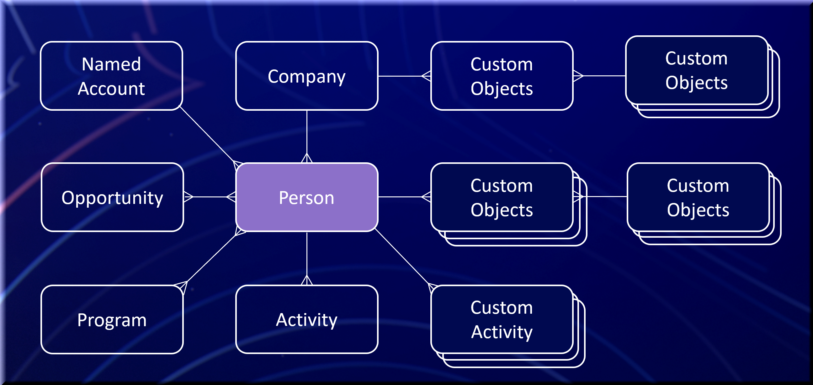

# 快速入門

Marketo Engage是行銷自動化平台，可讓行銷人員管理針對潛在客戶和客戶的個人化多管道方案和行銷活動。 可使用整合點來擴充Marketo Engage平台。 您可以在下方找到核心實體及其關係。

>[!NOTE]
>SOAP API即將淘汰，自2025年10月31日起不再提供。 所有新的開發應使用Marketo [REST API](./rest-api/rest-api.md)完成，而現有服務應於該日期前移轉，以避免服務中斷。 如果您有使用SOAP API的服務，請參閱SOAP API [移轉指南](./soap-api/migration.md)以瞭解如何移轉的資訊。
>

在Marketo Engage執行個體上啟用原生SFDC或MS Dynamics CRM連線時，下列物件為唯讀：公司、機會、機會角色、銷售人員

## 人員（銷售機會）

人是任何行銷自動化平台的基礎。 在Marketo中，所有非銷售人員記錄都稱為銷售機會，無論他們從銷售角度而言是否指定為銷售機會、潛在客戶、嫌疑人、聯絡人等。 潛在客戶物件隨附一組標準欄位，例如電子郵件、名字和姓氏。 您可以將其他欄位新增至銷售機會物件型別，以擴充與系統中記錄相關的資訊型別。 自訂屬性可以像標準欄位一樣讀取和寫入。 您可以在Marketo **[!UICONTROL Admin]** > **[!UICONTROL Field Management]**&#x200B;功能表中找到完整的欄位清單。 在Marketo中，銷售機會會由id欄位唯一識別。 必須在系統外部強制執行其他唯一金鑰。

相關API： [REST](https://developer.adobe.com/marketo-apis/api/mapi/#tag/Leads)，[JavaScript](javascript-api/lead-tracking.md#lead-tracking-api)

## 活動

潛在客戶與您的組織互動的方式有幾種。 潛在客戶可以造訪您公司網站上的頁面、參加貿易展會或下載白皮書。 您可以在Marketo中擷取這些動作的各個專案，協助行銷人員更清楚瞭解潛在客戶已執行哪些活動以及何時執行，以便他們能夠協調及時且相關的通訊。 活動一律會依leadId重新關聯至銷售機會。

您可以定義自己的自訂活動。 在您建立並發佈自訂活動後，可以透過Marketo API新增自訂活動。 自訂活動的詳細資訊可在[這裡](https://experienceleague.adobe.com/en/docs/marketo/using/product-docs/administration/marketo-custom-activities/understanding-custom-activities)找到。

相關API： [REST](https://developer.adobe.com/marketo-apis/api/mapi/#tag/Activities)，[JavaScript](javascript-api/lead-tracking.md#munchkin-behavior)

## 方案與行銷活動

計畫是一種機制，行銷人員可透過它從一個中央位置組織其所有不同型別的行銷工作。 電子郵件爆炸是方案的範例。 潛在客戶可執行與特定方案相關的多項動作/活動，而這些動作/活動會與方案產生關聯。 這稱為潛在客戶進度。 電子郵件爆炸計畫的進度範例將記錄何時向潛在客戶傳送電子郵件、人員何時開啟電子郵件或他們是否點進電子郵件中的連結。

行銷活動的建立是為了在方案中服務於特定目的和特定目標。 行銷活動的範例可能是縮小潛在客戶群組，並向他們傳送電子郵件爆炸訊息，或如果潛在客戶點進電子郵件爆炸計畫中的連結，則通知銷售代表以進行後續追蹤。

相關API： [REST](https://developer.adobe.com/marketo-apis/api/mapi/#tag/Campaigns)

## 標記

標籤是將資料分組以供報告之用的一種方式。 這些識別碼讓您能夠將資料分類，並定義您想要如何報告您的計畫，以瞭解計畫成效和ROI。

身為Marketo管理員，您可以在Marketo使用者建立方案時，建立必要和選用的標籤型別以供選擇。 您會定義每種標籤型別的可能值，且會反映貴公司想要用於報表用途的自訂標籤方式。

例如，您可以建立具有多個標籤值（例如，Northeast、Southeast）的自訂「區域」標籤型別，以讓您分析哪個區域產生最多銷售機會。 或者，舉例來說，您可以建立「擁有者」標籤型別，讓您評估並瞭解哪些計畫擁有者（例如Maria、David或John）對建立銷售機會和機會的影響最大。 您可以在[這裡](https://experienceleague.adobe.com/en/docs/marketo/using/product-docs/core-marketo-concepts/programs/working-with-programs/understanding-tags)找到更多關於標籤的資訊。

相關API： [REST](https://developer.adobe.com/marketo-apis/api/asset/)

## 清單

清單可讓行銷人員組織潛在客戶集合。 Marketo中有兩種型別的清單，靜態和智慧。 靜態清單是行銷人員可以在其選擇時新增或移除的固定潛在客戶清單。 智慧清單是基於一組指定特性的潛在客戶動態集合。 智慧清單的範例為「所有造訪過我們網站上的定價頁面的潛在客戶」。 隨著更多潛在客戶造訪定價頁面，此智慧清單會持續成長。 有關清單的詳細資訊可在[這裡](https://experienceleague.adobe.com/zh-hant/docs/marketo/using/home)找到。

相關API： [REST](https://developer.adobe.com/marketo-apis/api/asset/#tag/Static-Lists)

## 機會

行銷人員會以商機的形式將銷售線索提供給銷售。 商機代表潛在銷售交易，並與Marketo中的潛在客戶或聯絡人和組織相關聯。 商機角色是指定潛在客戶與組織之間的交集。 商機角色與組織內潛在客戶的功能有關。

相關API： [REST](https://developer.adobe.com/marketo-apis/api/mapi/#tag/Opportunities)

## 公司

組織(有時稱為Marketo中的帳戶)是指個人所屬的組織。 在Marketo或Revenue Cycle Analytics (RCA)中使用ROI報表時，請務必將人員與其組織和機會建立關聯，以便確定適當的ROI歸因。

相關API： [REST](https://developer.adobe.com/marketo-apis/api/mapi/#tag/Companies)

## 資產

Assets是指程式中使用的登入頁面、電子郵件、表單和影像。 Assets可以是指定方案的本機或全域。 全域資產適用於任何計畫。

相關API： [REST](https://developer.adobe.com/marketo-apis/api/asset/)

## Token

代號可讓行銷人員使用資產個人化訊息，並在流程動作中新增邏輯。 有適用於整個系統、計畫、銷售機會和公司的代號。 潛在客戶權杖的範例為{{lead.First Name}}。 此代號可以放置在電子郵件中，以顯示潛在客戶的名字。

在方案或資料夾層級定義的代號，在Marketo中稱為「我的代號」。 我的Token可以是下列三種型別之一：本機、繼承或覆寫。

在特定行銷活動資料夾或方案中本機建立的My Token，可用於該特定方案或行銷活動資料夾（本機）。 在行銷活動資料夾層級建立的My Token可用於該行銷活動資料夾內包含的所有方案（繼承）。 使用自訂值在程式層級修改的「我的Token」不會變更程式資料夾層級權杖的父「我的Token」值（已覆寫）。

我的Token使用命名慣例{{my.My Token}}，並在該Token名稱開頭新增「my」一詞。 例如，如果您建立名為EventDate的日期型別My Token，則該Token的名稱為{{my.EventDate}}。 有關「我的Token」的詳細資訊，請參閱[這裡](https://experienceleague.adobe.com/en/docs/marketo/using/product-docs/core-marketo-concepts/programs/tokens/understanding-my-tokens-in-a-program)。

相關API： [REST](https://developer.adobe.com/marketo-apis/api/asset/#tag/Tokens)

## 自訂物件

Marketo自訂物件允許在您的Marketo銷售機會和自訂物件記錄之間建立一對多或多對多(Edge-Bridge-Edge)關係。 在您建立並發佈Marketo自訂物件後，可以透過Marketo API對自訂物件執行CRUD操作。 如需自訂物件建立的詳細資訊，請參閱[這裡](https://experienceleague.adobe.com/zh-hant/docs/marketo/using/home)。 將新記錄新增至自訂物件時，您可以使用智慧清單觸發器來回應。 您也可以在智慧清單（分段）中，或在使用[電子郵件指令碼](email-scripting.md)的電子郵件中，使用自訂物件資料作為篩選器。

相關API： [REST](https://developer.adobe.com/marketo-apis/api/mapi/#tag/Custom-Objects)

## 銷售人員

若未啟用原生CRM整合，則可在Marketo中管理銷售人員記錄和潛在客戶關係。 這些記錄包含有關銷售人員的基本資訊，例如名稱、電子郵件和職稱，當銷售機會屬於某人時，這些資訊可用於在Marketo中篩選和代號。 與銷售人員的關係是透過「externalSalesPersonId」欄位在銷售機會層級管理，該欄位必須透過[同步銷售機會](https://developer.adobe.com/marketo-apis/api/mapi/#tag/Leads/operation/syncLeadUsingPOST) API更新。

相關API： [REST](https://developer.adobe.com/marketo-apis/api/mapi/#tag/Sales-Persons)
