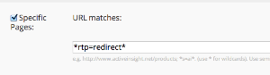

# 重新導向

使用RTP重新導向API ，傳送分段對象至目標URL。

- 您必須是Web Personalization客戶，並在您的網站上部署[RTP標籤](https://experienceleague.adobe.com/en/docs/marketo/using/product-docs/web-personalization/rtp-tag-implementation/deploy-the-rtp-javascript)，才能使用使用者內容API。
- RTP不支援以帳戶為根據的行銷指定帳戶清單。 ABM清單和程式碼只與在RTP內管理的已上傳帳戶清單（CSV檔案）有關。

## 使用情況

`rtp('send' , 'redirect' , 'field_name' , [ 'values_array' , '...' , '...' ] , 'www.redirect_url.com' , true/false )`

| 參數 | 選用/必要 | 類型 | 說明 |
| --- | --- | --- | --- |
| &#39;傳送&#39; | 必要 | 字串 | 方法動作。 |
| &#39;重新導向&#39; | 必要 | 字串 | 方法名稱。 |
| field_name | 必要 | 字串 | 要比對的欄位名稱。 範例： &#39;abm.name&#39; （請參閱下文）。 |
| values_array | 必要 | 陣列 | 比對欄位的值清單（不區分大小寫）。 |
| redirect_url | 必要 | 字串 | 將符合條件的訪客重新導向的目標URL。 |
| redirect_matched_visitors | 選用 | 布林值 | 如果為true，則會重新導向符合條件的訪客。 若為false，系統會重新導向條件不相符的訪客。 預設值： true。 |

重新導向條件可使用組織、產業、ABM清單、位置、ISP或相符的區段。

| 條件 | 資料階層 | 範例 |
| --- | --- | --- |
| 相符的區段（僅在首次點按後運作） | matchedSegments.name | rtp( &#39;send&#39;， &#39;redirect&#39; ， &#39;matchedSegments.name&#39; ， [&#39;Fortune 1,000&#39; ， &#39;Enterprise&#39;] ， &#39;<https://www.example.com>&#39;)； |
| 相符的區段（僅在首次點按後運作） | matchedSegments.id | rtp( &#39;send&#39;， &#39;redirect&#39;， &#39;matchedSegments.id&#39;， [106， 107， 190]， &#39;<https://www.example.com>&#39;)； |
| ABM清單 | abm.name | rtp( &#39;send&#39;， &#39;redirect&#39;， &#39;abm.name&#39; ， [&#39;top_key_accounts&#39;， &#39;active_customers&#39;]， &#39;<https://www.example.com>&#39;)； |
| ABM清單 | abm.code | rtp( &#39;send&#39;， &#39;redirect&#39;， &#39;abm.code&#39;， [13， 15]， &#39;<https://www.example.com>&#39;)； |
| 組織 | org | rtp( &#39;send&#39;， &#39;redirect&#39;， &#39;org&#39;， [&#39;ebay&#39;]， &#39;<https://www.example.com>&#39;)； |
| 位置 | location.country | rtp( &#39;send&#39;， &#39;redirect&#39;， &#39;location.country&#39;， [&#39;United States&#39;]， &#39;<https://www.example.com>&#39;)； |
| 位置 | location.state | rtp( &#39;send&#39;， &#39;redirect&#39;， &#39;location.state&#39;， [&#39;ca&#39;]， &#39;<https://www.example.com>&#39;)； |
| 位置 | location.city | rtp( &#39;send&#39;， &#39;redirect&#39;， &#39;location.city&#39;， [&#39;San Mateo&#39;]， &#39;<https://www.example.com>&#39;)； |
| 產業 | 產業 | rtp( &#39;send&#39;， &#39;redirect&#39;， &#39;industries&#39;， [&#39;Education&#39;]， &#39;<https://www.example.com>&#39;)； |
| ISP | isp | rtp( &#39;send&#39;， &#39;redirect&#39; ， isp ， [&#39;False&#39;]， &#39;<https://www.example.com>&#39;)； |

## 附註

- 若要減少根據公司圖、產業圖或位置重新導向的延遲，請在rtp(&#39;send&#39;， &#39;view&#39;)和rtp(&#39;get&#39;，&#39;campaign&#39;)之前插入重新導向程式碼。
- 將重新導向程式碼放置在頁首中rtp標籤的後面。
- 最佳化網站載入，以提升瀏覽器端JavaScript重新導向的速度。
- 避免自行重新導向。 rtp包含可封鎖循環重新導向呼叫的保護機制。

```html
<!DOCTYPE html>
<html lang="en-US">
<head>
<!-- RTP tag -->
<script type='text/javascript'>

// This tag needs to be replaced with your account tag
(function(c,h,a,f,i){c[a]=c[a]||function(){(c[a].q=c[a].q||[]).push(arguments)};
c[a].a=i;var g=h.createElement("script");g.async=true;g.type="text/javascript";
g.src=f+'?rh='+c.location.hostname+'&aid='+i;var b=h.getElementsByTagName("script")[0];b.parentNode.insertBefore(g,b);
})(window,document,"rtp","//xyz.marketo.com/rtp-api/v1/rtp.js","xyz");

// START REDIRECT EXAMPLE
//   - Using a helper redirect function
//   - Redirect based on named account
rtp('send','redirect','org', ['microsoft'],'http://www.marketo.com');

// Redirect based on named account list (ABM)
rtp('send','redirect','abm.name', {
    // Redirect visitors that match 'first_abm' list to www.marketo.com
    'http://www.marketo.com' : ['first_abm'],
    // Redirect visitors that match 'second_abm' list to blog.marketo.com
    'http://blog.marketo.com' : ['second_abm']
});
// END REDIRECT EXAMPLE
rtp('send','view');
rtp('get','campaign');
</script>
<!-- End of RTP tag -->
```

## 如何重新導向追蹤的訪客

1. 將引數附加至目標URL，例如&lt;www.marketo.com？rtp=redirect>。
1. 建立名稱為「Redirected by RTP」的區段。
1. 使用「特定頁面」引數來鎖定檢視包含引數之頁面的訪客。



## 如何使用不同的目標URL定義多個條件

重新導向呼叫支援多個呼叫。 使用多個呼叫來結合欄位，並使用不同的URL和值建立條件。

### 使用情況

`rtp('send', 'redirect', field_name, url_values_map);`

| 參數 | 選用/必要 | 類型 | 說明 |
| --- | --- | --- | --- |
| &#39;傳送&#39; | 必要 | 字串 | 方法動作。 |
| &#39;重新導向&#39; | 必要 | 字串 | 方法名稱。 |
| field_name | 必要 | 字串 | 要比對的欄位名稱。 範例： &#39;abm.name&#39; （請參閱上文）。 |
| url_values_map | 必要 | 物件 | 在重新導向URL和值清單之間對應。 範例：{&#39;<https://www.example.com>&#39; ： [&#39;first_abm&#39;， &#39;second_abm&#39;]} |

#### 範例

```javascript
rtp('send','redirect','abm.name', {
    // Redirect visitors that match 'first_abm' list to www.marketo.com
    'http://www.marketo.com' : ['first_abm'],
    // Redirect visitors that match 'second_abm' list to blog.marketo.com
    'http://blog.marketo.com' : ['second_abm']
});
rtp('send','redirect','org', {
    // Redirect visitors from 'Microsoft' to www.marketo.com/enterprise
    'http://www.marketo.com/enterprise' : ['microsoft']
});
```
