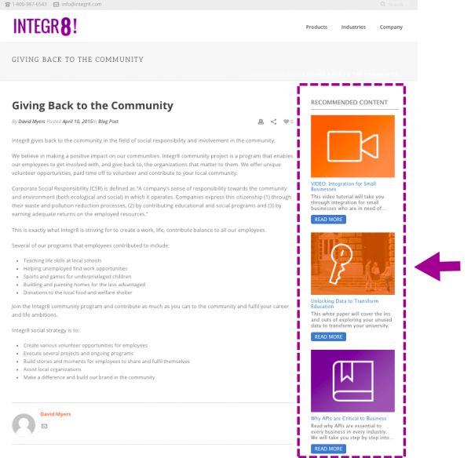

# 多媒體推薦

您必須在您要顯示Rich Media Recommendation範本的頁面上設定下列標籤和API呼叫。

1. 在頁首中
   1. 已安裝RTP標籤
   1. 將GET呼叫新增至頁面以填入建議
   1. 新增SET呼叫以設定範本
1. 在頁面本文中
   1. 將範本標籤（div類別）放置在您要顯示範本的位置

[此處](https://experienceleague.adobe.com/zh-hant/docs/marketo/using/product-docs/predictive-content/enabling-predictive-content/enable-predictive-content-for-web-rich-media)提供詳細資訊。

## 範本標籤

| 屬性 | 選用/必要 | 說明 |
|---|---|---|
| 類別 | 必要 | 指定此div HTML元素為RTP建議div。 |
| data-rtp-template-id | 必要 | 範本識別碼。 這會決定建議的對齊方式。 使用「template1」進行水準對齊、「template2」進行垂直對齊，或「template3」進行僅包含標題和說明的垂直對齊。 指令碼會將相符的範本插入這個`div.Permissible`值：template1、template2、template3。 |

### 範例

若要以水準對齊方式顯示建議，請使用「template1」。

```html
<div class="RTP_RCMD2" data-rtp-template-id="template1"></div>
```

若要以垂直對齊方式顯示建議，請使用「template2」。

```html
<div class="RTP_RCMD2" data-rtp-template-id="template2"></div>
```

若要以僅與標題和說明垂直對齊的方式顯示建議，請使用「template3」。

```html
<div class="RTP_RCMD2" data-rtp-template-id="template3"></div>
```

在[這裡](#example_of_rich_media_recommendation_template_1)檢視範本對齊的熒幕擷取畫面。

## 填入建議

此方法會使用建議填入頁面上的所有豐富媒體`<divs>`。

### 使用情況

`rtp('get', 'rcmd', 'richmedia');`

| 參數 | 選用/必要 | 類型 | 說明 |
|---|---|---|---|
| &#39;get&#39; | 必要 | 字串 | 方法動作。 |
| &#39;rcmd&#39; | 必要 | 字串 | 方法名稱。 |
| &#39;富媒體&#39; | 必要 | 字串 | 子方法名稱。 |

## 變更範本組態

此方法會變更範本的預設設定。

注意：使用此方法時，必須在呼叫rtp(&#39;get&#39;，&#39;rcmd&#39;， &#39;richmedia&#39;)之前呼叫它；

### 使用情況

`rtp('set', 'rcmd', 'richmedia', 'template_id', conf_obj);`

| 參數 | 選用/必要 | 類型 | 說明 |
|---|---|---|---|
| &#39;設定&#39; | 必要 | 字串 | 方法動作。 |
| &#39;rcmd&#39; | 必要 | 字串 | 方法名稱。 |
| &#39;富媒體&#39; | 必要 | 字串 | 子方法名稱。 |
| template_id | 選用 | 字串 | 用於設定變更的範本ID。 使用僅為一個範本指定設定變更。 |
| conf_obj | 必要 | 物件 | 新設定。 物件會將所有設定儲存為索引鍵/值組。 |

### 範例

此程式碼片段會變更範本的標題文字。

```javascript
rtp("set", "rcmd", "richmedia","template1",
    {
        "rcmd.title.text": "RECOMMENDED CONTENT"
    }
);
```

此程式碼片段會針對範本顯示使用多個設定來設定類別。

```javascript
rtp("set", "rcmd", "richmedia",
    {
        "template1":
        {
            "rcmd.title.text": "RECOMMENDED CONTENT",
            "rcmd.general.font.family": "arial",
            "category":
            [
                "webinar",
                "blog posts",
                "pricing_page_category",
                "product_a_category"
            ]
        }
    }
);
```

注意：使用「類別」可篩選在預測性內容建議結果中顯示的內容。 若要將預測性內容套用至所有啟用的內容片段，請將「類別」留空。 如果您只想為Rich Media範本中的輸出建議特定內容，請在「設定內容」頁面中新增內容的類別，並在建議範本程式碼中建立該類別的關聯。 根據您網站的區段（產品或解決方案）分類相關內容。

此程式碼片段顯示為一個範本設定多個範本設定。

```javascript
rtp("set", "rcmd", "richmedia",
    {
        "template1":
        {
            "rcmd.title.text": "RECOMMENDED CONTENT",
            "rcmd.general.font.family": "arial"
        }
    }
);
```

#### 設定屬性

| 設定 | 範例 | 說明 |
|---|---|---|
| rcmd.general.font.family | &quot;rcmd.general.font.family&quot; ： &quot;arial&quot; | 變更範本中所有文字的字型系列。 此屬性支援瀏覽器型別提供的所有CSS值。 如果自訂字型系列存在於頁面上，則可以使用自訂字型系列。 |
| rcmd.content.background.color | &quot;rcmd.content.background.color&quot; ： &quot;black&quot; | 變更範本內部方塊的背景顏色。 此屬性支援所有瀏覽器型別的CSS值。 |
| rcmd.title.text | &quot;rcmd.title.text&quot; ：&quot;建議內容&quot; | 變更範本標題。 |
| rcmd.title.background.color | &quot;rcmd.title.background.color&quot; ： &quot;blue&quot; | 變更標題方塊的背景顏色。 此屬性支援所有css色彩值（色彩名稱、rgb、...） |
| rcmd.title.font.size | &quot;rcmd.title.font.size&quot; ： &quot;26px&quot; | 變更標題字型大小。 屬性支援所有可能的字型大小CSS值(px、em、...) |
| rcmd.title.font.color | &quot;rcmd.title.font.color&quot; ： &quot;white&quot; | 變更標題字型顏色。 此屬性支援所有字型色彩值（rgb、十六進位……） |
| rcmd.description.font.color | &quot;rcmd.description.font.color&quot; ： &quot;white&quot; | 變更說明字型顏色。 此屬性支援所有字型色彩值（rgb、十六進位……） |
| rcmd.cta.background.color | &quot;rcmd.cta.background.color&quot; ： &quot;green&quot; | 變更按鈕背景顏色。 此屬性支援所有css色彩值（色彩名稱、rgb、...） |
| rcmd.cta.font.color | &quot;rcmd.cta.font.color&quot; ： &quot;rgb(90， 84， 164)&quot; | 變更按鈕字型顏色。 此屬性支援所有字型色彩值（rgb、十六進位……） |
| rcmd.cta.text | &quot;rcmd.cta.text&quot; ： &quot;推播&quot; | 變更按鈕文字。 所有按鈕的文字都相同。 |
| 類別 | &quot;category&quot; ： [&quot;one category&quot;] | 變更此範本支援的建議類別。 範本只會顯示具有此組態所設定其中一個類別的建議。 |

注意：組態支援可根據範本變更。

#### 基本範例

此範例有一個範本，內含三個建議。 將此範例複製到HTML頁面，然後將RTP標籤取代為您的標籤。

```html
<!DOCTYPE>
<html>
<head>
<meta http-equiv="Content-Type" content="text/html; charset=UTF-8">
<title>RTP recommendation</title>
<!-- RTP tag -->
<script type='text/javascript'>

// This tag needs to be replaced with your account tag
(function(c,h,a,f,i,e){c[a]=c[a]||function(){(c[a].q=c[a].q||[]).push(arguments)};
c[a].a=i;c[a].e=e;var g=h.createElement("script");g.async=true;g.type="text/javascript";
g.src=f+'?aid='+i;var b=h.getElementsByTagName("script")[0];b.parentNode.insertBefore(g,b);
})(window,document,"rtp","//example.rtp.com/rtp-api/v1/rtp.js","account_id");

// Send page view (required by  the recommendation)
rtp('send','view');
// Populate recommendation
rtp('get','rcmd', 'richmedia');
</script>
<!-- End of RTP tag -->
</head>
<body>
<div class="RTP_RCMD2" data-rtp-template-id="template1"></div>
</body>
</html>
```

#### 進階範例

此範例有一個範本，內含三個建議。 範本標題為「建議內容」，而按鈕文字為「閱讀更多」。 將此範例複製到HTML頁面，然後將RTP標籤取代為您的標籤。

```html
<!DOCTYPE>
<html>
<head>
<meta http-equiv="Content-Type" content="text/html; charset=UTF-8">
<title>RTP recommendation</title>
<!-- RTP tag -->
<script type='text/javascript'>

// This tag needs to be replaced with your account tag
(function(c,h,a,f,i,e){c[a]=c[a]||function(){(c[a].q=c[a].q||[]).push(arguments)};
c[a].a=i;c[a].e=e;var g=h.createElement("script");g.async=true;g.type="text/javascript";
g.src=f+'?aid='+i;var b=h.getElementsByTagName("script")[0];b.parentNode.insertBefore(g,b);
})(window,document,"rtp","//example.rtp.com/rtp-api/v1/rtp.js","account_id");

// Send page view (required by  the recommendation)
rtp('send','view');
// Populate the recommendation zone
rtp('get', 'campaign',true);
// Change template configuration
rtp('set', 'rcmd', 'richmedia',
    {
        template1 :
        {
            "rcmd.title.text" : "RECOMMENDED CONTENT",
            "rcmd.cta.text" : "Read More"
        }
    }
);
// Populate recommendation
rtp('get','rcmd', 'richmedia');
</script>
<!-- End of RTP tag -->
</head>
<body>
<div class="RTP_RCMD2" data-rtp-template-id="template1"></div>
</body>
</html>
```

#### 多媒體建議範本范#1範例

**名稱**：範本1 **描述**：水準內容包含影像、標題和描述，以及call to action按鈕。


#### 多媒體建議範本范#2範例

**名稱**：範本2 **描述**：垂直內容，包括影像、標題和描述，以及call to action按鈕。



#### 多媒體建議範本范#3範例

**名稱**：範本3 **描述**：僅包含標題和描述的垂直內容。 滑鼠懸停時，標題會變更顏色，並超連結至內容URL。 說明也連結至不變更顏色的內容。 
