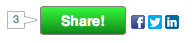

# 社交

[Marketo社交行銷](https://business.adobe.com/products/marketo/social-marketing.html)可讓行銷人員將社交Widget內嵌在網站和登陸頁面中。 社交Widget包括投票、社交分享按鈕、影片、抽獎和類似轉介優惠的促銷活動。

## 內嵌共用Widget範例

```html
<!-- Marketo Widget Loader Script -->

<script type="text/javascript" src="//b2c-mlm.marketo.com/jsloader/271d8232-1500-4305-b7ed-05d451b9ee0c/loader.php.js">
</script>

 <!-- The Location of the Social Widget -->

<divclass='cf_widgetloader cf_w_245d8f3c0955454cbd26abc39d0d874c'="" options="{&quot;outerHeight&quot;:400, &quot;outerWidth&quot;:600}">
</divclass='cf_widgetloader'>
```



社交Widget有兩種基本的自訂方法：

1. 使用產品的正常UI並附加事件接聽程式，以便在UI中發生某些動作時收到通知以執行其他商業邏輯。
1. 將產品的一般UI取代為自訂UI，並視需要啟用UI的快顯視窗「階段」。

## 將事件附加至一般UI

有兩種方式可全域或針對單一Widget訂閱CF JavaScript資料庫中的事件。 事件記錄於事件表格下方。

### 全域活動訂閱

```html
<script>
cf_scripts.afterload(function(){
    CF.events.listen("event_name_here",
        function(event, arg1){
            //Your code to do something on the event goes here.
            //It will be fired whenever ANY widget fires the event "event_name_here".
        }
    );
});
</script>
```

### 每個Widget事件訂閱

```html
<script>
cf_scripts.afterload(function(){
    CF.widget.listen("widget_name_here", "event_name_here",
        function(event, arg1){
            //Your code to do something on the event goes here.
            //It will be fired whenever the widget named "widget_name_here" fires the event "event_name_here".
        }
    );
});
</script>
```

## 範例

此範例顯示當使用者完成名為「referral_Signup」的Widget的優惠方案註冊後，具有ID「signedUp」之先前隱藏的元素。

```html
<div id='signedUp'style='display:none; color:green;'>This is a custom message to let you know that you signed up!</div>
<div class='cf_widgetLoader cf_w_referral_SignUp'></div>

<script>
    cf_scripts.afterload(function(){
        CF.widget.listen("referral_SignUp", "offer_enrolled", function(){
        cf_jq("#signedUp").show();
    });
});
</script>
```

## 基本事件表格

| 事件名稱 | 說明 | 使用此事件的Widget | 支援的引數（傳遞至事件回呼函式） |
| --- | --- | --- | --- |
| share_sent | 每次將共用要求傳送至伺服器以進行處理時引發 | 所有能夠共用的Widget | 1.」share_sent&quot; （字串）<br>2。 引數已傳送（物件） |
| share_success | 成功處理共用要求時引發。 | 所有能夠共用的Widget。 | 1.」share_success&quot; （字串）<br>2。 共用回應物件，包含已傳送的訊息和縮短的URL （物件） |
| vote_成功率 | 當使用者在輪詢中成功投票時引發。 | 投票、VS、投票Widget | &#x200B;1. &quot;vote_success&quot; （字串）<br>2。 投票給的專案，包括標題、說明、實體識別碼（物件） |
| offer_registered | 當使用者成功註冊優惠時引發 | 所有優惠方案Widget | 1.」offer_registered&quot; （字串）<br>2。 已變更使用者屬性（物件），<br>3。 變更的使用者屬性（物件） |
| 設定檔已儲存 | 當使用者從設定檔擷取更新其設定檔時引發 | 已啟用設定檔擷取的所有非選件Widget | 1.」profile_saved&quot; （字串）<br>2。 已變更使用者屬性（物件）<br>3。 變更的使用者屬性（物件） |
| video_loaded | 當內嵌視訊完全載入及初始化時引發。 | VideoShare Widget | &#x200B;1. &quot;video_loaded&quot; （字串） 2. 儲存視訊（jQuery物件）的「.cf_videoshare_wrap」元素 |

## 使用自訂UI取代UI

若要以自訂UI取代UI，您必須先關閉一般UI，方法是將選項&#x200B;_popupUIOnly_&#x200B;設定為&#x200B;_true_。 設定此選項後，標準UI將不會在頁面載入時呈現，而是Widget會擷取其資料，並藉由呼叫&#x200B;_CF.widget.activate_&#x200B;函式以及提供應執行動作的選項來等待您開始其其中一個彈出式階段。

以下是建立自訂按鈕的範例，此按鈕會針對名為&#x200B;_referral_Signup_&#x200B;的推薦優惠Widget啟動推薦優惠註冊流程。

```html
<button id="myNewSignUpButton">My newSign Up button</button>

<!-- Turn off the defaultreferral offer UI by setting popupUIOnly to true-->
<div class="cf_widgetLoader cf_w_referral_SignUp" options="{popupUIOnly:true}"></div>

<script>
cf_scripts.afterload(function($, CF){
    // After the cf script library has loaded, find the button with
    // id="myNewSignUpButton", and attach a click listener to it.
    $("#myNewSignUpButton").click(function(){
        // When it is clicked, activate the popup widget flow for the referral,
        // asking it to point to the clicked button.
        CF.widget.activate("referral_SignUp", {pointTo:$(this)});
    });
});
</script>
```

因為常會新增按一下處理常式，所以有捷徑方法可新增它們。 下列在功能上等同於前面的範例。

```html
<button id="myNewSignUpButton">My newSign Up button</button>
<div class="cf_widgetLoader cf_w_referral_SignUp" options="{popupUIOnly:true}"></div>

<script>
cf_scripts.afterload(function($, CF){
    // Use the addClickActivate convenience method, which will
    // automatically make the popup point at the clicked item with id myNewSignUpButton.
    CF.widget.addClickActivate("#myNewSignUpButton", "referral_SignUp", {});
});
</script>
```

## 取得Widget UI資料以放入您的取代UI

如果您需要有關Widget的資料以繪製您的取代UI，您可以從特殊事件&#x200B;_ui_data_&#x200B;取得資料。 您可以使用一般`CF.widget.listen`函式接聽此事件，但這麼做可能會造成潛在競爭情形，使您的事件接聽程式在Widget已引發_ui_data_事件之後新增，因此您永遠不會收到資料。 若要避免此競爭，只要執行了會導致重新繪製Widget的標準UI的動作，就會使用`CF.widget.uiData_ method instead, which will give you the most recent available _ui_data_, and listen for all future updates as well. The _ui_data`事件，即使您已使用`popupUIOnly`選項停用該UI亦然。

此範例使用`uiData`函式來顯示使用者擁有的Widget名稱為&#x200B;_sweeps_Sweepstakes_&#x200B;之抽獎專案的專案數。

```html
<span>You have <span id="entryCount">?</span> entries.</span>

<div class="cf_widgetLoader cf_w_sweeps_Sweepstakes"></div>

<button id='myNewSweepsButton'>New Sweeps Up Button!</button>

<script>
cf_scripts.afterload(function($, CF){
    CF.widget.uiData("sweeps_Sweepstakes", function(uiData){
        if(uiData.user && uiData.userStatus && uiData.userEntries){
            $("entryCount").html(""+ uiData.userEntries);
        }
        else{
            $("entryCount").html("0");
        }
    });
});
</script>
```

## 反向連結優惠方案註冊UI資料參考

| 類型 | 說明 |
|---------------|----------------------------------------------------|
| 日期 | 日期值，格式為&quot;yyyy-MM-dd&quot; |
| 數字 | 整數或浮點數 |
| RTF文字 | HTML字串 |
| 分數 | 帶正負號的32位元整數 |
| sfdc行銷活動 | 用於Salesforce行銷活動管理整合 |
| 文字 | 文字字串 |

## 轉介選件TrackProgress UI資料參考

| 類型 | 說明 |
|---------------|----------------------------------------------------|
| 日期 | 日期值，格式為&quot;yyyy-MM-dd&quot; |
| 數字 | 整數或浮點數 |
| RTF文字 | HTML字串 |
| 分數 | 帶正負號的32位元整數 |
| sfdc行銷活動 | 用於Salesforce行銷活動管理整合 |
| 文字 | 文字字串 |

## 抽獎UI資料參考（用於社交活動抽獎，而非LM抽獎）

| 類型 | 說明 |
|---------------|----------------------------------------------------|
| 日期 | 日期值，格式為&quot;yyyy-MM-dd&quot; |
| 數字 | 整數或浮點數 |
| RTF文字 | HTML字串 |
| 分數 | 帶正負號的32位元整數 |
| sfdc行銷活動 | 用於Salesforce行銷活動管理整合 |
| 文字 | 文字字串 |

## 社交登入（表單填寫Widget）資料參考

| 類型 | 說明 |
|---------------|----------------------------------------------------|
| 日期 | 日期值，格式為&quot;yyyy-MM-dd&quot; |
| 數字 | 整數或浮點數 |
| RTF文字 | HTML字串 |
| 分數 | 帶正負號的32位元整數 |
| sfdc行銷活動 | 用於Salesforce行銷活動管理整合 |
| 文字 | 文字字串 |

```javascript
{
"alt_id": "http://www.facebook.com/profile.php?id=1526228678",
"provider_name": "facebook",
"default_photo_url": "https://graph.facebook.com/1526228678/picture?type=large",
"email": "ian.b.taylor@gmail.com",
"verified_email": "ian.b.taylor@gmail.com",
"gender": "male",
"preferred_user_name": "IanTaylor",
"display_name": "Ian Taylor",
"birth_date": 343954800000,
"first_name": "Ian",
"last_name": "Taylor",
"city": null,
"state": null,
"region": null,
"postal_code": null,
"country": null,
"time_zone": null,
"connection_count": 0,
"credentials": {
"uid": "1526228678",
"scopes": "publish_actions",
"expires": "1371994082",
"accessToken": "BAAGFJ0KUFpcBABuNMptmYY...",
"type": "Facebook"
},
"about_me": null,
"cur_pos_title": "Senior Staff Engineer",
"phone_number": null,
"company": "Marketo",
"cur_pos_start_date": 1333231200000,
"cur_pos_summary": null
}
```
