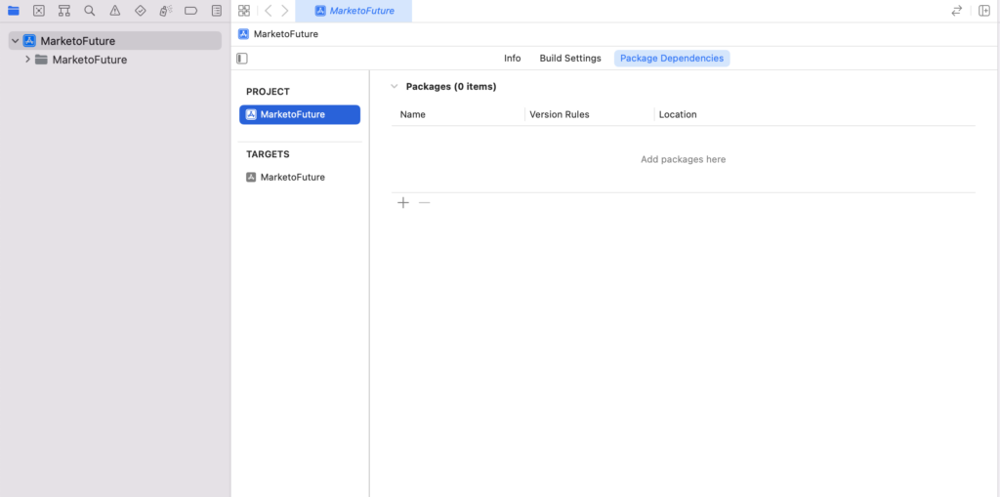
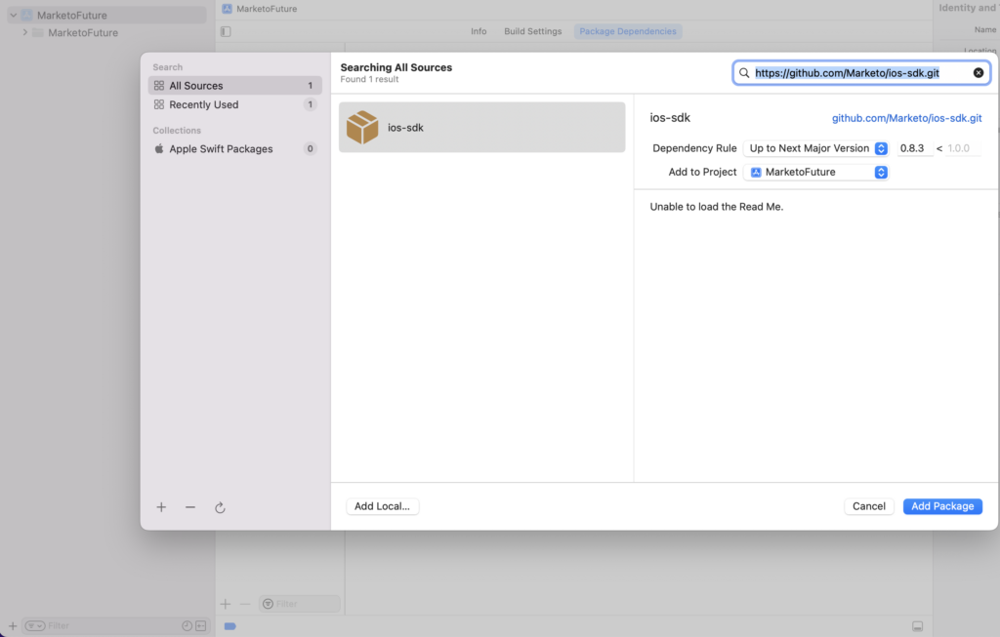

# 安裝

Marketo Mobile SDK的安裝指示。 傳送推播通知及/或應用程式內訊息需執行以下步驟。

## 在iOS上安裝Marketo SDK

### 先決條件

1. [在Marketo管理中新增應用程式](https://experienceleague.adobe.com/en/docs/marketo/using/product-docs/mobile-marketing/admin/add-a-mobile-app) （取得您的應用程式秘密金鑰和Munchkin ID）
1. [設定推播通知](push-notifications.md) （選擇性）

### 透過CocoaPods安裝框架

1. 安裝CocoaPods。 `$ sudo gem install cocoapods`
1. 將目錄變更至您的專案目錄，並建立具有智慧型預設值的Podfile。 `$ pod init`
1. 開啟您的Podfile。 `$ open -a Xcode Podfile`
1. 將下列行新增至您的Podfile。 `$ pod 'Marketo-iOS-SDK'`
1. 儲存並關閉您的Podfile。
1. 下載並安裝Marketo iOS SDK。 `$ pod install`
1. 在Xcode中開啟工作區。 `$ open App.xcworkspace`

### 使用Swift Package Manager安裝架構

1. 從專案導覽器選取您的專案，並在「新增套件相依性」底下，按一下「+」，如下所示：

   

1. 從此存放庫新增Marketo套件。 新增此存放庫的URL： https://github.com/Marketo/ios-sdk。

   

1. 現在新增資源套件，如下所示：尋找 `MarketoFramework.XCframework` 在專案導覽器中開啟，並在「尋找器」中開啟。 拖放 `MKTResources.bundle` 以複製束資源。

### 設定Swift橋接標題

1. 前往「檔案>新增>檔案」，然後選取「標頭檔案」。

   

1. 將檔案命名為「&lt;」_專案名稱_>-Bridging-Header」。

1. 前往「專案>目標>建置階段> Swift編譯器>程式碼產生」。 將下列路徑新增至Objective-Bridging標頭：

   `$(PODS_ROOT)/<_ProjectName_>-Bridging-Header.h`

   

## 初始化SDK

您必須先使用Munchkin帳戶ID和應用程式秘密金鑰初始化Marketo iOS SDK，才能加以使用。 您可以在Marketo管理區域的「行動應用程式和裝置」下方找到這些應用程式。

1. 開啟您的AppDelegate.m檔案(Objective-C)或橋接檔案(Swift)，並匯入Marketo.h標題檔案。

   ```
   #import <MarketoFramework/MarketoFramework.h>
   ```

1. 將下列程式碼貼入 `application:didFinishLaunchingWithOptions`：函式。

   請注意，我們必須傳遞「原生」作為原生應用程式的框架型別。

>[!BEGINTABS]

>[!TAB 目標C]

```
Marketo *sharedInstance = [Marketo sharedInstance];

[sharedInstance initializeWithMunchkinID:@"munchkinAccountId" appSecret:@"secretKey" mobileFrameworkType:@"native" launchOptions:launchOptions];
```

>[!TAB Swift]

```
let sharedInstance: Marketo = Marketo.sharedInstance()

sharedInstance.initialize(withMunchkinID: "munchkinAccountId", appSecret: "secretKey", mobileFrameworkType: "native", launchOptions: launchOptions)
```

>[!ENDTABS]

1. 取代 `munkinAccountId` 和 `secretKey` 以上使用您在Marketo中找到的「Munchkin帳戶ID」和「秘密金鑰」 **[!UICONTROL Admin]** > **[!UICONTROL Mobile Apps and Devices]** 區段。

## iOS測試裝置

1. 選取「專案>目標>資訊> URL型別」。
1. 新增識別碼： ${PRODUCT_NAME}
1. 設定URL配置： `mkto-<Secret Key_>`
1. 包含應用程式:openURL:來源應用程式:annotation: 至AppDelegate.m檔案(Objective-C)

## 在AppDelegate中處理自訂Url型別

>[!BEGINTABS]

>[!TAB 目標C]

```
- (BOOL)application:(UIApplication *)app
            openURL:(NSURL *)url
            options:(NSDictionary<UIApplicationOpenURLOptionsKey,id> *)options{
   
    return [[Marketo sharedInstance] application:app
                                         openURL:url
                                         options:options];    
}
```

>[!TAB Swift]

```
private func application(_ app: UIApplication, open url: URL, options: [UIApplication.OpenURLOptionsKey : Any] = [:]) -> Bool
    {
        return Marketo.sharedInstance().application(app, open: url, options: options)
    }
```

>[!ENDTABS]

## 如何在Android上安裝Marketo SDK

### 先決條件

1. [在Marketo管理中新增應用程式](https://experienceleague.adobe.com/en/docs/marketo/using/product-docs/mobile-marketing/admin/add-a-mobile-app) （取得您的應用程式秘密金鑰和Munchkin ID）
1. [設定推播通知](push-notifications.md#android_setup_push) （選擇性）
1. [下載適用於Android的Marketo SDK](https://codeload.github.com/Marketo/android-sdk/zip/refs/heads/master)

### 使用Gradle設定Android SDK

1. 在應用程式層級build.gradle檔案中，在相依性區段下新增

`implementation 'com.marketo:MarketoSDK:0.8.9'`

1. 根 `build.gradle` 檔案應具有

   ```
   buildscript {
       repositories {
           google()
           mavenCentral()
       }
   ```

1. 將專案與Gradle檔案同步

### 設定許可權

開啟 `AndroidManifest.xml` 並新增下列許可權。 您的應用程式必須要求「網際網路」和「ACCESS_NETWORK_STATE」許可權。 如果您的應用程式已要求這些許可權，請略過此步驟。

```xml
<uses‐permission android:name="android.permission.INTERNET"></uses‐permission>
<uses‐permission android:name="android.permission.ACCESS_NETWORK_STATE"></uses‐permission>
```

### 初始化SDK

1. 開啟應用程式中的Application或Activity類別，並在setContentView或Application Context之前，將Marketo SDK匯入您的Activity。

   ```java
   // Initialize Marketo
   Marketo marketoSdk = Marketo.getInstance(getApplicationContext());
   marketoSdk.initializeSDK("native","munchkinAccountId","secretKey");
   ```

1. ProGuard組態（選購）

   如果您正在使用應用程式的ProGuard，請在您的應用程式中新增下列行 `proguard.cfg` 檔案。 檔案位於您的專案資料夾中。 新增此程式碼會將Marketo SDK排除在模糊化程式之外。

   ```
   -dontwarn com.marketo.*
   -dontnote com.marketo.*
   -keep class com.marketo.`{ *; }
   ```

## Android測試裝置

將「MarketoActivity」新增至 `AndroidManifest.xml` 應用程式標籤內的檔案。

```xml
<activity android:name="com.marketo.MarketoActivity"  android:configChanges="orientation|screenSize" >
    <intent-filter android:label="MarketoActivity" >
        <action  android:name="android.intent.action.VIEW"/>
        <category  android:name="android.intent.category.DEFAULT"/>
        <category  android:name="android.intent.category.BROWSABLE"/>
        <data android:host="add_test_device" android:scheme="mkto" />
    </intent-filter>
</activity>
```

## Firebase Cloud Messaging支援

適用於Android的MME Software Development Kit (SDK)已更新至更現代、穩定及可擴充的架構，其中包含更優異的彈性及適合Android應用程式開發人員的新工程功能。

Android應用程式開發人員現在可以直接使用Google的 [Firebase雲端通訊](https://firebase.google.com/docs/cloud-messaging/) (FCM)搭配此SDK。

### 新增FCM至您的應用程式

1. 在Android應用程式中整合最新的Marketo Android SDK。  步驟位於 [GitHub](https://github.com/Marketo/android-sdk).
1. 在Firebase主控台上設定Firebase應用程式。
   1. 建立/新增專案於 [](https://accounts.google.com/ServiceLogin?passive=1209600&amp;osid=1&amp;continue=https://console.firebase.google.com/&amp;followup=https://console.firebase.google.com/)Firebase主控台。
      1. 在 [Firebase主控台](https://accounts.google.com/ServiceLogin?passive=1209600&amp;osid=1&amp;continue=https://console.firebase.google.com/&amp;followup=https://console.firebase.google.com/)，選取 `Add Project`.
      1. 從現有Google Cloud專案清單中選取您的GCM專案，然後選取 `Add Firebase`.
      1. 在Firebase歡迎畫面中，選取 `Add Firebase to your Android App`.
      1. 提供您的封裝名稱和SHA-1，然後選取 `Add App`. 新 `google-services.json` 已下載您Firebase應用程式的檔案。
      1. 選取 `Continue` 並依照在Android Studio中新增Google Services外掛程式的詳細指示操作。

   1. 導覽至專案總覽中的「專案設定」
      1. 按一下「一般」標籤。 下載「google-services.json」檔案。
      1. 按一下「雲端訊息」索引標籤。 複製「伺服器金鑰」和「寄件者ID」。 提供這些「伺服器金鑰」和「傳送者ID」給Marketo。
   1. 在Android應用程式中設定FCM變更
      1. 切換至Android Studio中的專案檢視，以檢視您的專案根目錄
         1. 將下載的「google-services.json」檔案移至Android應用程式模組的根目錄中
         1. 在專案層級build.gradle中，新增下列內容：

            ```
            buildscript {
              dependencies {
                classpath 'com.google.gms:google-services:4.0.0'
              }
            }
            ```

         1. 在應用程式層級build.gradle中，新增下列內容：

            ```
            dependencies {
              compile 'com.google.firebase:firebase-core:17.4.0'
            } 
            // Add to the bottom of the file 
            apply plugin: 'com.google.gms.google-services'
            ```

         1. 最後，按一下ID中所顯示列中的「立即同步」
   1. 編輯應用程式的資訊清單FCM SDK會自動新增所有必要的許可權和必要的接收器功能。 請務必從應用程式的資訊清單中移除下列過時的（且可能有害，因為它們可能會導致訊息重複）元素：

      ```xml
      <uses-permission android:name="android.permission.WAKE_LOCK" />
      <permission android:name="<your-package-name>.permission.C2D_MESSAGE" android:protectionLevel="signature" />
      <uses-permission android:name="<your-package-name>.permission.C2D_MESSAGE" />
      
      ...
      
      <receiver>
        android:name="com.google.android.gms.gcm.GcmReceiver"
        android:exported="true"
        android:permission="com.google.android.c2dm.permission.SEND"
        <intent-filter>
          <action android:name="com.google.android.c2dm.intent.RECEIVE" />
          <category android:name="<your-package-name> />
        </intent-filter> 
      </receiver>
      ```
