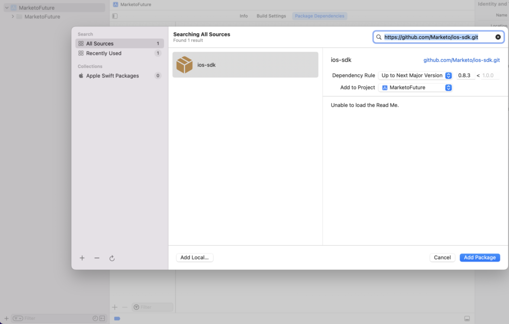
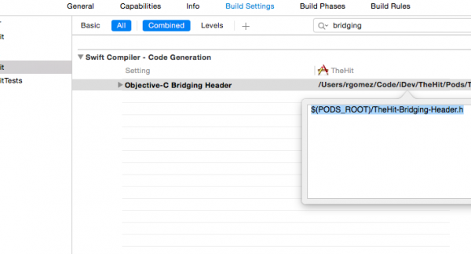

# 安裝

安裝並初始化Marketo Mobile SDK，以傳送推播通知和/或應用程式內訊息。

## 在iOS上安裝Marketo SDK

### 先決條件

1. [在Marketo Admin](https://experienceleague.adobe.com/en/docs/marketo/using/product-docs/mobile-marketing/admin/add-a-mobile-app)中新增應用程式，並取得應用程式秘密金鑰和Munchkin ID。
1. 選用： [設定推播通知](push-notifications.md)。

### 透過CocoaPods安裝框架

1. 安裝CocoaPods。`$ sudo gem install cocoapods`
1. 將目錄變更至您的專案目錄，並建立具有智慧型預設值的Podfile。`$ pod init`
1. 開啟您的Podfile。`$ open -a Xcode Podfile`
1. 將下列行新增至您的Podfile。`$ pod 'Marketo-iOS-SDK'`
1. 儲存並關閉您的Podfile。
1. 下載並安裝Marketo iOS SDK。`$ pod install`
1. 在Xcode中開啟工作區。`$ open App.xcworkspace`

### 使用Swift Package Manager安裝架構

1. 在「專案導覽器」中選取您的專案。 在「新增套件相依性」下，選取「+」。

   

1. 從<https://github.com/Marketo/ios-sdk>新增Marketo套件。

   

1. 新增資源套件。 在專案導覽器中找出`MarketoFramework.XCframework`，並在Finder中將其開啟。 拖曳`MKTResources.bundle`以複製組合資源。

### 設定Swift橋接標題

1. 前往「檔案>新增>檔案」，然後選取「標頭檔案」。

   ![選取[標頭檔]](assets/choose-header-file.png)

1. 將檔案命名為「&lt;_ProjectName_>-Bridging-Header」。

1. 前往「專案>目標>建置階段> Swift編譯器>程式碼產生」。 將下列路徑新增至Objective-Bridging標頭：

   `$(PODS_ROOT)/<_ProjectName_>-Bridging-Header.h`

   

## 初始化SDK

使用您的Marketo帳戶ID和應用程式秘密金鑰初始化Munchkin iOS SDK。 在Marketo管理員的「行動應用程式和裝置」底下尋找這兩個值。

1. 開啟Objective-C的AppDelegate.m檔案或Swift的橋接檔案。 匯入Marketo.h標頭檔案。

   ```
   #import <MarketoFramework/MarketoFramework.h>
   ```

1. 將下列程式碼貼到`application:didFinishLaunchingWithOptions`：函式中。

   傳遞「原生」作為原生應用程式的框架型別。

>[!BEGINTABS]

>[!TAB 目標C]

```objectivec
Marketo *sharedInstance = [Marketo sharedInstance];

[sharedInstance initializeWithMunchkinID:@"munchkinAccountId" appSecret:@"secretKey" mobileFrameworkType:@"native" launchOptions:launchOptions];
```

>[!TAB Swift]

```swift
let sharedInstance: Marketo = Marketo.sharedInstance()

sharedInstance.initialize(withMunchkinID: "munchkinAccountId", appSecret: "secretKey", mobileFrameworkType: "native", launchOptions: launchOptions)
```

>[!ENDTABS]

1. 將`munkinAccountId`和`secretKey`取代為Marketo **[!UICONTROL Admin]** > **[!UICONTROL Mobile Apps and Devices]**&#x200B;中的「Munchkin帳戶ID」和「秘密金鑰」。

## iOS測試裝置

1. 選取「專案>目標>資訊> URL型別」。
1. 新增識別碼${PRODUCT_NAME}。
1. 將URL配置設定為`mkto-<Secret Key_>`。
1. 將應用程式:openURL:sourceApplication:annotation:新增至Objective-C的AppDelegate.m檔案。

## 在AppDelegate中處理自訂Url型別

>[!BEGINTABS]

>[!TAB 目標C]

```objectivec
- (BOOL)application:(UIApplication *)app
            openURL:(NSURL *)url
            options:(NSDictionary<UIApplicationOpenURLOptionsKey,id> *)options{

    return [[Marketo sharedInstance] application:app
                                         openURL:url
                                         options:options];
}
```

>[!TAB Swift]

```swift
private func application(_ app: UIApplication, open url: URL, options: [UIApplication.OpenURLOptionsKey : Any] = [:]) -> Bool
    {
        return Marketo.sharedInstance().application(app, open: url, options: options)
    }
```

>[!ENDTABS]

## 如何在Android上安裝Marketo SDK

### 先決條件

1. [在Marketo Admin](https://experienceleague.adobe.com/en/docs/marketo/using/product-docs/mobile-marketing/admin/add-a-mobile-app)中新增應用程式，並取得應用程式秘密金鑰和Munchkin ID。
1. 選用： [設定推播通知](push-notifications.md#android_setup_push)。
1. [下載適用於Android的Marketo SDK](https://codeload.github.com/Marketo/android-sdk/zip/refs/heads/master)

### 使用Gradle設定Android SDK

1. 在應用程式層級build.gradle檔案中，在相依性區段下新增相依性。

   `implementation 'com.marketo:MarketoSDK:0.8.9'`

1. 將下列設定新增至根`build.gradle`檔案。

   ```
   buildscript {
       repositories {
           google()
           mavenCentral()
       }
   ```

1. 將專案與Gradle檔案同步。

### 設定許可權

開啟`AndroidManifest.xml`並新增下列許可權。 您的應用程式必須要求「網際網路」和「ACCESS_NETWORK_STATE」許可權。 如果應用程式已要求，請略過此步驟。

```xml
<uses‐permission android:name="android.permission.INTERNET"></uses‐permission>
<uses‐permission android:name="android.permission.ACCESS_NETWORK_STATE"></uses‐permission>
```

### 初始化SDK

1. 開啟「應用程式」或「活動」類別。 在setContentView之前或在Application Context中將Marketo SDK匯入活動中。

   ```java
   // Initialize Marketo
   Marketo marketoSdk = Marketo.getInstance(getApplicationContext());
   marketoSdk.initializeSDK("native","munchkinAccountId","secretKey");
   ```

1. ProGuard組態（選購）

   如果您的應用程式使用ProGuard，請在專案資料夾的`proguard.cfg`檔案中加入下列各行。 此設定會排除Marketo SDK的模糊化功能。

   ```
   -dontwarn com.marketo.*
   -dontnote com.marketo.*
   -keep class com.marketo.`{ *; }
   ```

## Android測試裝置

將「MarketoActivity」新增至應用程式標籤內的`AndroidManifest.xml`。

```xml
<activity android:name="com.marketo.MarketoActivity"  android:configChanges="orientation|screenSize" >
    <intent-filter android:label="MarketoActivity" >
        <action  android:name="android.intent.action.VIEW"/>
        <category  android:name="android.intent.category.DEFAULT"/>
        <category  android:name="android.intent.category.BROWSABLE"/>
        <data android:host="add_test_device" android:scheme="mkto" />
    </intent-filter>
</activity>
```

## Firebase Cloud Messaging支援

適用於Android的MME SDK支援直接使用Google的[Firebase雲端通訊](https://firebase.google.com/docs/cloud-messaging/) (FCM)。

### 新增FCM至您的應用程式

1. 將最新的Marketo Android SDK整合至Android應用程式。 檢視[GitHub](https://github.com/Marketo/android-sdk)上的步驟。
1. 在Firebase主控台中設定Firebase應用程式。
   1. 在[&#128279;](https://accounts.google.com/ServiceLogin?passive=1209600&osid=1&continue=https://console.firebase.google.com/&followup=https://console.firebase.google.com/)Firebase主控台上建立/新增專案。
      1. 在[Firebase主控台](https://accounts.google.com/ServiceLogin?passive=1209600&osid=1&continue=https://console.firebase.google.com/&followup=https://console.firebase.google.com/)中，選取`Add Project`。
      1. 從現有Google Cloud專案清單中選取您的GCM專案，然後選取`Add Firebase`。
      1. 在Firebase歡迎畫面中，選取`Add Firebase to your Android App`。
      1. 提供您的封裝名稱和SHA-1，然後選取`Add App`。 已下載您Firebase應用程式的新`google-services.json`檔案。
      1. 選取`Continue`並依照在Android Studio中新增Google Services外掛程式的詳細指示操作。

   1. 導覽至專案總覽中的「專案設定」
      1. 按一下「一般」標籤。 下載「google-services.json」檔案。
      1. 按一下「雲端訊息」索引標籤。 複製「伺服器金鑰」和「寄件者ID」。 提供這些「伺服器金鑰」和「傳送者ID」給Marketo。
   1. 在Android應用程式中設定FCM。
      1. 切換至Android Studio中的專案檢視，以檢視您的專案根目錄
         1. 將下載的「google-services.json」檔案移至Android應用程式模組的根目錄中
         1. 在專案層級build.gradle中，新增下列內容：

            ```
            buildscript {
              dependencies {
                classpath 'com.google.gms:google-services:4.0.0'
              }
            }
            ```

         1. 在應用程式層級build.gradle中，新增下列內容：

            ```
            dependencies {
              compile 'com.google.firebase:firebase-core:17.4.0'
            }
            // Add to the bottom of the file
            apply plugin: 'com.google.gms.google-services'
            ```

         1. 最後，選取ID中所顯示列中的&#x200B;**[!UICONTROL Sync now]**
   1. 編輯應用程式資訊清單。 FCM SDK會自動新增必要的許可權和接收者功能。 移除下列過時元素，這些元素可能會導致訊息重複：

      ```xml
      <uses-permission android:name="android.permission.WAKE_LOCK" />
      <permission android:name="<your-package-name>.permission.C2D_MESSAGE" android:protectionLevel="signature" />
      <uses-permission android:name="<your-package-name>.permission.C2D_MESSAGE" />
      
      ...
      
      <receiver>
        android:name="com.google.android.gms.gcm.GcmReceiver"
        android:exported="true"
        android:permission="com.google.android.c2dm.permission.SEND"
        <intent-filter>
          <action android:name="com.google.android.c2dm.intent.RECEIVE" />
          <category android:name="<your-package-name> />
        </intent-filter>
      </receiver>
      ```
