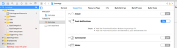

# 離子型

本主題說明如何整合Marketo Cordova外掛程式。 目前不支援[!DNL Ionic]電容器。

## 先決條件

1. [在Marketo Admin中新增應用程式](https://experienceleague.adobe.com/zh-hant/docs/marketo/using/product-docs/mobile-marketing/admin/add-a-mobile-app) (取得您的應用程式秘密金鑰和Munchkin ID)。
1. 設定推播通知([iOS](push-notifications.md) | [Android](push-notifications.md) )。
1. 安裝[[!DNL Ionic]](https://ionicframework.com/getting-started/)與[Cordova CLI](https://cordova.apache.org/docs/en/latest/guide/cli/)。

## 安裝指示

### 設定Marketo [!DNL Ionic]外掛程式

1. 假設已安裝Cordova CLI，請移至您的[!DNL Ionic]應用程式目錄，然後執行下列命令，將Marketo外掛程式新增至您的應用程式：

   `$ ionic plugin add https://github.com/Marketo/PhoneGapPlugin.git --variable APPLICATION_SECRET_KEY="YOUR_APPLICATION_SECRET"`

1. 若要確認外掛程式已新增至應用程式，請執行以下命令：

   `$ ionic plugin list com.marketo.plugin 0.X.0 "MarketoPlugin"`

### 遷移到較新版本（可選）

1. 若要移除現有外掛程式，請執行以下命令：

   `$ ionic plugin remove com.marketo.plugin`

1. 若要讀取外掛程式，請執行以下命令：

   `$ ionic plugin add https://github.com/Marketo/PhoneGapPlugin.git --variable APPLICATION_SECRET_KEY="YOUR_APPLICATION_SECRET"`

### 在xCode中啟用推播通知

1. 在xCode專案中開啟推播通知功能。

### 追蹤推播通知

將下列程式碼貼入`application:didFinishLaunchingWithOptions:`函式中。

>[!BEGINTABS]

>[!TAB 目標C]

```
Marketo *sharedInstance = [Marketo sharedInstance];

[sharedInstance trackPushNotification:launchOptions];
```

>[!TAB Swift]

```
let sharedInstance: Marketo = Marketo.sharedInstance()

sharedInstance.trackPushNotfication(launchOptions)
```

>[!ENDTABS]

### 初始化Marketo框架

若要確保在應用程式啟動時起始Marketo架構，請在主要JavaScript檔案的`onDeviceReady`函式下新增下列程式碼。

您必須傳遞`ionicCordova`作為[!DNL Ionic] Cordova應用程式的架構型別。

#### 語法

```javascript
// This method will Initialize the Marketo Framework using Your MunchkinId and Secret Key
marketo.initialize(
  function() { console.log("MarketoSDK Init done."); },
  function(error) { console.log("an error occurred:" + error); },
  'YOUR_MUNCHKIN_ID',
  'YOUR_SECRET_KEY',
  'FRAMEWORK_TYPE'
);

// For session tracking, add following.
marketo.onStart(
  function(){ console.log("onStart."); },
  function(error){ console.log("Failed to report onStart." + error); }
);
```

#### 參數

- Success回呼：在Marketo架構成功初始化時要執行的函式。
- 失敗回呼：當Marketo架構初始化失敗時要執行的函式。
- Munchkin ID ：註冊時從Marketo收到的Munchkin ID。
- 秘密金鑰：註冊時從Marketo收到的秘密金鑰。

### 初始化Marketo推播通知

若要確保已起始Marketo推播通知，請在主要JavaScript檔案中初始化函式後，新增下列程式碼。

#### 語法

```javascript
// This function will Enable user notifications (prompts the user to accept push notifications in iOS)
marketo.initializeMarketoPush(
    function() { console.log("Marketo push successfully initialized."); },
    function(error) { console.log("an error occurred:" + error); },
    'YOUR_GCM_PROJECT_ID' // This is required for Android and will be ignored in iOS
);
```

#### 參數

- Success回呼：Marketo推播通知成功初始化時要執行的函式。
- 失敗回呼：當Marketo推播通知無法初始化時要執行的函式。
- GCM_PROJECT_ID ：建立應用程式後，在[Google開發人員主控台](https://accounts.google.com/ServiceLogin?service=cloudconsole&passive=1209600&osid=1&continue=https://console.cloud.google.com/apis/dashboard&followup=https://console.cloud.google.com/apis/dashboard)中找到GCM專案ID。

登出時也可以取消註冊權杖。

```javascript
marketo.uninitializeMarketoPush(
  function() { console.log("Marketo push successfully uninitialized."); } ,
  function(error) { console.log("an error occurred:" + error); }
);
```

## 關聯銷售機會

您可以呼叫associateLead函式來建立Marketo Lead。

### 語法

```javascript
marketo.associateLead(
  function(){ console.log("MarketoSDK : Lead Added"); },
  function(error){ console.log("an error occurred:" + error); },
  'Lead_Data_JSON_String'
);
```

### 參數

- Success回呼：當Marketo架構成功建立潛在客戶關聯時要執行的函式。
- 失敗回呼：當Marketo架構無法關聯潛在客戶時要執行的函式。
- 潛在客戶資料：JSON字串格式的潛在客戶資料。

### 範例

```javascript
// First create a lead as shown below
var lead = {};
lead[marketo.KEY_FIRST_NAME] = "Ionic";
lead[marketo.KEY_LAST_NAME] = "App";
lead[marketo.KEY_EMAIL] = email;
lead[marketo.KEY_ADDRESS] = "demo address";
lead[marketo.KEY_CITY] = "city";
lead[marketo.KEY_STATE] = "state";
lead[marketo.KEY_COUNTRY] = "country";
lead[marketo.KEY_POSTAL_CODE] = "postalCode";
lead[marketo.KEY_GENDER] = "gender";

// Use associateLead function to associate it.
marketo.associateLead(
  function() { console.log("MarketoSDK : Lead Associated"); },
  function(error) { console.log("an error occurred:" + error); },
  JSON.stringify(lead)
);
```

## 報表動作

您可以藉由呼叫`reportaction`函式來報告任何使用者執行的動作。

### 語法

```javascript
marketo.reportaction(
  function(){ console.log("MarketoSDK : New event sent "); },
  function(error){ console.log("an error occurred:" + error); },
  'Action_Name',
  'Action_Data_JSON_String'
);
```

### 參數

- 成功回呼：Marketo框架成功回報動作時要執行的函式。
- 失敗回呼：Marketo框架無法回報動作時要執行的函式。
- 動作名稱：動作名稱。
- 動作資料： JSON字串格式的動作資料。

### 範例

```javascript
// First create an event as below
var event = {
    "Action Type":"Add To Cart",
    "Action Details":"Adding Product in cart",
    "Action Metric":"10",
    "Action Length":"1"
}

marketo.reportaction(
    function(){ console.log("Reported action successfully."); },
    function(error){ console.log("Failed to report action." + error); },
    "Add To Cart",
    JSON.stringify(event)
);
```

## 工作階段報告

繫結「暫停」和「繼續」事件型別，如下所示，以報告「開始」和「停止」事件。 這可用來追蹤您在行動應用程式中花費的時間。 注意：這在Android中是必要的。

```javascript
//Add the following code in your www/js/index.js

bindEvents: function() {
   document.addEventListener('pause', this.onStop, false);
   document.addEventListener('resume', this.onStart, false);
},
onStop: function() {
   marketo.onStop(
       function(){ console.log("onStop"); },
       function(error){ console.log("Failed to report onStop." + error); }
   );
},
onStart: function() {
   marketo.onStart(
       function(){ console.log("onStart."); },
       function(error){console.log( "Failed to report onStart." + error); }
   );
},
```

## 建立銷售機會

從混合應用程式建立銷售機會有三種方式：

1. MARKETO MME SDK
1. MARKETO REST API
1. 表單提交

根據使用的方法，新建立的潛在客戶會由不同的觸發器和篩選器識別。 使用MME SDK或REST API建立的潛在客戶會出現在「建立的潛在客戶」觸發器和篩選器中。 由表單提交建立的潛在客戶會出現在「填寫表單」觸發器和篩選器中。

最佳實務建議在建立銷售機會時，與網頁應用程式使用的方法保持一致。 如果您已有使用表單提交作為建立銷售機會的機制之網頁應用程式，請在混合式應用程式中建立銷售機會時，使用該相同的機制。 如果您已有使用我們REST API作為建立銷售機會的機制的網頁應用程式，請在混合式應用程式中建立銷售機會時，使用該相同的機制。 如果您未使用表單提交或REST API做為在網頁應用程式中建立銷售機會的機制，可以考慮使用MME SDK在Marketo中建立銷售機會。
