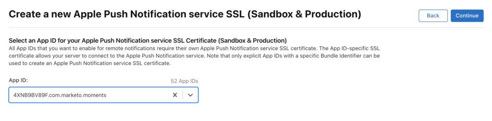
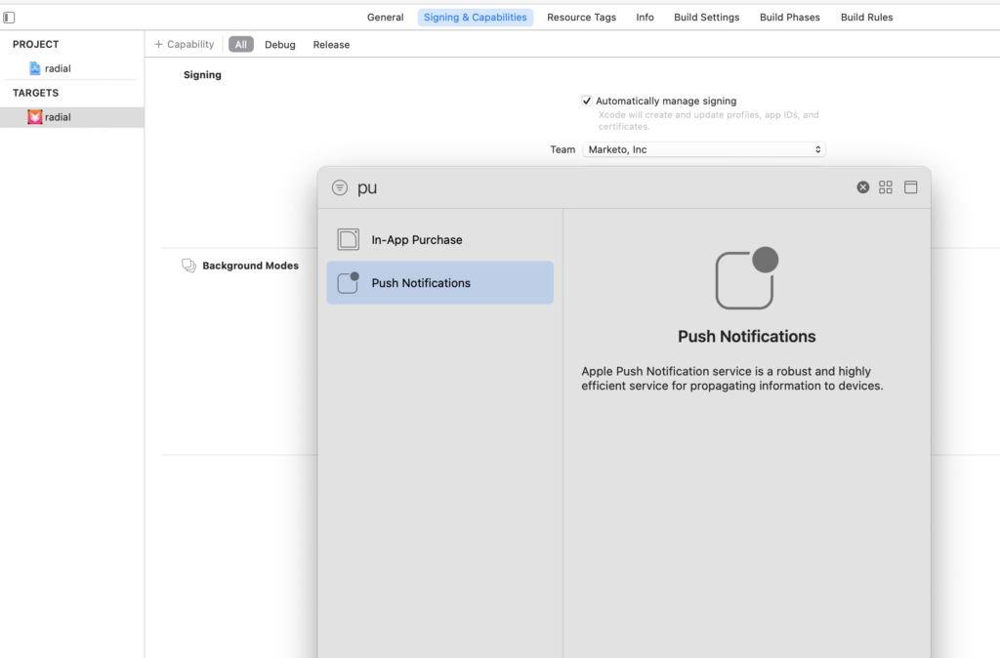

# 推播通知

為使用Marketo Mobile SDK的iOS或Android應用程式啟用推播通知。

## 在iOS上設定推播通知

啟用推播通知有三個步驟：

1. 在您的Apple開發人員帳戶中設定推播通知。
1. 在xCode中啟用推播通知。
1. 使用Marketo SDK啟用應用程式中的推播通知。

### 在Apple開發人員帳戶上設定推播通知

1. 登入Apple開發人員[成員中心](https://developer.apple.com/membercenter)。
1. 選取「憑證、識別碼和設定檔」。
1. 選取「iOS， tvOS， watchOS」下的「Certificates->All」資料夾。
1. 選取左上角憑證旁的「+」。
1. 選取「Apple推播通知服務SSL （沙箱和生產）」，然後選取「繼續」。
1. 選取用來建置應用程式的應用程式識別碼。
1. 建立並上傳CSR以產生推送憑證。
1. 下載憑證並連按兩下以安裝。
1. 開啟「鑰匙圈存取」，用滑鼠右鍵按一下憑證，然後將兩個專案匯出至`.p12`檔案。
1. 透過Marketo Admin Console上傳此檔案以設定通知。
1. 更新應用程式布建設定檔。

### 在xCode中啟用推播通知

開啟xCode專案中的推播通知功能。

### 透過Marketo SDK啟用應用程式中的推播通知

將下列程式碼新增至`AppDelegate.m`檔案，以將推播通知傳送至客戶裝置。

**注意** — 如果您使用[!DNL Adobe Launch]副檔名，請使用`ALMarketo`作為類別名稱。

新增下列匯入至`AppDelegate.h`。

>[!BEGINTABS]

>[!TAB 目標C]

```objectivec
#import <UserNotifications/UserNotifications.h>
```

>[!TAB Swift]

```swift
import UserNotifications
```

>[!ENDTABS]

將`UNUserNotificationCenterDelegate`新增至`AppDelegate`，如下所示。

>[!BEGINTABS]

>[!TAB 目標C]

```objectivec
@interface AppDelegate : UIResponder <UIApplicationDelegate, UNUserNotificationCenterDelegate>
```

>[!TAB Swift]

```swift
class AppDelegate: UIResponder, UIApplicationDelegate , UNUserNotificationCenterDelegate
```

>[!ENDTABS]

新增下列程式碼以初始化推播通知服務。

>[!BEGINTABS]

>[!TAB 目標C]

```objectivec
BOOL)application:(UIApplication *)application didFinishLaunchingWithOptions:(NSDictionary *)launchOptions {
UNUserNotificationCenter *center = [UNUserNotificationCenter currentNotificationCenter];
        center.delegate = self;
        [center requestAuthorizationWithOptions:(UNAuthorizationOptionSound | UNAuthorizationOptionAlert | UNAuthorizationOptionBadge) completionHandler:^(BOOL granted, NSError * _Nullable error){
            if(!error){
                dispatch_async(dispatch_get_main_queue(), ^{
                    [[UIApplication sharedApplication] registerForRemoteNotifications];
                });
            }
        }];

    return YES;
}
```

>[!TAB Swift]

```swift
func application(_ application: UIApplication, didFinishLaunchingWithOptions launchOptions: [UIApplication.LaunchOptionsKey: Any]?) -> Bool {

    UNUserNotificationCenter.current().requestAuthorization(options: [.alert, .sound,    .badge]) { granted, error in
            if let error = error {
                print("\(error.localizedDescription)")
            } else {
                DispatchQueue.main.async {
                    application.registerForRemoteNotifications()
                }
            }
        }

        return true
}
```

>[!ENDTABS]

呼叫此方法以開始註冊Apple推送服務。 如果註冊成功，應用程式會呼叫應用程式委派物件的`application:didRegisterForRemoteNotificationsWithDeviceToken:`方法，並為其傳遞裝置代號。

如果註冊失敗，應用程式會改為呼叫其應用程式委派的`application:didFailToRegisterForRemoteNotificationsWithError:`方法。

向Marketo註冊推播權杖。 必須註冊裝置代號才能接收來自Marketo的推播通知。

>[!BEGINTABS]

>[!TAB 目標C]

```objectivec
- (void)application:(UIApplication *)application didRegisterForRemoteNotificationsWithDeviceToken:(NSData *)deviceToken {
    // Register the push token with Marketo
    [[Marketo sharedInstance] registerPushDeviceToken:deviceToken];
}
```

>[!TAB Swift]

```swift
func application(_ application: UIApplication, didRegisterForRemoteNotificationsWithDeviceToken deviceToken: Data) {
    // Register the push token with Marketo
    Marketo.sharedInstance().registerPushDeviceToken(deviceToken)
}
```

>[!ENDTABS]

您也可以在使用者登出時取消註冊權杖。

>[!BEGINTABS]

>[!TAB 目標C]

```objectivec
[[Marketo sharedInstance] unregisterPushDeviceToken];
```

>[!TAB Swift]

```swift
Marketo.sharedInstance().unregisterPushDeviceToken
```

>[!ENDTABS]

若要重新註冊推送代號，請從步驟3將程式碼擷取至AppDelegate方法。 從ViewController登入方法呼叫該方法。

在Marketo註冊裝置代號後處理推播通知。

>[!BEGINTABS]

>[!TAB 目標C]

```objectivec
- (void)application:(UIApplication *)application didReceiveRemoteNotification:(NSDictionary *)userInfo
{
    [[Marketo sharedInstance] handlePushNotification:userInfo];
}
```

>[!TAB Swift]

```swift
func application(_ application: UIApplication, didReceiveRemoteNotification userInfo: [AnyHashable : Any]) {
    Marketo.sharedInstance().handlePushNotification(userInfo)
}
```

>[!ENDTABS]

將下列方法新增至AppDelegate。

當應用程式於前景時，使用此方法來顯示警報、播放音效或增加徽章。 在此方法中呼叫適當的completionHandler。

>[!BEGINTABS]

>[!TAB 目標C]

```objectivec
-(void)userNotificationCenter:(UNUserNotificationCenter *)center
    willPresentNotification:(UNNotification *)notification
        withCompletionHandler:(void (^)(UNNotificationPresentationOptions options))completionHandler{

    completionHandler(UNAuthorizationOptionSound | UNAuthorizationOptionAlert | UNAuthorizationOptionBadge);
}
```

>[!TAB Swift]

```swift
func userNotificationCenter(_ center: UNUserNotificationCenter,
            willPresent notification: UNNotification, withCompletionHandler completionHandler: @escaping (
    UNNotificationPresentationOptions) -> Void) {
    completionHandler([.alert, .sound,.badge])
}
```

>[!ENDTABS]

處理AppDelegate中新收到的推播通知。

當使用者透過開啟應用程式、解除通知或選擇UNNotificationAction回應通知時，委派會呼叫此方法。 在應用程式從applicationDidFinishLaunching：返回之前設定委派。

>[!BEGINTABS]

>[!TAB 目標C]

```objectivec
- (void)userNotificationCenter:(UNUserNotificationCenter *)center
didReceiveNotificationResponse:(UNNotificationResponse *)response withCompletionHandler:(void(^)(void))completionHandler {
    [[Marketo sharedInstance] userNotificationCenter:center didReceiveNotificationResponse:response withCompletionHandler:completionHandler];
}
```

>[!TAB Swift]

```swift
func userNotificationCenter(_ center: UNUserNotificationCenter,
                                didReceive response: UNNotificationResponse,
                                withCompletionHandler
                                completionHandler: @escaping () -> Void) {
        Marketo.sharedInstance().userNotificationCenter(center, didReceive: response, withCompletionHandler: completionHandler)
}
```

>[!ENDTABS]

追蹤推播通知。

如果應用程式在背景或非作用中，裝置會收到推播通知，如下所示。 Marketo會追蹤使用者何時選取通知。


當裝置收到推播通知時，會將通知傳遞至應用程式委派上的`application:didReceiveRemoteNotification:`回呼。

下列Marketo活動記錄會顯示應用程式事件和推播通知事件。


## 在Android上設定推播通知

1. 在應用程式標籤內新增下列許可權。

   開啟`AndroidManifest.xml`並新增下列許可權。 您的應用程式必須要求「網際網路」和「ACCESS_NETWORK_STATE」許可權。 如果應用程式已要求，請略過此步驟。

   ```xml
   <uses‐permission android:name="android.permission.INTERNET"/>
   <uses‐permission android:name="android.permission.ACCESS_NETWORK_STATE"/>
   
   <!‐‐Following permissions are required for push notification.‐‐>
   <uses-permission android:name="android.permission.GET_ACCOUNTS"/>
   <!‐‐Keeps the processor from sleeping when a message is received.‐‐>
   <uses-permission android:name="android.permission.WAKE_LOCK"/>
   <permission android:name="<PACKAGE_NAME>.permission.C2D_MESSAGE" android:protectionLevel="signature" />
   <uses-permission android:name="<PACKAGE_NAME>.permission.C2D_MESSAGE" />
   <!-- This app has permission to register and receive data message. -->
   <uses-permission android:name="com.google.android.c2dm.permission.RECEIVE" />
   ```

1. 使用HTTPv1設定FCM。

   - 在Marketo功能管理員中啟用MME FCM HTTPv1。
   - 在MLM中上傳應用程式的服務帳戶Json檔案。
   - 從Firebase主控台下載服務帳戶Json檔案。
   - 在Marketo中上傳服務帳戶Json檔案後等候一小時，再傳送推播通知。

## Android測試裝置

將Marketo活動新增至應用程式標籤內的資訊清單檔案。

```xml
<activity android:name="com.marketo.MarketoActivity"  android:configChanges="orientation|screenSize">
    <intent-filter android:label="MarketoActivity">
        <action  android:name="android.intent.action.VIEW"/>
        <category  android:name="android.intent.category.DEFAULT"/>
        <category  android:name="android.intent.category.BROWSABLE"/>
        <data android:host="add_test_device" android:scheme="mkto"/>
    </intent-filter/>
</activity/>
```

## 註冊Marketo推送服務

1. 將Firebase傳訊服務新增至`AndroidManifest.xml`，然後再新增關閉的應用程式標籤。

   ```xml
   <meta-data
       android:name="com.google.android.gms.version"
       android:value="@integer/google_play_services_version" />
   <service android:name=".MyFirebaseMessagingService">
   <intent-filter>
   <action android:name="com.google.firebase.INSTANCE_ID_EVENT"/>
   <action android:name="com.google.firebase.MESSAGING_EVENT"/>
   </intent-filter>
   </service>
   ```

1. 將Marketo SDK方法新增至`MyFirebaseMessagingService`，如下所示。

   ```java
   import com.marketo.Marketo;
   
   public class MyFirebaseMessagingService extends FirebaseMessagingService {
   
       @Override
       public void onNewToken(String s) {
           super.onNewToken(s);
           Marketo marketoSdk = Marketo.getInstance(this.getApplicationContext());
           marketoSdk.setPushNotificaitonToken(s);
           // Add your code here...
       }
   
       @Override
       public void onMessageReceived(RemoteMessage remoteMessage) {
           Marketo marketoSdk = Marketo.getInstance(this.getApplicationContext());
           marketoSdk.showPushNotificaiton(remoteMessage);
           // Add your code here...
       }
   
   }
   ```

   **注意** — 如果您使用Adobe擴充功能，請新增下列程式碼。

   ```java
   import com.marketo.Marketo;
   
   public class MyFirebaseMessagingService extends FirebaseMessagingService {
   
       @Override
       public void onNewToken(String token) {
           super.onNewToken(token);
           ALMarketo.setPushNotificationToken(token);
           // Add your code here...
       }
   
       @Override
       public void onMessageReceived(RemoteMessage remoteMessage) {
           ALMarketo.showPushNotification(remoteMessage);
           // Add your code here...
       }
   
   }
   ```

**注意**： FCM SDK會自動新增必要的許可權和接收者功能。 如果您使用舊版SDK，請移除下列過時元素，這可能會導致訊息重複。

```xml
<receiver android:name="com.marketo.MarketoBroadcastReceiver" android:permission="com.google.android.c2dm.permission.SEND">
    <intent-filter>
        <!‐‐Receives the actual messages.‐‐>
        <action android:name="com.google.android.c2dm.intent.RECEIVE"/>
        <!‐‐Register to enable push notification‐‐>
        <action android:name="com.google.android.c2dm.intent.REGISTRATION"/>
        <!‐‐‐Replace YOUR_PACKAGE_NAME with your own package name‐‐>
        <category android:name="YOUR_PACKAGE_NAME"/>
    </intent-filter>
</receiver>

<!‐‐Marketo service to handle push registration and notification‐‐>
<service android:name="com.marketo.MarketoIntentService"/>
```

1. 初始化Marketo推播。 儲存設定後，建立或開啟Application類別並新增下列程式碼。 從Firebase主控台取得寄件者ID。

   ```java
   Marketo marketoSdk = Marketo.getInstance(getApplicationContext());
   
   // Enable push notification here. The push notification channel name can by any string
   marketoSdk.initializeMarketoPush(SENDER_ID,"ChannelName");
   ```

   如果您使用[!DNL Adobe Launch]副檔名，請使用下列程式碼。

   ```java
   // Enable push notification here. The push notification channel name can by any string
   ALMarketo.initializeMarketoPush(SENDER_ID,"ChannelName");
   ```

   如果您沒有SENDER_ID，請完成[本教學課程](https://developers.google.com/cloud-messaging/)中詳述的步驟以啟用Google雲端傳訊服務。

   您也可以在使用者登出時取消註冊權杖。

   ```java
   marketoSdk.uninitializeMarketoPush();
   ```

   如果您使用[!DNL Adobe Launch]副檔名，請使用下列程式碼。

   ```java
   ALMarketo.uninitializeMarketoPush();
   ```

   注意：若要重新註冊推播權杖，請從步驟3將程式碼擷取至AppDelegate方法。 從ViewController登入方法呼叫該方法。

1. 選用性：設定通知圖示。 呼叫下列方法以設定自訂通知圖示。

   ```java
   MarketoConfig.Notification config = new MarketoConfig.Notification();
   // Optional bitmap for honeycomb and above
   config.setNotificationLargeIcon(bitmap);
   
   // Required icon Resource ID
   config.setNotificationSmallIcon(R.drawable.notification_small_icon);
   
   // Set the configuration
   //Use the static methods on ALMarketo class when using Adobe Extension
   Marketo.getInstance(context).setNotificationConfig(config);
   
   // Get the configuration set
   Marketo.getInstance(context).getNotificationConfig();
   ```

## 疑難排解

如果行動推送訊息無法如預期運作，請在調查實施作業詳細資料之前檢查常見的設定問題。

### 未顯示推送訊息

檢查是否已在裝置上停用推送訊息。 行動使用者可以控制他們是否接收每個應用程式的訊息，而開發人員或行銷人員可能會在開發期間停用訊息。

檢查應用程式是否已開啟及啟用。 當應用程式作用中時，行動推送訊息不會出現在畫面上。 而是會出現在應用程式的「本機通知」區域中。

### 在Marketo中檢視活動記錄

使用Marketo活動記錄檔來確認訊息已傳送。

檢閱應該收到訊息之人員的活動記錄。 如果訊息已傳送，則活動記錄會包含記錄。 如果記錄不存在，請檢查Marketo中的iOS憑證或Android API金鑰設定。

### 憑證或金鑰無效

驗證是否已為沙箱或生產載入正確的憑證。 如有必要，請重新匯出iOS憑證或Android金鑰，並將它們重新載入到Marketo中。

### .p12檔案遺失憑證或金鑰(iOS)

匯出憑證時，同時匯出金鑰和憑證。

### 布建設定檔已過期(iOS)

新增裝置後，更新布建設定檔並產生新憑證。 將Xcode專案指向正確的設定檔和憑證，並將憑證匯入Marketo。

### 無法上傳iOS憑證(IOS)

請確定用來匯出憑證的密碼不含空格。 舉例來說，請避免使用下列文字：

`Hello World 123`

使用此：

`HelloWorld123`

### 疑難排解iOS憑證

對於沙箱應用程式，請使用「開發人員」或「通用」憑證。 對於生產應用程式，請上傳有效的「散發」或「通用」憑證。

### 推播退回/無效權杖

註冊權杖在下列情況下可能失效：

- 如果使用者端應用程式取消向GCM註冊。
- 如果使用者端應用程式自動解除註冊，且使用者解除安裝該應用程式時，就會發生這種情況。 例如，在iOS上，如果APNS回饋服務報告APNS權杖無效。
- 如果註冊Token過期。 例如，Google可能會決定重新整理註冊權杖，或iOS裝置的APNS權杖已過期。
- 如果使用者端應用程式已更新，但新版本未設定為可接收訊息。
