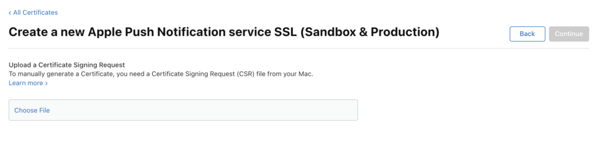

# 推播通知

如何啟用推播通知。

## 在iOS上設定推播通知

啟用推播通知有三個步驟：

1. 在Apple開發人員帳戶上設定推播通知。
1. 在xCode中啟用推播通知。
1. 透過Marketo SDK啟用應用程式中的推播通知。

### 在Apple開發人員帳戶上設定推播通知

1. 登入Apple開發人員[成員中心](http://developer.apple.com/membercenter)。
1. 按一下「憑證、識別碼和設定檔」。
1. 按一下「iOS， tvOS， watchOS」底下的「Certificates->All」資料夾。
1. 選取憑證旁邊左上角畫面上的「+」
1. 啟用「Apple推播通知服務SSL （沙箱和生產）」核取方塊，然後按一下「繼續」。
1. 選取您用來建置應用程式的應用程式識別碼。
1. 建立並上傳CSR以產生推送憑證。
1. 將憑證下載到本機電腦，然後按兩下以安裝。
1. 開啟「鑰匙圈存取」，以滑鼠右鍵按一下憑證，然後將2個專案匯出至`.p12`檔案。
1. 透過MarketoAdmin Console上傳此檔案以設定通知。
1. 更新應用程式布建設定檔。

### 在xCode中啟用推播通知

在xCode專案中開啟推播通知功能。

### 透過Marketo SDK啟用應用程式中的推播通知

將下列程式碼新增至`AppDelegate.m`檔案，以將推播通知傳送至您客戶的裝置。

**備註** — 如果使用[!DNL Adobe Launch]副檔名，請使用`ALMarketo`作為類別名稱

在`AppDelegate.h`中匯入下列專案。

>[!BEGINTABS]

>[!TAB 目標C]

```
#import <UserNotifications/UserNotifications.h>
```

>[!TAB Swift]

```
import UserNotifications
```

>[!ENDTABS]

將`UNUserNotificationCenterDelegate`新增至`AppDelegate`，如下所示。

>[!BEGINTABS]

>[!TAB 目標C]

```
@interface AppDelegate : UIResponder <UIApplicationDelegate, UNUserNotificationCenterDelegate>
```

>[!TAB Swift]

```
class AppDelegate: UIResponder, UIApplicationDelegate , UNUserNotificationCenterDelegate
```

>[!ENDTABS]

啟動推播通知服務。 若要啟用推播通知，請在程式碼下方新增。

>[!BEGINTABS]

>[!TAB 目標C]

```objectivec
BOOL)application:(UIApplication *)application didFinishLaunchingWithOptions:(NSDictionary *)launchOptions {
UNUserNotificationCenter *center = [UNUserNotificationCenter currentNotificationCenter];
        center.delegate = self;
        [center requestAuthorizationWithOptions:(UNAuthorizationOptionSound | UNAuthorizationOptionAlert | UNAuthorizationOptionBadge) completionHandler:^(BOOL granted, NSError * _Nullable error){
            if(!error){
                dispatch_async(dispatch_get_main_queue(), ^{
                    [[UIApplication sharedApplication] registerForRemoteNotifications];
                });
            }
        }];

    return YES;
}
```

>[!TAB Swift]

```
func application(_ application: UIApplication, didFinishLaunchingWithOptions launchOptions: [UIApplication.LaunchOptionsKey: Any]?) -> Bool {
            
    UNUserNotificationCenter.current().requestAuthorization(options: [.alert, .sound,    .badge]) { granted, error in
            if let error = error {
                print("\(error.localizedDescription)")
            } else {
                DispatchQueue.main.async {
                    application.registerForRemoteNotifications()
                }
            }
        }
        
        return true
}
```

>[!ENDTABS]

呼叫此方法以開始向Apple推送服務註冊流程。 如果註冊成功，應用程式會呼叫您應用程式委派物件的`application:didRegisterForRemoteNotificationsWithDeviceToken:`方法，並為其傳遞裝置代號。

如果註冊失敗，應用程式會改為呼叫其應用程式委派的`application:didFailToRegisterForRemoteNotificationsWithError:`方法。

向Marketo註冊推播權杖。 若要從Marketo接收推播通知，您必須向Marketo註冊裝置代號。

>[!BEGINTABS]

>[!TAB 目標C]

```
- (void)application:(UIApplication *)application didRegisterForRemoteNotificationsWithDeviceToken:(NSData *)deviceToken {
    // Register the push token with Marketo
    [[Marketo sharedInstance] registerPushDeviceToken:deviceToken];
}
```

>[!TAB Swift]

```
func application(_ application: UIApplication, didRegisterForRemoteNotificationsWithDeviceToken deviceToken: Data) {
    // Register the push token with Marketo
    Marketo.sharedInstance().registerPushDeviceToken(deviceToken)
}
```

>[!ENDTABS]

當使用者登出時，也可以取消註冊權杖。

>[!BEGINTABS]

>[!TAB 目標C]

```
[[Marketo sharedInstance] unregisterPushDeviceToken];
```

>[!TAB Swift]

```
Marketo.sharedInstance().unregisterPushDeviceToken
```

>[!ENDTABS]

若要重新註冊推播權杖，請從步驟3將程式碼擷取至AppDelegate方法，並從ViewController登入方法呼叫。

處理推播通知。 若要從Marketo接收推播通知，您必須向Marketo註冊裝置代號。

>[!BEGINTABS]

>[!TAB 目標C]

```
- (void)application:(UIApplication *)application didReceiveRemoteNotification:(NSDictionary *)userInfo
{
    [[Marketo sharedInstance] handlePushNotification:userInfo];
}
```

>[!TAB Swift]

```
func application(_ application: UIApplication, didReceiveRemoteNotification userInfo: [AnyHashable : Any]) {
    Marketo.sharedInstance().handlePushNotification(userInfo)
}
```

>[!ENDTABS]

在AppDelegate中新增下列方法

使用此方法，您可以在應用程式於前景時顯示警報、聲音或增加徽章。 您必須在此方法中呼叫您選擇的completionHandler。

>[!BEGINTABS]

>[!TAB 目標C]

```
-(void)userNotificationCenter:(UNUserNotificationCenter *)center
    willPresentNotification:(UNNotification *)notification
        withCompletionHandler:(void (^)(UNNotificationPresentationOptions options))completionHandler{

    completionHandler(UNAuthorizationOptionSound | UNAuthorizationOptionAlert | UNAuthorizationOptionBadge);
}
```

>[!TAB Swift]

```
func userNotificationCenter(_ center: UNUserNotificationCenter, 
            willPresent notification: UNNotification, withCompletionHandler completionHandler: @escaping (
    UNNotificationPresentationOptions) -> Void) {
    completionHandler([.alert, .sound,.badge])
}
```

>[!ENDTABS]

在AppDelegate中處理新收到的推播通知

當使用者透過開啟應用程式、解除通知或選擇UNNotificationAction回應通知時，將會在委派上呼叫方法。 必須先設定委派，應用程式才會從applicationDidFinishLaunching：返回。

>[!BEGINTABS]

>[!TAB 目標C]

```
- (void)userNotificationCenter:(UNUserNotificationCenter *)center
didReceiveNotificationResponse:(UNNotificationResponse *)response withCompletionHandler:(void(^)(void))completionHandler {
    [[Marketo sharedInstance] userNotificationCenter:center didReceiveNotificationResponse:response withCompletionHandler:completionHandler];
}
```

>[!TAB Swift]

```
func userNotificationCenter(_ center: UNUserNotificationCenter,
                                didReceive response: UNNotificationResponse,
                                withCompletionHandler
                                completionHandler: @escaping () -> Void) {
        Marketo.sharedInstance().userNotificationCenter(center, didReceive: response, withCompletionHandler: completionHandler)
}
```

>[!ENDTABS]

追蹤推播通知

如果您的應用程式在背景執行（或未啟用），裝置將會收到推播通知，如下所示。 Marketo將會追蹤使用者點選通知的時間。


如果裝置收到推播通知，就會在您的App委派上將它傳遞給`application:didReceiveRemoteNotification:`回呼。

以下是來自Marketo的Marketo活動記錄，其中顯示應用程式事件和推播通知事件。


## 在Android上設定推播通知

1. 在應用程式標籤內新增以下許可權。

   開啟`AndroidManifest.xml`並新增下列許可權。 您的應用程式必須要求「網際網路」和「ACCESS_NETWORK_STATE」許可權。 如果您的應用程式已要求這些許可權，請略過此步驟。

   ```xml
   <uses‐permission android:name="android.permission.INTERNET"/>
   <uses‐permission android:name="android.permission.ACCESS_NETWORK_STATE"/>
   
   <!‐‐Following permissions are required for push notification.‐‐>
   <uses-permission android:name="android.permission.GET_ACCOUNTS"/>
   <!‐‐Keeps the processor from sleeping when a message is received.‐‐>
   <uses-permission android:name="android.permission.WAKE_LOCK"/>
   <permission android:name="<PACKAGE_NAME>.permission.C2D_MESSAGE" android:protectionLevel="signature" />
   <uses-permission android:name="<PACKAGE_NAME>.permission.C2D_MESSAGE" />
   <!-- This app has permission to register and receive data message. -->
   <uses-permission android:name="com.google.android.c2dm.permission.RECEIVE" />
   ```

1. 使用HTTPv1設定FCM (Google在2023年6月12日有[已棄用的XMPP通訊協定](https://firebase.google.com/docs/cloud-messaging/xmpp-server-ref)，並將在2024年6月移除) 

- 在Marketo功能管理員中啟用MME FCM HTTPv1
   - 在MLM中上傳應用程式的服務帳戶Json檔案。
   - 您可以從Firebase主控台下載服務帳戶Json檔案。   
   - 在Marketo中上傳服務帳戶Json檔案後，等候一小時再傳送推播通知。  

## Android測試裝置

在應用程式標籤內的資訊清單檔案中新增Marketo活動。

```xml
<activity android:name="com.marketo.MarketoActivity"  android:configChanges="orientation|screenSize">
    <intent-filter android:label="MarketoActivity">
        <action  android:name="android.intent.action.VIEW"/>
        <category  android:name="android.intent.category.DEFAULT"/>
        <category  android:name="android.intent.category.BROWSABLE"/>
        <data android:host="add_test_device" android:scheme="mkto"/>
    </intent-filter/>
</activity/>
```

## 註冊Marketo推送服務

1. 若要從Marketo接收推播通知，您必須將Firebase訊息服務新增至`AndroidManifest.xml`。 在結尾的應用程式標籤前新增。

   ```xml
   <meta-data
       android:name="com.google.android.gms.version"
       android:value="@integer/google_play_services_version" />
   <service android:name=".MyFirebaseMessagingService">
   <intent-filter>
   <action android:name="com.google.firebase.INSTANCE_ID_EVENT"/>
   <action android:name="com.google.firebase.MESSAGING_EVENT"/>
   </intent-filter>
   </service>
   ```

1. 在檔案`MyFirebaseMessagingService`中新增Marketo SDK方法，如下所示

   ```java
   import com.marketo.Marketo;
   
   public class MyFirebaseMessagingService extends FirebaseMessagingService {
   
       @Override
       public void onNewToken(String s) {
           super.onNewToken(s);
           Marketo marketoSdk = Marketo.getInstance(this.getApplicationContext());
           marketoSdk.setPushNotificaitonToken(s);
           // Add your code here...
       }
   
       @Override
       public void onMessageReceived(RemoteMessage remoteMessage) {
           Marketo marketoSdk = Marketo.getInstance(this.getApplicationContext());
           marketoSdk.showPushNotificaiton(remoteMessage);
           // Add your code here...
       }
   
   }
   ```

   **附註** — 如果使用Adobe副檔名，請新增如下

   ```java
   import com.marketo.Marketo;
   
   public class MyFirebaseMessagingService extends FirebaseMessagingService {
   
       @Override
       public void onNewToken(String token) {
           super.onNewToken(token);
           ALMarketo.setPushNotificationToken(token);
           // Add your code here...
       }
   
       @Override
       public void onMessageReceived(RemoteMessage remoteMessage) {
           ALMarketo.showPushNotification(remoteMessage);
           // Add your code here...
       }
   
   }
   ```

**注意**： FCM SDK會自動新增所有必要的許可權以及必要的接收器功能。 如果您使用舊版SDK，請務必從應用程式的資訊清單中移除下列過時的（且可能有害，因為它們可能會導致訊息重複）元素

```xml
<receiver android:name="com.marketo.MarketoBroadcastReceiver" android:permission="com.google.android.c2dm.permission.SEND">
    <intent-filter>
        <!‐‐Receives the actual messages.‐‐>
        <action android:name="com.google.android.c2dm.intent.RECEIVE"/>
        <!‐‐Register to enable push notification‐‐>
        <action android:name="com.google.android.c2dm.intent.REGISTRATION"/>
        <!‐‐‐Replace YOUR_PACKAGE_NAME with your own package name‐‐>
        <category android:name="YOUR_PACKAGE_NAME"/>
    </intent-filter>
</receiver>

<!‐‐Marketo service to handle push registration and notification‐‐>
<service android:name="com.marketo.MarketoIntentService"/>
```

1. 初始化Marketo推播儲存上述設定後，您必須初始化Marketo推播通知。 建立或開啟您的Application類別，然後複製/貼上下列程式碼。 您可以從Firebase主控台取得您的寄件者ID。


   ```java
   Marketo marketoSdk = Marketo.getInstance(getApplicationContext());
   
   // Enable push notification here. The push notification channel name can by any string
   marketoSdk.initializeMarketoPush(SENDER_ID,"ChannelName");
   ```

   如果使用[!DNL Adobe Launch]副檔名，請使用下列指示

   ```java
   // Enable push notification here. The push notification channel name can by any string
   ALMarketo.initializeMarketoPush(SENDER_ID,"ChannelName");
   ```

   如果您沒有SENDER_ID，請完成[本教學課程](https://developers.google.com/cloud-messaging/)中詳述的步驟以啟用Google雲端傳訊服務。

   當使用者登出時，也可以取消註冊權杖。

   ```java
   marketoSdk.uninitializeMarketoPush();
   ```

   如果使用[!DNL Adobe Launch]副檔名，請使用下列指示

   ```java
   ALMarketo.uninitializeMarketoPush();
   ```

   注意：若要重新註冊推播權杖，請從步驟3將程式碼擷取至AppDelegate方法，並從ViewController登入方法呼叫。

1. 設定通知圖示（選用）若要設定自訂通知圖示，應呼叫下列方法。

   ```java
   MarketoConfig.Notification config = new MarketoConfig.Notification();
   // Optional bitmap for honeycomb and above
   config.setNotificationLargeIcon(bitmap);
   
   // Required icon Resource ID
   config.setNotificationSmallIcon(R.drawable.notification_small_icon); 
   
   // Set the configuration 
   //Use the static methods on ALMarketo class when using Adobe Extension
   Marketo.getInstance(context).setNotificationConfig(config); 
   
   // Get the configuration set 
   Marketo.getInstance(context).getNotificationConfig();
   ```

## 疑難排解

設定行動推送訊息需要許多步驟，以及開發人員和行銷人員的協調。 如果您遇到問題，請檢查一些簡單事項。

在確認簡單專案正確無誤後，您就可以深入瞭解程式設計細節。

### 未顯示推送訊息

首先，檢查是否已在聽筒上停用推送訊息。 行動使用者可以控制他們是否接收任何特定應用程式的訊息。 開發人員（和行銷人員）通常會在開發期間的某個時間點停用這些訊息。 因此，首先要檢查的是收件者是否已停用您應用程式的推送訊息。

第二，應用程式是否已在此裝置上開啟及啟用？ 當您的應用程式是裝置上的作用中應用程式時，行動推送訊息不會出現在畫面上。 相反地，這類通知會出現在應用程式的「本機通知」區域中。

### 在Marketo中檢視活動記錄

追蹤錯誤時，第一個要檢視的地方是在Marketo活動記錄檔中。 您可以使用活動記錄檔來驗證是否已傳送訊息。

在活動記錄中，檢視應接收訊息之人員的活動記錄。 如果訊息已傳送，則活動記錄中會有記錄。 如果沒有，則可能是因為在Marketo中設定了iOS憑證或Android API金鑰。

### 憑證或金鑰無效

仔細檢查您的設定，確保您已為沙箱或生產載入適當的憑證。 有時最好由開發人員重新匯出憑證(iOS)或金鑰(Android)，然後將它們重新載入至Marketo，以確保它們正確無誤。

### .p12檔案遺失憑證或金鑰(iOS)

匯出憑證時，請確定您匯出金鑰&#x200B;_和_&#x200B;憑證。

### 布建設定檔已過期(iOS)

每當新增裝置時，您必須更新布建設定檔並產生新憑證。 確認您的Xcode專案接著會指向正確的設定檔和憑證，並將這些憑證匯入Marketo。

### 無法上傳iOS憑證(IOS)

請確認匯出憑證時使用的密碼不含空格。  舉例來說，請避免使用下列文字：

`Hello World 123`

使用此：

`HelloWorld123`

### 疑難排解iOS憑證

對於沙箱應用程式，您可以使用「開發人員」或「通用」憑證。 但針對生產應用程式，您必須上傳有效的「發佈」或「通用」憑證。

### 推播退回/無效權杖

現有註冊權杖在多種情況下可能不再有效，包括：

- 如果使用者端應用程式取消向GCM註冊。
- 如果使用者端應用程式自動解除註冊，且使用者解除安裝該應用程式時，就會發生這種情況。 例如，在iOS上，如果APNS回饋服務報告APNS權杖無效。
- 如果註冊Token過期。 例如，Google可能會決定重新整理註冊權杖，或iOS裝置的APNS權杖已過期。
- 如果使用者端應用程式已更新，但新版本未設定為可接收訊息。
