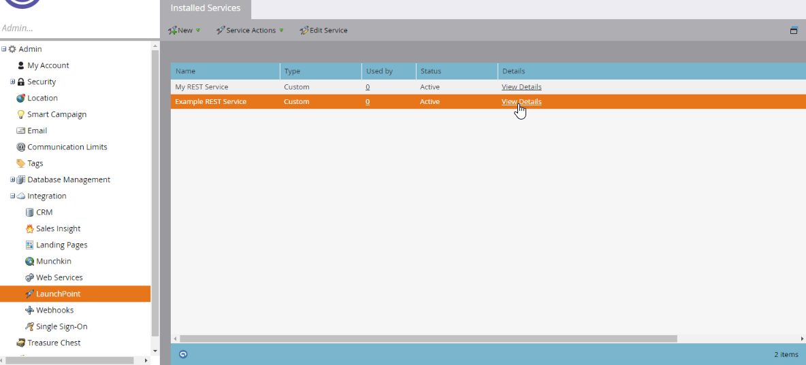

# Authentication

Marketo的REST API已透過雙腿OAuth 2.0驗證。使用者端ID和使用者端密碼由您定義的自訂服務提供。 每個自訂服務都由僅限API的使用者擁有，該使用者擁有一組可授權服務執行特定動作的角色和許可權。 存取權杖與單一自訂服務相關聯。 存取權杖到期與執行個體中可能存在之其他自訂服務相關聯的權杖無關。

## 建立存取Token

在`Client ID` > `Client Secret` > **[!UICONTROL Admin]**&#x200B;功能表中找到&#x200B;**[!UICONTROL Integration]**&#x200B;和&#x200B;**[!UICONTROL LaunchPoint]**，方法是選取自訂服務並按一下&#x200B;**[!UICONTROL View Details]**。




在REST API區段的`Identity URL` > **[!UICONTROL Admin]** > **[!UICONTROL Integration]**&#x200B;功能表中找到&#x200B;**[!UICONTROL Web Services]**。

使用HTTP GET （或POST）要求建立存取權杖，如下所示：

```
GET <Identity URL>/oauth/token?grant_type=client_credentials&client_id=<Client Id>&client_secret=<Client Secret>
```

如果您的請求有效，您會收到類似以下的JSON回應：

```json
{
    "access_token": "cdf01657-110d-4155-99a7-f986b2ff13a0:int",
    "token_type": "bearer",
    "expires_in": 3599,
    "scope": "apis@acmeinc.com"
}
```

回應定義

- `access_token` — 您隨著後續呼叫傳遞的Token，以驗證目標執行個體。
- `token_type` - OAuth驗證方法。
- `expires_in` — 目前Token的剩餘有效期限（以秒為單位） （超過此時間後即無效）。 存取權杖最初建立時，其有效期限為3600秒或一小時。
- `scope` — 用於驗證之自訂服務的擁有使用者。

## 使用存取權杖

呼叫REST API方法時，存取權杖必須包含在每個呼叫中，呼叫才能成功。
存取權杖必須以HTTP標頭傳送。

>[!IMPORTANT]
>
>自2026年1月31日起，將移除對使用`access_token`查詢引數的驗證支援。 如果您的專案使用查詢引數來傳遞存取Token，應儘快更新以使用[授權標頭](https://experienceleague.adobe.com/en/docs/marketo-developer/marketo/rest/authentication#using-an-access-token)。 新開發應僅使用`Authorization`標頭。

### 切換至Authorization標題

若要從使用`access_token`查詢引數切換為授權標頭，需要少量程式碼變更。

以CURL為例，此程式碼會傳送`access_token`值做為表單引數（ — F標幟）：

```bash
curl ...  -F access_token=<Access Token> <REST API Endpoint Base URL>/bulk/v1/apiCall.json
```

此程式碼會傳送與`Authorization: Bearer` http標頭相同的值（ — H標幟）：

```bash
curl ... -H 'Authorization: Bearer <Access Token>' <REST API Endpoint Base URL>/bulk/v1/apiCall.json
```

## 提示和最佳實務

管理存取權杖到期很重要，可確保您的整合順暢運作，並防止在正常作業期間發生未預期的驗證錯誤。 為整合設計驗證時，請務必儲存身分識別回應中包含的權杖和有效期。

在發出任何REST呼叫之前，您應該根據權杖的剩餘期限來檢查其有效性。 如果權杖已過期，請呼叫[身分](https://developer.adobe.com/marketo-apis/api/identity/#tag/Identity/operation/identityUsingGET)端點以更新權杖。 這有助於確保您的REST呼叫絕不會因為權杖過期而失敗。 這可協助您以可預測的方式管理REST呼叫的延遲，這對於面向使用者的應用程式至關重要。

如果使用過期的權杖來驗證REST呼叫，REST呼叫將失敗並傳回602錯誤代碼。 如果使用無效的權杖來驗證REST呼叫，則會傳回601錯誤代碼。 如果收到這些程式碼中的任一個，使用者端應呼叫身分識別端點以續約權杖。

如果您在權杖過期之前呼叫身分端點，回應中將會傳回相同的權杖及其剩餘期限。

請記住，您的存取權杖是按自訂服務而非使用者所擁有。 即使兩個身分識別回應的範圍可能屬於同一個使用者，但如果是透過來自兩個不同服務的憑證所建立，則存取權杖和到期日會彼此獨立。 當同一應用程式中有多組認證時，請記住這一點；使用者端ID可能是用來分別管理認證的有用金鑰。
