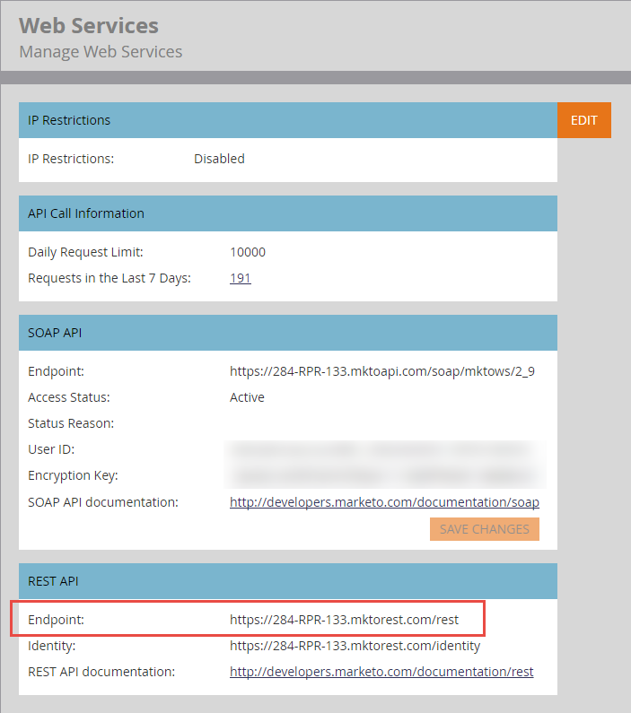

# 基礎 URL

每個API呼叫的[端點參考](endpoint-reference.md)檔案顯示REST方法、路徑、資源及引數，這些必須附加至基底URL才能形成要求。

以下是格式正確的REST URL範例：

`https://284-RPR-133.mktorest.com/rest/v1/lead/318581.json?fields=email,firstName,lastName`

由下列部分所組成：

- 基底URL： `https://284-RPR-133.mktorest.com/rest`
- 路徑： `/v1/lead/`
- 資源： `318582.json`
- 查詢引數： `fields=email,firstName,lastName`

基礎URL包含帳戶ID (亦即Munchkin ID)，因此每個Marketo訂閱都是唯一的。 您的基底URL是登入Marketo並導覽至&#x200B;**[!UICONTROL Admin]** > **[!UICONTROL Integration]** > **[!UICONTROL Web Services]**&#x200B;功能表所找到。 如下列熒幕擷取畫面所示，「REST API」區段底下標示為「端點：」。

找到基本URL後，請複製該URL，並將其納入您呼叫任何REST API時使用的URL中。
