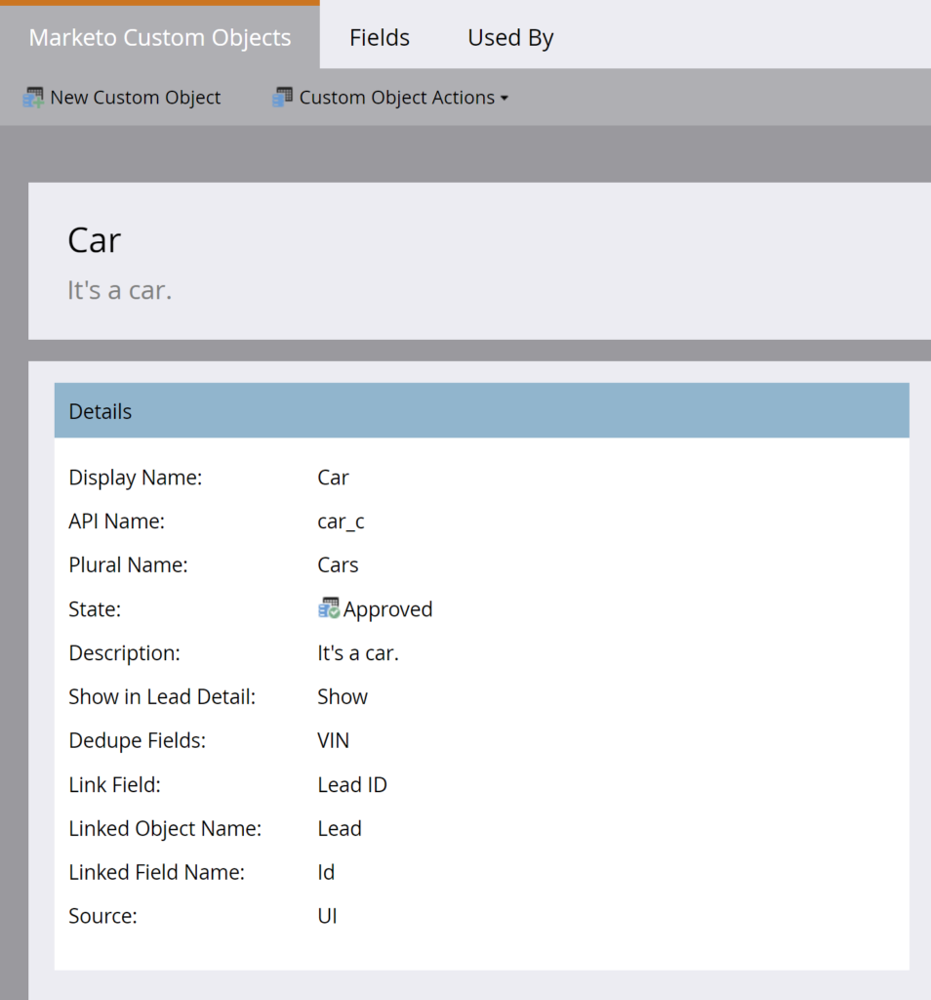
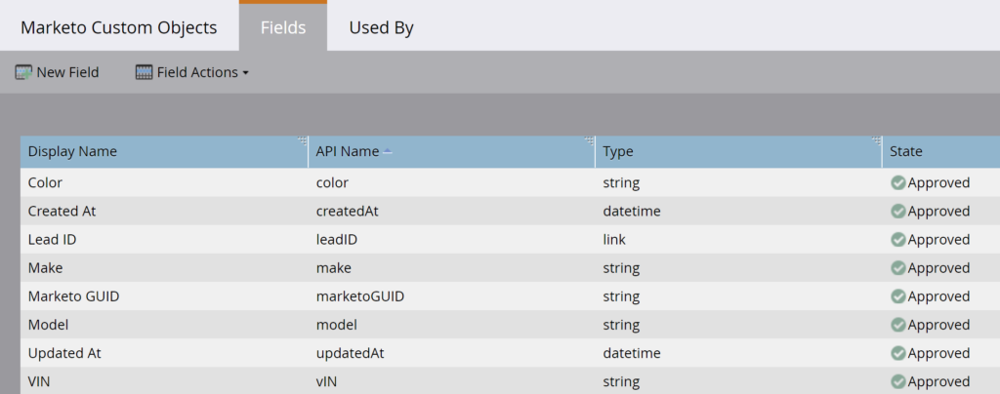

# 大量自訂物件擷取

[大量自訂物件擷取端點參考](https://developer.adobe.com/marketo-apis/api/mapi/#tag/Bulk-Export-Custom-Objects)

REST API的批次自訂物件擷取集合提供程式設計介面，可從Marketo中擷取大型自訂物件記錄集合。 此為建議使用的介面，用於需要在Marketo與一或多個外部系統之間持續交換資料（用於ETL、資料倉儲和封存）的使用案例。

此API支援匯出直接連結至潛在客戶的第一層Marketo自訂物件記錄。 傳入自訂物件的名稱，以及物件連結到的潛在客戶清單。 對於清單中的每個潛在客戶，符合指定自訂物件名稱的連結自訂物件記錄會以列寫入匯出檔案中。 可以在Marketo UI[中潛在客戶詳細資訊頁面的](https://experienceleague.adobe.com/zh-hant/docs/marketo/using/product-docs/administration/marketo-custom-objects/understanding-marketo-custom-objects)自訂物件標籤中檢視自訂物件資料。

## 權限

大量自訂物件擷取API需要API使用者擁有具有「唯讀自訂物件」或「讀寫自訂物件」許可權之一或兩者的角色。

## 篩選器

自訂物件擷取支援數個篩選器選項，這些選項用於指定連結至自訂物件的潛在客戶清單。 如果清單中的潛在客戶連結至符合指定自訂物件名稱的自訂物件記錄，則記錄會寫入匯出檔案。 每個匯出作業只能指定一個篩選器型別。

| 篩選器型別 | 資料類型 | 附註 |
|---|---|---|
| `updatedAt` | 日期範圍 | 接受具有成員`startAt`和`endAt` &amp;amp；nbsp的JSON物件。；`startAt`接受代表低浮水印的日期時間，而`endAt`接受代表高浮水印的日期時間。 範圍必須為31天或更少。 具有此篩選型別的工作會傳回在日期範圍內更新的所有可存取記錄。 日期時間應採用ISO-8601格式，不含毫秒。 |
| `staticListName` | 字串 | 接受靜態清單的名稱。 具有此篩選型別的工作會在工作開始處理時，傳回屬於靜態清單成員的所有可存取記錄。 使用取得清單端點擷取靜態清單名稱。 |
| `staticListId` | 整數 | 接受靜態清單的識別碼。 具有此篩選型別的工作會在工作開始處理時，傳回屬於靜態清單成員的所有可存取記錄。 使用取得清單端點擷取靜態清單ID。 |
| `smartListName`* | 字串 | 接受智慧清單的名稱。 具有此篩選型別的工作會傳回工作開始處理時屬於智慧列示成員的所有可存取記錄。 使用「取得智慧列示」端點擷取智慧列示名稱。 |
| `smartListId`* | 整數 | 接受智慧清單的識別碼。 具有此篩選型別的工作會傳回工作開始處理時屬於智慧列示成員的所有可存取記錄。 使用「取得智慧列示」端點擷取智慧列示ID。 |

部分訂閱無法使用篩選器型別。 如果您的訂閱無法使用，您在呼叫「建立匯出潛在客戶工作」端點時會收到錯誤（「1035，目標訂閱不受支援的篩選器型別」）。 客戶可以聯絡Marketo支援，以便在他們的訂閱中啟用此功能。

## 選項

[建立匯出自訂物件工作](https://developer.adobe.com/marketo-apis/api/mapi/#tag/Bulk-Export-Custom-Objects/operation/createExportCustomObjectsUsingPOST)端點提供數個格式選項。 這些選項讓使用者能夠：

- 指定要包含在匯出檔案中的欄位
- 重新命名這些欄位的欄標題
- 指定匯出檔案的格式

| 參數 | 資料類型 | 必要 | 附註 |
|---|---|---|---|
| `fields` | 陣列[字串] | 是 | 字串陣列，包含描述自訂物件端點傳回的自訂物件屬性名稱值。 列出的欄位會包含在匯出的檔案中。 |
| `columnHeaderNames` | 物件 | 無 | 包含欄位和欄標題名稱之索引鍵/值組的JSON物件。 索引鍵必須是匯出作業中包含的欄位名稱。 值是該欄位匯出的欄標題的名稱。 |
| `format` | 字串 | 無 | 接受以下其中之一：CSV、TSV、SSV。 匯出的檔案會分別呈現為逗號分隔值、定位字元分隔值或空格分隔值檔案（如果設定）。 如果未設定，則預設為CSV。 |

## 建立工作

使用[建立匯出自訂物件工作](https://developer.adobe.com/marketo-apis/api/mapi/#tag/Bulk-Export-Custom-Objects/operation/createExportCustomObjectsUsingPOST)端點開始匯出之前，會先定義工作的引數。

必要的`apiName`路徑引數是[描述自訂物件](https://developer.adobe.com/marketo-apis/api/mapi/#tag/Custom-Objects/operation/describeUsingGET_1)端點傳回的自訂物件名稱。 這會指定要匯出的Marketo自訂物件。 不允許CRM自訂物件。 必要的`filter`引數包含連結至自訂物件的潛在客戶清單。 這可以參考靜態清單或智慧清單。 必要的`fields`引數包含要包含在匯出檔案中的自訂物件屬性的API名稱。 我們可選擇定義檔案的`format`，以及`columnHeaderNames`。

例如，假設我們已建立名為「Car」的自訂物件，其欄位如下：顏色、製作、模型、VIN。 連結欄位是銷售機會ID，重複資料刪除欄位是VIN。

自訂物件定義



自訂物件欄位



我們可以呼叫[描述自訂物件](https://developer.adobe.com/marketo-apis/api/mapi/#tag/Custom-Objects/operation/describeUsingGET_1)，以程式設計方式檢查回應中`fields`屬性中所顯示的自訂物件屬性。

```
GET /rest/v1/customobjects/car_c/describe.json
```

```json
{
    "requestId": "148ef#1793e00f64f",
    "result": [
        {
            "name": "car_c",
            "displayName": "Car",
            "description": "It's a car.",
            "createdAt": "2021-05-05T16:14:41Z",
            "updatedAt": "2021-05-05T16:14:42Z",
            "idField": "marketoGUID",
            "dedupeFields": [
                "vIN"
            ],
            "searchableFields": [
                [
                    "vIN"
                ],
                [
                    "marketoGUID"
                ],
                [
                    "leadID"
                ]
            ],
            "relationships": [
                {
                    "field": "leadID",
                    "type": "child",
                    "relatedTo": {
                        "name": "Lead",
                        "field": "Id"
                    }
                }
            ],
            "fields": [
                {
                    "name": "createdAt",
                    "displayName": "Created At",
                    "dataType": "datetime",
                    "updateable": false,
                    "crmManaged": false
                },
                {
                    "name": "marketoGUID",
                    "displayName": "Marketo GUID",
                    "dataType": "string",
                    "length": 36,
                    "updateable": false,
                    "crmManaged": false
                },
                {
                    "name": "updatedAt",
                    "displayName": "Updated At",
                    "dataType": "datetime",
                    "updateable": false,
                    "crmManaged": false
                },
                {
                    "name": "color",
                    "displayName": "Color",
                    "dataType": "string",
                    "length": 255,
                    "updateable": true,
                    "crmManaged": false
                },
                {
                    "name": "leadID",
                    "displayName": "Lead ID",
                    "dataType": "integer",
                    "updateable": true,
                    "crmManaged": false
                },
                {
                    "name": "make",
                    "displayName": "Make",
                    "dataType": "string",
                    "length": 255,
                    "updateable": true,
                    "crmManaged": false
                },
                {
                    "name": "model",
                    "displayName": "Model",
                    "dataType": "string",
                    "length": 255,
                    "updateable": true,
                    "crmManaged": false
                },
                {
                    "name": "vIN",
                    "displayName": "VIN",
                    "dataType": "string",
                    "length": 255,
                    "updateable": true,
                    "crmManaged": false
                }
            ]
        }
    ],
    "success": true
}
```

使用[同步自訂物件](https://developer.adobe.com/marketo-apis/api/mapi/#tag/Custom-Objects/operation/syncCustomObjectsUsingPOST)端點建立數個自訂物件記錄，並將每個記錄連結至不同的銷售機會。 一個銷售機會可以連結到許多自訂物件記錄。 這稱為「一對多」關係。

```
POST /rest/v1/customobjects/car_c.json
```

```json
{
   "action":"createOrUpdate",
   "input":[
       {
           "leadId": 11,
           "color": "Pearl White",
           "make": "Tesla",
           "model": "Model S",
           "vIN": "5YJSA1E41FF156789"
       },
       {
           "leadId": 12,
           "color": "Midnight Silver Metallic",
           "make": "Tesla",
           "model": "Model X",
           "vIN": "LRWXB2B41FF198765"
       },
       {
           "leadId": 13,
           "color": "Fusion Red",
           "make": "Tesla",
           "model": "Roadster",
           "vIN": "SFGRC3C41FF154321"
       }
    ]
}
```

```json
{
    "requestId": "50d9#1793e066088",
    "result": [
        {
            "seq": 0,
            "marketoGUID": "d911eaa1-fd0b-4a99-9b71-c6a7233c782c",
            "status": "created"
        },
        {
            "seq": 1,
            "marketoGUID": "20d04ffb-51f0-4336-924c-c783b9bb4215",
            "status": "created"
        },
        {
            "seq": 2,
            "marketoGUID": "e7da4331-8e7a-473b-85c8-047638eb6c7f",
            "status": "created"
        }
    ],
    "success": true
}
```

上述三個銷售機會中的每一個都屬於名為「購車者」的靜態清單，其`id`為1081，如下表所示，請呼叫[依清單ID取得銷售機會](https://developer.adobe.com/marketo-apis/api/mapi/#tag/Static-Lists/operation/getLeadsByListIdUsingGET_1)端點。

```
GET /rest/v1/lists/1081/leads.json
```

```json
{
    "requestId": "d023#1793e1e982b",
    "result": [
        {
            "id": 11,
            "firstName": "Hanna",
            "lastName": "Crawford",
            "email": "208161Hanna.Crawford@pookmail.com",
            "updatedAt": "2020-01-16T02:38:22Z",
            "createdAt": "2017-07-27T01:38:42Z"
        },
        {
            "id": 12,
            "firstName": "Bertha",
            "lastName": "Fulton",
            "email": "208160Bertha.Fulton@trashymail.com",
            "updatedAt": "2020-01-16T02:38:22Z",
            "createdAt": "2017-07-27T01:38:42Z"
        },
        {
            "id": 13,
            "firstName": "Faith",
            "lastName": "England",
            "email": "208159Faith.England@dodgit.com",
            "updatedAt": "2020-01-16T02:38:22Z",
            "createdAt": "2017-07-27T01:38:42Z"
        }
    ],
    "success": true
}
```

現在，讓我們建立匯出作業來擷取這些記錄。 我們使用[建立匯出自訂物件工作](https://developer.adobe.com/marketo-apis/api/mapi/#tag/Bulk-Export-Custom-Objects/operation/createExportCustomObjectsUsingPOST)端點，在`fields`引數中指定自訂物件屬性，並在`filter`引數中指定靜態清單識別碼。

```
POST /bulk/v1/customobjects/car_c/export/create.json
```

```json
{
    "fields": [
        "leadId",
        "color",
        "make",
        "model",
        "vIN"
    ],
    "filter": {
        "staticListId": 1081
    }
}
```

```json
{
    "requestId": "8d2f#1793e289e87",
    "result": [
        {
            "exportId": "f2c03f1d-226f-47c1-a557-357af8c2b32a",
            "format": "CSV",
            "status": "Created",
            "createdAt": "2021-05-05T20:12:01Z"
        }
    ],
    "success": true
}
```

這會在回應中傳回一個狀態，指出工作已建立。 工作已定義並建立，但尚未開始。 若要這麼做，必須使用[並從建立狀態回應呼叫](https://developer.adobe.com/marketo-apis/api/mapi/#tag/Bulk-Export-Custom-Objects/operation/enqueueExportCustomObjectsUsingPOST)排入佇列匯出自訂物件工作`apiName`端點`exportId`。

```
POST /bulk/v1/customobjects/car_c/export/f2c03f1d-226f-47c1-a557-357af8c2b32a/enqueue.json
```

```json
{
    "requestId": "cfaf#1793e2a0762",
    "result": [
        {
            "exportId": "f2c03f1d-226f-47c1-a557-357af8c2b32a",
            "format": "CSV",
            "status": "Queued",
            "createdAt": "2021-05-05T20:12:01Z",
            "queuedAt": "2021-05-05T20:13:32Z"
        }
    ],
    "success": true
}
```

當有可用的匯出位置時，此回應會以初始`status`的「已排入佇列」回應，之後設為「正在處理」。

## 輪詢工作狀態

只能為同一API使用者建立的作業擷取狀態。

由於這是非同步端點，在建立作業後，我們必須輪詢其狀態以判斷其進度。 使用[取得匯出自訂物件工作狀態](https://developer.adobe.com/marketo-apis/api/mapi/#tag/Bulk-Export-Custom-Objects/operation/getExportCustomObjectsStatusUsingGET)端點進行輪詢。 狀態只會每60秒更新一次，因此不建議使用低於此值的輪詢頻率，並且在幾乎所有情況下仍然會太高。 狀態列位可能會以下列任一專案回應：已建立、已排入佇列、正在處理、已取消、已完成或失敗。

```
GET /bulk/v1/customobjects/{apiName}/export/{exportId}/status.json
```

```json
{
    "requestId": "14daa#1793e2cf9de",
    "result": [
        {
            "exportId": "f2c03f1d-226f-47c1-a557-357af8c2b32a",
            "format": "CSV",
            "status": "Processing",
            "createdAt": "2021-05-05T20:12:01Z",
            "queuedAt": "2021-05-05T20:13:32Z",
            "startedAt": "2021-05-05T20:14:15Z"
        }
    ],
    "success": true
}
```

狀態端點回應指出工作仍在處理中，因此檔案尚不可擷取。 工作`status`變更為「已完成」後，便可供下載。

```json
{
    "requestId": "14daa#1793e2cf9de",
    "result": [
        {
            "exportId": "f2c03f1d-226f-47c1-a557-357af8c2b32a",
            "format": "CSV",
            "status": "Completed",
            "createdAt": "2021-05-05T20:12:01Z",
            "queuedAt": "2021-05-05T20:13:32Z",
            "startedAt": "2021-05-05T20:14:15Z",
            "finishedAt": "2021-05-05T20:14:28Z",
            "numberOfRecords": 3,
            "fileSize": 182,
            "fileChecksum": "sha256:fac0cabc2352229c12e18b2fde03d1f24178bc71e9e926f520ae8d61bbe98c01"
        }
    ],
    "success": true
}
```

## 正在擷取您的資料

若要擷取已完成自訂物件匯出的檔案，只要使用您的[和](https://developer.adobe.com/marketo-apis/api/mapi/#tag/Bulk-Export-Custom-Objects/operation/getExportCustomObjectsFileUsingGET)呼叫`apiName`Get Export Custom Object File`exportId`端點即可。

回應包含以設定作業方式格式化的檔案。 端點會以檔案內容回應。 如果要求的自訂物件屬性是空的（不包含任何資料），則會將`null`放置在匯出檔案中的對應欄位中。

```
GET /bulk/v1/customobjects/car_c/export/f2c03f1d-226f-47c1-a557-357af8c2b32a/file.json
```

```csv
leadId,color,make,model,vIN
11,Pearl White,Tesla,Model S,5YJSA1E41FF156789
12,Midnight Silver Metallic,Tesla,Model X,LRWXB2B41FF198765
13,Fusion Red,Tesla,Roadster,SFGRC3C41FF154321
```

為了支援擷取資料的部分擷取和便於恢復擷取，檔案端點可選擇性地支援型別`Range`的HTTP標頭`bytes`。 如果未設定標頭，將會傳回所有內容。 您可以閱讀更多有關在Marketo [大量擷取](bulk-extract.md)中使用Range標頭的資訊。

## 取消工作

如果工作設定不正確或變得不必要，可以使用[取消匯出自訂物件工作](https://developer.adobe.com/marketo-apis/api/mapi/#tag/Bulk-Export-Custom-Objects/operation/getExportCustomObjectsFileUsingPOST)端點輕鬆取消工作。 此回應中包含`status`，指出工作已取消。

```
POST /bulk/v1/customobjects/car_c/export/f2c03f1d-226f-47c1-a557-357af8c2b32a/cancel.json
```

```json
{
    "requestId": "e5f9#179391286a7",
    "result": [
        {
            "exportId": "4a8cdd80-0d16-4dd6-9923-6ec97e30e91b",
            "format": "CSV",
            "status": "Cancelled",
            "createdAt": "2021-05-04T20:24:33Z"
        }
    ],
    "success": true
}
```
