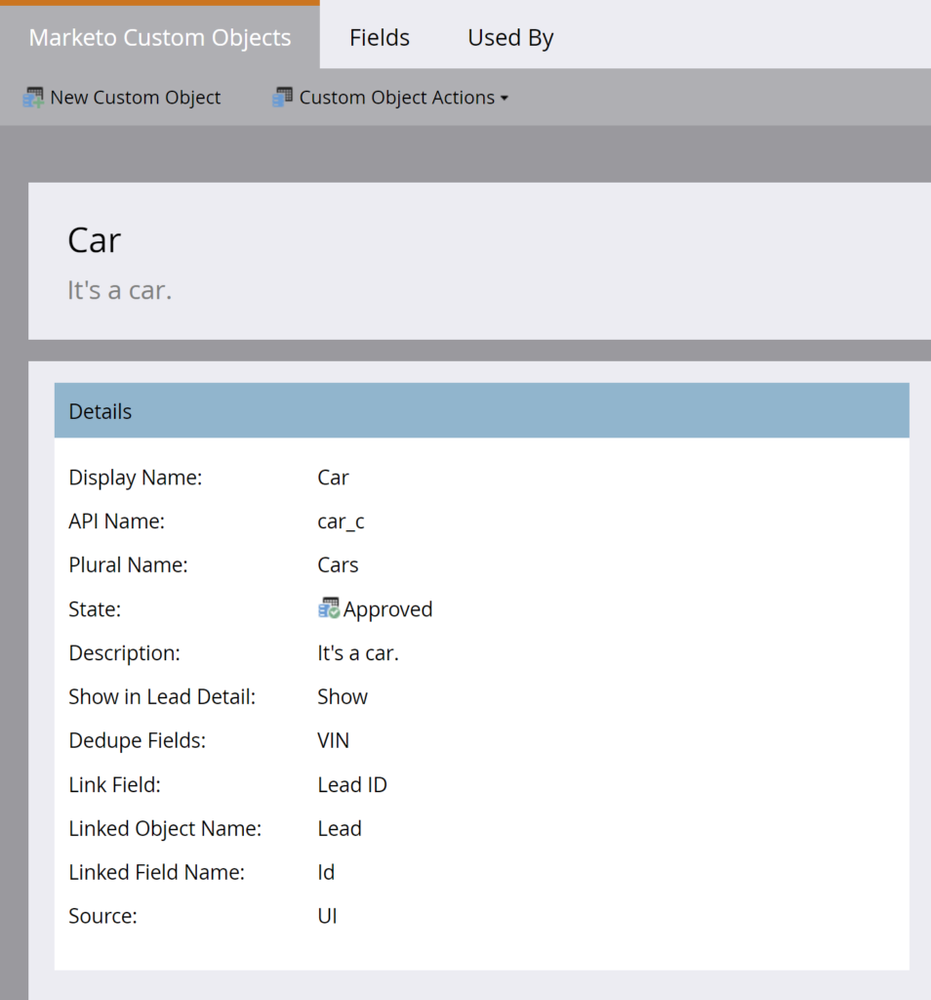
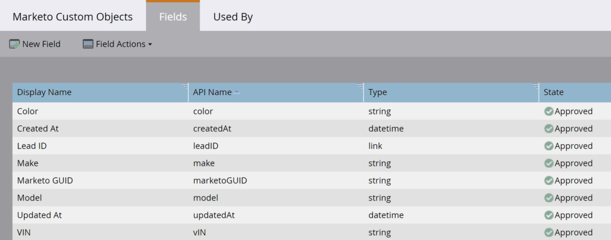

# 大量自訂物件擷取

[大量自訂物件擷取端點參考](https://developer.adobe.com/marketo-apis/api/mapi#tag/Bulk-Export-Custom-Objects)

大量自訂物件擷取REST API會從Marketo擷取大量自訂物件記錄。 使用這些API在Marketo和外部系統、ETL、資料倉儲和封存之間持續交換資料。

API會匯出直接連結至潛在客戶的第一級Marketo自訂物件記錄。 指定自訂物件名稱和連結的潛在客戶清單。 對於每個潛在客戶，API會將比對的連結自訂物件記錄寫入匯出檔案中的列。

您可以在Marketo UI](https://experienceleague.adobe.com/en/docs/marketo/using/product-docs/administration/marketo-custom-objects/understanding-marketo-custom-objects)中潛在客戶詳細資訊頁面的[自訂物件標籤中檢視自訂物件資料。

## 權限

API使用者必須具有具有唯讀自訂物件許可權、讀寫自訂物件許可權或兩者的角色。

## 篩選器

自訂物件擷取篩選器會指定連結至自訂物件的潛在客戶清單。 如果列出的銷售機會連結至符合指定自訂物件名稱的記錄，API會將這些記錄寫入匯出檔案。

每個匯出作業僅指定一個篩選器型別。

| 篩選器型別 | 資料類型 | 附註 |
| --- | --- | --- |
| `updatedAt` | 日期範圍 | 接受具有成員`startAt`和`endAt` &amp;nbsp.；`startAt`的JSON物件，接受代表低浮水印的日期時間，以及`endAt`接受代表高浮水印的日期時間。 範圍必須為31天或更少。 具有此篩選型別的工作會傳回在日期範圍內更新的所有可存取記錄。 日期時間應採用ISO-8601格式，不含毫秒。 |
| `staticListName` | 字串 | 接受靜態清單的名稱。 具有此篩選型別的工作會在工作開始處理時，傳回屬於靜態清單成員的所有可存取記錄。 使用取得清單端點擷取靜態清單名稱。 |
| `staticListId` | 整數 | 接受靜態清單的識別碼。 具有此篩選型別的工作會在工作開始處理時，傳回屬於靜態清單成員的所有可存取記錄。 使用取得清單端點擷取靜態清單ID。 |
| `smartListName`* | 字串 | 接受智慧清單的名稱。 具有此篩選型別的工作會傳回工作開始處理時屬於智慧列示成員的所有可存取記錄。 使用「取得智慧列示」端點擷取智慧列示名稱。 |
| `smartListId`* | 整數 | 接受智慧清單的識別碼。 具有此篩選型別的工作會傳回工作開始處理時屬於智慧列示成員的所有可存取記錄。 使用「取得智慧列示」端點擷取智慧列示ID。 |

部分訂閱不支援此篩選型別。 如果無法使用，[建立匯出潛在客戶工作]端點會傳回`1035, Unsupported filter type for target subscription`。 請聯絡Marketo支援，為您的訂閱請求此功能。

## 選項

[建立匯出自訂物件工作](https://developer.adobe.com/marketo-apis/api/mapi#operation/createExportCustomObjectsUsingPOST)端點提供下列選項：

- 指定要包含在匯出檔案中的欄位。
- 重新命名匯出的欄標題。
- 指定匯出檔案格式。

| 參數 | 資料類型 | 必要 | 附註 |
| --- | --- | --- | --- |
| `fields` | 陣列[字串] | 是 | 字串陣列，包含描述自訂物件端點傳回的自訂物件屬性名稱值。 列出的欄位會包含在匯出的檔案中。 |
| `columnHeaderNames` | 物件 | 無 | 包含欄位和欄標題名稱之索引鍵/值組的JSON物件。 索引鍵必須是匯出作業中包含的欄位名稱。 值是該欄位匯出的欄標題的名稱。 |
| `format` | 字串 | 無 | 接受以下其中之一：CSV、TSV、SSV。 匯出的檔案會分別呈現為逗號分隔值、定位字元分隔值或空格分隔值檔案（如果設定）。 如果未設定，則預設為CSV。 |

## 建立工作

使用[建立匯出自訂物件工作](https://developer.adobe.com/marketo-apis/api/mapi#operation/createExportCustomObjectsUsingPOST)端點來定義匯出工作。

請求會使用以下引數：

- `apiName`：必要的路徑引數。 使用[描述自訂物件](https://developer.adobe.com/marketo-apis/api/mapi#operation/describeUsingGET_1)端點傳回的名稱，指定要匯出的Marketo自訂物件。 不允許CRM自訂物件。
- `filter`：必要。 透過參考靜態清單或智慧清單來指定連結的銷售機會。
- `fields`：必要。 指定要包含在匯出檔案中的自訂物件屬性的API名稱。
- `format`：選擇性。 指定匯出檔案格式。
- `columnHeaderNames`：選擇性。 指定取代欄標題名稱。

此範例使用具有`Color`、`Make`、`Model`和`VIN`欄位的`Car`自訂物件。 連結欄位是銷售機會ID，重複資料刪除欄位是VIN。

自訂物件定義



自訂物件欄位



呼叫[描述自訂物件](https://developer.adobe.com/marketo-apis/api/mapi#operation/describeUsingGET_1)以程式設計方式檢查自訂物件屬性。 回應傳回`fields`中的屬性。

```http
GET /rest/v1/customobjects/car_c/describe.json
```

```json
{
    "requestId": "148ef#1793e00f64f",
    "result": [
        {
            "name": "car_c",
            "displayName": "Car",
            "description": "It's a car.",
            "createdAt": "2021-05-05T16:14:41Z",
            "updatedAt": "2021-05-05T16:14:42Z",
            "idField": "marketoGUID",
            "dedupeFields": [
                "vIN"
            ],
            "searchableFields": [
                [
                    "vIN"
                ],
                [
                    "marketoGUID"
                ],
                [
                    "leadID"
                ]
            ],
            "relationships": [
                {
                    "field": "leadID",
                    "type": "child",
                    "relatedTo": {
                        "name": "Lead",
                        "field": "Id"
                    }
                }
            ],
            "fields": [
                {
                    "name": "createdAt",
                    "displayName": "Created At",
                    "dataType": "datetime",
                    "updateable": false,
                    "crmManaged": false
                },
                {
                    "name": "marketoGUID",
                    "displayName": "Marketo GUID",
                    "dataType": "string",
                    "length": 36,
                    "updateable": false,
                    "crmManaged": false
                },
                {
                    "name": "updatedAt",
                    "displayName": "Updated At",
                    "dataType": "datetime",
                    "updateable": false,
                    "crmManaged": false
                },
                {
                    "name": "color",
                    "displayName": "Color",
                    "dataType": "string",
                    "length": 255,
                    "updateable": true,
                    "crmManaged": false
                },
                {
                    "name": "leadID",
                    "displayName": "Lead ID",
                    "dataType": "integer",
                    "updateable": true,
                    "crmManaged": false
                },
                {
                    "name": "make",
                    "displayName": "Make",
                    "dataType": "string",
                    "length": 255,
                    "updateable": true,
                    "crmManaged": false
                },
                {
                    "name": "model",
                    "displayName": "Model",
                    "dataType": "string",
                    "length": 255,
                    "updateable": true,
                    "crmManaged": false
                },
                {
                    "name": "vIN",
                    "displayName": "VIN",
                    "dataType": "string",
                    "length": 255,
                    "updateable": true,
                    "crmManaged": false
                }
            ]
        }
    ],
    "success": true
}
```

使用[同步自訂物件](https://developer.adobe.com/marketo-apis/api/mapi#operation/syncCustomObjectsUsingPOST)端點建立自訂物件記錄，並將每個記錄連結至潛在客戶。 潛在客戶可以連結至多個自訂物件記錄，建立一對多關係。

```http
POST /rest/v1/customobjects/car_c.json
```

```json
{
   "action":"createOrUpdate",
   "input":[
       {
           "leadId": 11,
           "color": "Pearl White",
           "make": "Tesla",
           "model": "Model S",
           "vIN": "5YJSA1E41FF156789"
       },
       {
           "leadId": 12,
           "color": "Midnight Silver Metallic",
           "make": "Tesla",
           "model": "Model X",
           "vIN": "LRWXB2B41FF198765"
       },
       {
           "leadId": 13,
           "color": "Fusion Red",
           "make": "Tesla",
           "model": "Roadster",
           "vIN": "SFGRC3C41FF154321"
       }
    ]
}
```

```json
{
    "requestId": "50d9#1793e066088",
    "result": [
        {
            "seq": 0,
            "marketoGUID": "d911eaa1-fd0b-4a99-9b71-c6a7233c782c",
            "status": "created"
        },
        {
            "seq": 1,
            "marketoGUID": "20d04ffb-51f0-4336-924c-c783b9bb4215",
            "status": "created"
        },
        {
            "seq": 2,
            "marketoGUID": "e7da4331-8e7a-473b-85c8-047638eb6c7f",
            "status": "created"
        }
    ],
    "success": true
}
```

此範例中的三個銷售機會屬於`Car Buyers`靜態清單，其值為`id` 1081。 呼叫[依清單ID](https://developer.adobe.com/marketo-apis/api/mapi#operation/getLeadsByListIdUsingGET_1)端點取得銷售機會，以擷取清單成員。

```http
GET /rest/v1/lists/1081/leads.json
```

```json
{
    "requestId": "d023#1793e1e982b",
    "result": [
        {
            "id": 11,
            "firstName": "Hanna",
            "lastName": "Crawford",
            "email": "208161Hanna.Crawford@pookmail.com",
            "updatedAt": "2020-01-16T02:38:22Z",
            "createdAt": "2017-07-27T01:38:42Z"
        },
        {
            "id": 12,
            "firstName": "Bertha",
            "lastName": "Fulton",
            "email": "208160Bertha.Fulton@trashymail.com",
            "updatedAt": "2020-01-16T02:38:22Z",
            "createdAt": "2017-07-27T01:38:42Z"
        },
        {
            "id": 13,
            "firstName": "Faith",
            "lastName": "England",
            "email": "208159Faith.England@dodgit.com",
            "updatedAt": "2020-01-16T02:38:22Z",
            "createdAt": "2017-07-27T01:38:42Z"
        }
    ],
    "success": true
}
```

若要擷取這些記錄，請呼叫[建立匯出自訂物件工作](https://developer.adobe.com/marketo-apis/api/mapi#operation/createExportCustomObjectsUsingPOST)端點。 在`fields`中指定自訂物件屬性，並在`filter`中指定靜態清單識別碼。

```http
POST /bulk/v1/customobjects/car_c/export/create.json
```

```json
{
    "fields": [
        "leadId",
        "color",
        "make",
        "model",
        "vIN"
    ],
    "filter": {
        "staticListId": 1081
    }
}
```

```json
{
    "requestId": "8d2f#1793e289e87",
    "result": [
        {
            "exportId": "f2c03f1d-226f-47c1-a557-357af8c2b32a",
            "format": "CSV",
            "status": "Created",
            "createdAt": "2021-05-05T20:12:01Z"
        }
    ],
    "success": true
}
```

回應會確認工作已建立，但匯出不會自動啟動。 傳遞`apiName`及傳回的`exportId`至[排入佇列匯出自訂物件工作](https://developer.adobe.com/marketo-apis/api/mapi#operation/enqueueExportCustomObjectsUsingPOST)端點以啟動工作。

```http
POST /bulk/v1/customobjects/car_c/export/f2c03f1d-226f-47c1-a557-357af8c2b32a/enqueue.json
```

```json
{
    "requestId": "cfaf#1793e2a0762",
    "result": [
        {
            "exportId": "f2c03f1d-226f-47c1-a557-357af8c2b32a",
            "format": "CSV",
            "status": "Queued",
            "createdAt": "2021-05-05T20:12:01Z",
            "queuedAt": "2021-05-05T20:13:32Z"
        }
    ],
    "success": true
}
```

排入佇列的回應最初傳回`Queued`狀態。 匯出位置可用時，狀態會變更為`Processing`。

## 輪詢工作狀態

您只能擷取相同API使用者所建立之工作的狀態。

因為匯出是以非同步方式執行，請使用[取得匯出自訂物件工作狀態](https://developer.adobe.com/marketo-apis/api/mapi#operation/getExportCustomObjectsStatusUsingGET)端點來輪詢其進度。 狀態只會每60秒更新一次，因此請勿更頻繁地輪詢。

狀態可以是`Created`、`Queued`、`Processing`、`Canceled`、`Completed`或`Failed`。

```http
GET /bulk/v1/customobjects/{apiName}/export/{exportId}/status.json
```

```json
{
    "requestId": "14daa#1793e2cf9de",
    "result": [
        {
            "exportId": "f2c03f1d-226f-47c1-a557-357af8c2b32a",
            "format": "CSV",
            "status": "Processing",
            "createdAt": "2021-05-05T20:12:01Z",
            "queuedAt": "2021-05-05T20:13:32Z",
            "startedAt": "2021-05-05T20:14:15Z"
        }
    ],
    "success": true
}
```

此回應顯示工作仍在處理中，因此檔案無法使用。 當工作狀態變更為`Completed`時，檔案已可供下載。

```json
{
    "requestId": "14daa#1793e2cf9de",
    "result": [
        {
            "exportId": "f2c03f1d-226f-47c1-a557-357af8c2b32a",
            "format": "CSV",
            "status": "Completed",
            "createdAt": "2021-05-05T20:12:01Z",
            "queuedAt": "2021-05-05T20:13:32Z",
            "startedAt": "2021-05-05T20:14:15Z",
            "finishedAt": "2021-05-05T20:14:28Z",
            "numberOfRecords": 3,
            "fileSize": 182,
            "fileChecksum": "sha256:fac0cabc2352229c12e18b2fde03d1f24178bc71e9e926f520ae8d61bbe98c01"
        }
    ],
    "success": true
}
```

## 正在擷取您的資料

若要擷取已完成的自訂物件匯出，請將`apiName`和`exportId`傳遞至[取得匯出自訂物件檔案](https://developer.adobe.com/marketo-apis/api/mapi#operation/getExportCustomObjectsFileUsingGET)端點。

端點會以為作業設定的格式傳回檔案。 如果要求的自訂物件屬性不含任何資料，則對應的匯出欄位會包含`null`。

```http
GET /bulk/v1/customobjects/car_c/export/f2c03f1d-226f-47c1-a557-357af8c2b32a/file.json
```

```csv
leadId,color,make,model,vIN
11,Pearl White,Tesla,Model S,5YJSA1E41FF156789
12,Midnight Silver Metallic,Tesla,Model X,LRWXB2B41FF198765
13,Fusion Red,Tesla,Roadster,SFGRC3C41FF154321
```

對於部分或可恢復擷取，檔案端點支援範圍型別為`bytes`的可選HTTP `Range`標頭。 如果您未設定標頭，端點會傳回整個檔案。 如需詳細資訊，請參閱[大量擷取](bulk-extract.md)。

## 取消工作

若要取消設定錯誤或不再需要的工作，請呼叫[取消匯出自訂物件工作](https://developer.adobe.com/marketo-apis/api/mapi#operation/cancelExportCustomObjectsUsingPOST)端點。 回應狀態表示作業已取消。

```http
POST /bulk/v1/customobjects/car_c/export/f2c03f1d-226f-47c1-a557-357af8c2b32a/cancel.json
```

```json
{
    "requestId": "e5f9#179391286a7",
    "result": [
        {
            "exportId": "4a8cdd80-0d16-4dd6-9923-6ec97e30e91b",
            "format": "CSV",
            "status": "Cancelled",
            "createdAt": "2021-05-04T20:24:33Z"
        }
    ],
    "success": true
}
```
