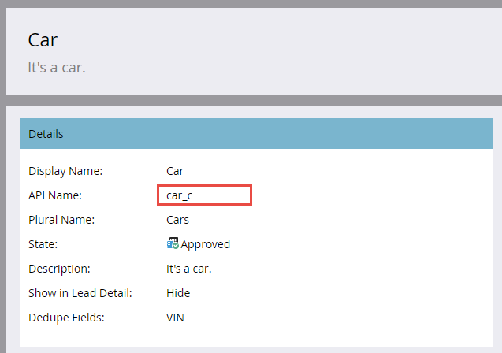
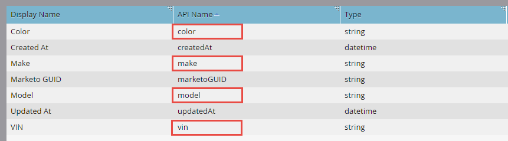

# 大量自訂物件匯入

[大量自訂物件匯入端點參考](https://developer.adobe.com/marketo-apis/api/mapi/#tag/Bulk-Import-Custom-Objects)

如果要匯入許多自訂物件記錄，最佳做法是使用大量API以非同步方式匯入它們。 這是透過匯入包含分隔記錄（逗號、定位字元或分號）的純文字檔案來完成的。 檔案可包含任意數量的記錄，但大小必須小於10MB （否則會傳回HTTP 413狀態代碼）。 檔案的內容取決於您的自訂物件定義。 第一列一律包含標題，列出要將每列的值對應到的欄位。 標題中的所有欄位名稱都必須符合API名稱（如下所述）。 其餘的列包含要匯入的資料，每列有一筆記錄。 記錄作業僅限「插入或更新」。

## 處理限制

在限制內，您可以提交多個大量匯入請求。 每個請求都會當作工作新增至FIFO佇列進行處理。 最多可同時處理兩個工作。 在任何指定時間，佇列中最多允許10個工作（包括目前處理的2個）。 如果超過十個作業的上限，則會傳回「1016，匯入次數過多」錯誤。

## 自訂物件範例

在使用大量API之前，您必須先使用Marketo管理UI [建立自訂物件](https://experienceleague.adobe.com/en/docs/marketo/using/product-docs/administration/marketo-custom-objects/create-marketo-custom-objects). 例如，假設我們已建立具有「顏色」、「製作」、「模型」和「VIN」欄位的「Car」自訂物件。 以下是顯示自訂物件的管理員UI畫面。 您可以看到我們使用VIN欄位進行重複資料刪除。 這些API名稱會強調顯示，因為在呼叫大量API相關端點時必須使用這些名稱。



以下是管理UI中顯示的自訂物件欄位。



### API名稱

您可以將自訂物件API名稱傳遞至 [描述自訂物件](#describe) 端點。

```
/rest/v1/customobjects/{apiName}/describe.json
```

```json
{
    "requestId": "46ff#15a686e66de",
    "result": [
        {
            "name": "car_c",
            "displayName": "Car",
            "description": "It's a car.",
            "createdAt": "2017-02-22T19:55:51Z",
            "updatedAt": "2017-02-22T19:55:51Z",
            "idField": "marketoGUID",
            "dedupeFields": [
                "vin"
            ],
            "searchableFields": [
                [
                    "vin"
                ],
                [
                    "marketoGUID"
                ]
            ],
            "fields": [
                {
                    "name": "createdAt",
                    "displayName": "Created At",
                    "dataType": "datetime",
                    "updateable": false
                },
                {
                    "name": "marketoGUID",
                    "displayName": "Marketo GUID",
                    "dataType": "string",
                    "length": 36,
                    "updateable": false
                },
                {
                    "name": "updatedAt",
                    "displayName": "Updated At",
                    "dataType": "datetime",
                    "updateable": false
                },
                {
                    "name": "color",
                    "displayName": "Color",
                    "dataType": "string",
                    "length": 255,
                    "updateable": true
                },
                {
                    "name": "make",
                    "displayName": "Make",
                    "dataType": "string",
                    "length": 255,
                    "updateable": true
                },
                {
                    "name": "model",
                    "displayName": "Model",
                    "dataType": "string",
                    "length": 255,
                    "updateable": true
                },
                {
                    "name": "vin",
                    "displayName": "VIN",
                    "dataType": "string",
                    "length": 255,
                    "updateable": true
                }
            ]
        }
    ],
    "success": true
}
```

### 匯入檔案

現在，假設您要匯入三筆「Car」自訂物件記錄。 使用逗號分隔格式(CSV)時，檔案可能如下所示：

```
color,make,model,vin
red,bmw,2002,WBA4R7C55HK895912
yellow,bmw,320i,WBA4R7C30HK896061
blue,bmw,325i,WBS3U9C52HP970604
```

第1行是標題，第2-4行是自訂物件資料記錄。

## 建立工作

若要提出大量匯入請求，您必須在的路徑中包含自訂物件的API名稱 [匯入自訂物件](https://developer.adobe.com/marketo-apis/api/mapi/#tag/Identity/operation/identityUsingPOST) 端點。 您還必須包含參照匯入檔案名稱的「file」引數，以及指定匯入檔案分隔方式的「format」引數（「csv」、「tsv」或「ssv」）。

```
POST /bulk/v1/customobjects/{apiName}/import.json?format=csv
```

```
Transfer-Encoding: chunked
Content-Type: multipart/form-data; boundary=----WebKitFormBoundaryXjWP6BP8Ciq6bPeo
Content-Length: 290
Host: <munchkinId>.mktorest.com
```

```
------WebKitFormBoundaryXjWP6BP8Ciq6bPeo
Content-Disposition: form-data; name="file"; filename="custom_object_import.csv"
Content-Type: text/csv

color,make,model,vin
red,bmw,2002,WBA4R7C55HK895912
yellow,bmw,320i,WBA4R7C30HK896061
blue,bmw,325i,WBS3U9C52HP970604
------WebKitFormBoundaryXjWP6BP8Ciq6bPeo--
```

```json
{
    "requestId": "c015#15a68a23418",
    "result": [
        {
            "batchId": 1013,
            "status": "Queued",
            "objectApiName": "car_c"
        }
    ],
    "success": true
}
```

在此範例中，我們指定了「csv」格式，並將匯入檔案命名為「custom_object_import.csv」。

請注意，在回應我們呼叫時，這裡沒有成功或失敗清單，就像您會從同步自訂物件端點返回一樣。 相反地，您會收到 `batchId`. 這是因為呼叫為非同步呼叫，且可能傳回 `status` 「已排入佇列」、「正在匯入」或「失敗」的專案。 您應該保留batchId，以便取得匯入工作的狀態，或在完成時擷取失敗和/或警告。 batchId的有效期為七天。

複製大量匯入請求的簡單方法是使用命令列的curl：

```
curl -X POST -i -F format='csv' -F file='@custom_object_import.csv' -F access_token='<Access Token>' <REST API Endpoint URL>/bulk/v1/customobjects/car_c/import.json
```

其中匯入檔案「custom_object_import.csv」包含以下內容：

```
color,make,model,vin
red,bmw,2002,WBA4R7C55HK895912
yellow,bmw,320i,WBA4R7C30HK896061
blue,bmw,325i,WBS3U9C52HP970604
```

## 輪詢工作狀態

建立匯入工作之後，您必須查詢其狀態。 最佳實務是每5到30秒輪詢匯入工作。 若要這麼做，請傳遞自訂物件的API名稱和 `batchId` 在至的路徑中 [取得匯入自訂物件狀態](https://developer.adobe.com/marketo-apis/api/mapi/#tag/Bulk-Import-Custom-Objects/operation/getImportCustomObjectStatusUsingGET) 端點。

```
GET /bulk/v1/customobjects/{apiName}/import/{batchId}/status.json
```

```json
{
    "requestId": "2a5#15a68dd9be1",
    "result": [
        {
            "batchId": 1013,
            "operation": "import",
            "status": "Complete",
            "objectApiName": "car_c",
            "numOfObjectsProcessed": 3,
            "numOfRowsFailed": 0,
            "numOfRowsWithWarning": 0,
            "importTime": "2 second(s)",
            "message": "Import succeeded, 3 records imported (3 members)"
        }
    ],
    "success": true
}
```

此回應會顯示已完成的匯入，但 `status` 可以是下列其中一項：完成、已排入佇列、匯入、失敗。 如果工作已完成，則會列出已處理的列數、失敗和警告。 訊息屬性也是尋找其他工作資訊的好地方。

## 失敗

失敗由以下指示 `numOfRowsFailed` 中的屬性 [取得匯入自訂物件狀態](https://developer.adobe.com/marketo-apis/api/mapi/#tag/Bulk-Import-Custom-Objects/operation/getImportCustomObjectStatusUsingGET) 回應。 如果numOfRowsFailed大於零，則該值表示發生的失敗次數。 呼叫 [取得匯入自訂物件失敗](https://developer.adobe.com/marketo-apis/api/mapi/#tag/Bulk-Import-Custom-Objects/operation/getImportCustomObjectFailuresUsingGET) 端點以取得包含失敗詳細資料的檔案。 同樣地，您必須傳遞自訂物件API名稱並 `batchId` 路徑中。 如果不存在失敗檔案，則會傳回HTTP 404狀態代碼。

繼續此範例，我們可以修改標題並將「vin」變更為「vin」（在逗號和「vin」之間新增空格）以強制失敗。

```
color,make,model, vin
```

當我們重新匯入並檢查狀態時，我們會看到此回應包含 `numRowsFailed`：3. 這表示有三個失敗。

```
GET /bulk/v1/customobjects/car_c/import/{batchId}/status.json
```

```json
{
    "requestId": "12260#15a68f491ed",
    "result": [
        {
            "batchId": 1016,
            "operation": "import",
            "status": "Complete",
            "objectApiName": "car_c",
            "numOfObjectsProcessed": 0,
            "numOfRowsFailed": 3,
            "numOfRowsWithWarning": 0,
            "importTime": "1 second(s)",
            "message": "Import completed with errors, 0 records imported (0 members), 3 failed"
        }
    ],
    "success": true
}
```

現在進行「取得匯入自訂物件失敗」端點呼叫，以取得其他失敗詳細資料：

```
GET /bulk/v1/customobjects/car_c/import/{batchId}/failures.json
```

```
color,make,model, vin,Import Failure Reason
red,bmw,2002,WBA4R7C55HK895912,missing.dedupe.fields
yellow,bmw,320i,WBA4R7C30HK896061,missing.dedupe.fields
blue,bmw,325i,WBS3U9C52HP970604,missing.dedupe.fields
```

我們可以看到我們遺漏了重複資料刪除的欄位 `vin`.

## 警告

警告會以下列方式表示 `numOfRowsWithWarning` 屬性在取得匯入自訂物件狀態回應中。 如果numOfRowsWithWarning大於零，則該值表示警告發生的次數。 呼叫 [取得匯入自訂物件警告](https://developer.adobe.com/marketo-apis/api/mapi/#tag/Bulk-Import-Custom-Objects/operation/getImportCustomObjectWarningsUsingGET) 端點以取得包含警告詳細資料的檔案。 同樣地，您必須傳遞自訂物件API名稱並 `batchId` 路徑中。 如果警告檔案不存在，則會傳回HTTP 404狀態代碼。

```
GET /bulk/v1/customobjects/car_c/import/{batchId}/warnings.json
```
