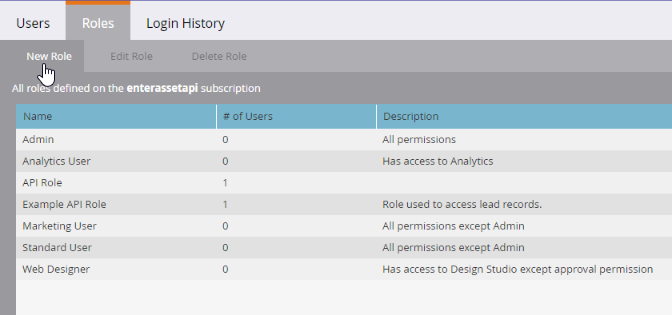

# 自訂服務

自訂服務會提供認證以使用Marketo進行驗證。 需要認證才能從Marketo [身分識別服務](https://developer.adobe.com/marketo-apis/api/identity/#tag/Identity/operation/identityUsingGET)取得存取權杖。 每個自訂服務的範圍限定為單一API專用使用者，自訂服務會從中衍生其許可權。

## 角色

建立自訂服務的第一步是建立可套用至相關「僅限API」使用者的角色。 這是從&#x200B;**[!UICONTROL Admin]** > **[!UICONTROL Users & Roles]** > **[!UICONTROL Roles]**&#x200B;功能表完成的。

角色是個別許可權的容器，可允許或限制存取特定功能。 在已啟用工作區與分割區的訂閱中，會根據工作區授予許可權。 如果使用者在一個工作區中擁有許可權，但在另一個工作區沒有許可權，則他們只能在該工作區中執行允許的動作。 若要建立角色，請按一下新增角色按鈕。

請務必為您的角色提供描述性名稱。 僅限API的使用者具有一組特定的許可權，這些許可權與一般使用者許可權不同且互不相同。 API許可權存在於「存取API」樹狀結構下方的階層中。

### 角色許可權

只有「存取API」群組中的許可權會套用至API使用者，也就是說，授予所有管理員許可權不會將任何API許可權授予使用者。

建構角色時，請仔細考慮您應該允許應用程式使用此角色來執行哪些動作。 僅授予執行這些動作所需的最低許可權集。 允許不必要的許可權集可允許整合在您的訂閱中執行不需要的動作。 您可以使用[許可權工具](endpoint-reference.md)來決定您的最小許可權集。 檢視[許可權](#permission_list)的完整清單。

## 使用者

建立角色後，您必須建立「僅限API」使用者。 僅限API的使用者是Marketo中的特殊使用者型別，因為他們由其他使用者管理，且無法用於登入Marketo。 僅限API的使用者可以：

- 建立自訂服務
- 這些服務的範圍許可權
- 存取REST API

>[!MORELIKETHIS]
>
>若要建立僅限API的使用者，請前往「**[!UICONTROL Admin]** > **[!UICONTROL Users & Roles]** > **[!UICONTROL Users]**」功能表並按一下「[!UICONTROL Invite New User]」。

根據使用者將使用的服務和應用程式，為使用者提供描述性名稱和電子郵件地址（不一定有效）。 填寫對話方塊選單中的必填欄位，按一下「僅限API」核取方塊，然後將您的其中一個API角色授予使用者。 這會將該角色的許可權集指派給使用者。

最後，按一下「傳送」以建立僅限API的使用者。

在布建具有認證的新應用程式時，強烈考慮為該服務建立新的使用者，即使它具有與其他現有整合相同的許可權集。 系統會根據每位使用者來追蹤API呼叫使用量統計資料和錯誤，因此為每個應用程式布建使用者，可協助您隔離特定應用程式的使用量和問題。 如果您遇到達到每日API呼叫限制的問題，或整合所進行的API呼叫所造成的錯誤，這個方法就能派上用場。

## 自訂服務

自訂服務會提供使用Marketo執行個體執行驗證所需的實際憑證（使用者端ID和使用者端密碼）。 若要布建一個，請移至您的&#x200B;**[!UICONTROL Admin]** > **[!UICONTROL Integrations]** > **[!UICONTROL LaunchPoint]**&#x200B;功能表，然後選取&#x200B;**[!UICONTROL New Service]**。

為服務指定描述性名稱，並從「服務」清單中選取「自訂」。 提供您服務的詳細描述，並從[僅限API使用者]清單中選取適當的使用者，然後按一下[!UICONTROL Create]。

這會將新服務新增至您的LaunchPoint服務清單，以及「檢視詳細資料」的選項。 按一下「檢視詳細資料」，系統就會提供驗證所需的使用者端ID和使用者端密碼、擁有的使用者，以及取得權杖以用於短期測試目的的選項。 您從此對話方塊取得的權杖，其存留期與一般從[身分識別服務](https://developer.adobe.com/marketo-apis/api/identity/#tag/Identity/operation/identityUsingGET)取得的權杖相同，並且從建立起的3,600秒內有效。

## 工作區與分割區

在具有Workspaces和Partitions的訂閱中，存取指定記錄或資產的能力是根據使用者角色在指定工作區中的許可權授與的。 每個工作區都可以存取「工作區與分割區」功能表中的一或多個分割區，而且銷售機會屬於單一分割區。 如果僅限API的使用者有權讀取或寫入工作區中的潛在客戶記錄，則其能夠存取該工作區有權存取之分割中的所有記錄。

Assets屬於工作區，因此讀取或寫入資產的能力取決於使用者是否在相關工作區中擁有角色，且角色有權在工作區中讀取或寫入該型別的資產記錄。

## 許可權清單

以下為僅限API使用者可用的所有許可權清單，以及使用者允許具有該API許可權的使用者執行哪些操作。

| 角色許可權 | 授予存取權…… |
| --- | --- |
| 核准Assets | 核准資產 |
| 執行行銷活動 | 請求或排程行銷活動 |
| 唯讀活動 | 擷取潛在客戶活動 |
| 唯讀活動中繼資料 | 擷取潛在客戶活動中繼資料 |
| 唯讀Assets | 擷取資產詳細資訊 |
| 唯讀行銷活動 | 擷取行銷活動詳細資料 |
| 唯讀公司 | 擷取公司詳細資料 |
| 唯讀自訂物件 | 擷取自訂物件詳細資料 |
| 唯讀銷售機會 | 擷取銷售機會詳細資料 |
| 唯讀具名帳戶 | 擷取具名帳戶詳細資料 |
| 唯讀具名帳戶清單 | 擷取具名帳戶清單詳細資料 |
| 唯讀機會 | 擷取機會詳細資料 |
| 唯讀銷售人員 | 擷取銷售人員詳細資料 |
| 讀寫活動 | 擷取和建立潛在客戶活動 |
| 讀寫活動中繼資料 | 擷取和建立潛在客戶活動中繼資料 |
| 讀寫Assets | 擷取、建立和更新資產 |
| 讀寫行銷活動 | 擷取、建立和更新行銷活動 |
| 讀寫公司 | 擷取、建立和更新公司 |
| 讀寫自訂物件 | 擷取、建立和更新自訂物件 |
| 讀寫潛在客戶 | 擷取、建立和更新潛在客戶詳細資訊 |
| 讀寫具名帳戶 | 擷取、建立和更新具名帳戶 |
| 讀寫具名帳戶清單 | 擷取、建立和更新具名帳戶清單 |
| 讀寫機會 | 擷取、建立和更新商機 |
| 讀寫銷售人員 | 擷取、建立和更新銷售人員 |
