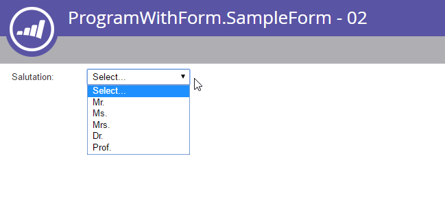

# Forms

[Forms端點參考](https://developer.adobe.com/marketo-apis/api/asset/#tag/Forms)

[表單欄位端點參考](https://developer.adobe.com/marketo-apis/api/asset/#tag/Form-Fields)

Marketo表單具有一組複雜的端點，可完全控制遠端系統的表單管理。 表單的結構可能很複雜，因為有許多不同型別的物件必須作為表單的一部分進行管理：Forms、欄位、欄位集、可見性規則和後續頁面規則。

## 查詢

Forms支援資產擷取的標準方法，識別碼為[&#128279;](https://developer.adobe.com/marketo-apis/api/asset/#tag/Forms/operation/getLpFormByIdUsingGET)的[、名稱為](https://developer.adobe.com/marketo-apis/api/asset/#tag/Forms/operation/getLpFormByNameUsingGET)的[以及瀏覽為](https://developer.adobe.com/marketo-apis/api/asset/#tag/Forms/operation/browseForms2UsingGET)的。 每個表單回應都包含其所有屬性，但欄位清單除外。

### 依ID

[依ID取得表單](https://developer.adobe.com/marketo-apis/api/asset/#tag/Forms/operation/getLpFormByIdUsingGET)將表單`id`作為路徑引數並傳回表單記錄。

```
GET /rest/asset/v1/form/{id}.json
```

```json
{
    "success": true,
    "warnings": [],
    "errors": [],
    "requestId": "948f#154e3bad8e3",
    "result": [
        {
            "id": 736,
            "name": "newForm",
            "description": "test",
            "createdAt": "2016-05-24T17:05:54Z+0000",
            "updatedAt": "2016-05-24T17:05:54Z+0000",
            "url": "https://app-devlocal1.marketo.com/#FO736B2",
            "status": "draft",
            "theme": "simple",
            "language": "French",
            "locale": "fr_FR",
            "progressiveProfiling": false,
            "labelPosition": "left",
            "fontFamily": "Helvetica",
            "fontSize": "13px",
            "folder": {
                "type": "Folder",
                "value": 293,
                "folderName": "yyLNLHzgOM"
            },
            "knownVisitor": {
                "type": "form",
                "template": null
            },
            "thankYouList": [
                {
                    "followupType": "none",
                    "followupValue": null,
                    "default": true
                }
            ],
            "buttonLocation": 120,
            "buttonLabel": "Envoyer",
            "waitingLabel": "Veuillez patienter"
        }
    ]
}
```

### 依名稱

[依名稱取得表單](https://developer.adobe.com/marketo-apis/api/asset/#tag/Forms/operation/getLpFormByNameUsingGET)將表單`name`作為路徑引數並傳回表單記錄。

```
GET /rest/asset/v1/form/byName.json?name=newForm
```

```json
{
    "success": true,
    "warnings": [],
    "errors": [],
    "requestId": "948f#154e3bad8e3",
    "result": [
        {
            "id": 736,
            "name": "newForm",
            "description": "test",
            "createdAt": "2016-05-24T17:05:54Z+0000",
            "updatedAt": "2016-05-24T17:05:54Z+0000",
            "url": "https://app-devlocal1.marketo.com/#FO736B2",
            "status": "draft",
            "theme": "simple",
            "language": "French",
            "locale": "fr_FR",
            "progressiveProfiling": false,
            "labelPosition": "left",
            "fontFamily": "Helvetica",
            "fontSize": "13px",
            "folder": {
                "type": "Folder",
                "value": 293,
                "folderName": "yyLNLHzgOM"
            },
            "knownVisitor": {
                "type": "form",
                "template": null
            },
            "thankYouList": [
                {
                    "followupType": "none",
                    "followupValue": null,
                    "default": true
                }
            ],
            "buttonLocation": 120,
            "buttonLabel": "Envoyer",
            "waitingLabel": "Veuillez patienter"
        }
    ]
}
```

### 瀏覽

[取得Forms](https://developer.adobe.com/marketo-apis/api/asset/#tag/Forms/operation/browseForms2UsingGET)表單的運作方式與其他資產API瀏覽端點類似，並允許對`status`、`maxReturn`和`offset`進行選擇性篩選。 狀態可以是：已核准、已核准且具有草稿，或草稿。

```
GET /rest/asset/v1/forms.json
```

```json
{
    "success": true,
    "warnings": [],
    "errors": [],
    "requestId": "645d#154e3d499ac",
    "result": [
        {
            "id": 227,
            "name": "aKAUVDfbsX",
            "description": "",
            "createdAt": "2016-05-18T20:36:20Z+0000",
            "updatedAt": "2016-05-18T20:36:20Z+0000",
            "url": "https://app-devlocal1.marketo.com/#FO227B2",
            "status": "draft",
            "theme": "simple",
            "language": "English",
            "locale": "en_US",
            "progressiveProfiling": false,
            "labelPosition": "left",
            "fontFamily": "Helvetica",
            "fontSize": "13px",
            "folder": {
                "type": "Folder",
                "value": 293,
                "folderName": "yyLNLHzgOM"
            },
            "knownVisitor": {
                "type": "form",
                "template": null
            },
            "thankYouList": [
                {
                    "followupType": "none",
                    "followupValue": null,
                    "default": true
                }
            ],
            "buttonLocation": 120,
            "buttonLabel": "Submit",
            "waitingLabel": "Please Wait"
        },
        {
            "id": 695,
            "name": "AoMXgfFbma",
            "description": "",
            "createdAt": "2016-05-19T18:50:40Z+0000",
            "updatedAt": "2016-05-19T18:50:40Z+0000",
            "url": "https://app-devlocal1.marketo.com/#FO695B2",
            "status": "draft",
            "theme": "simple",
            "language": "English",
            "locale": "en_US",
            "progressiveProfiling": true,
            "labelPosition": "left",
            "fontFamily": "Helvetica",
            "fontSize": "13px",
            "folder": {
                "type": "Folder",
                "value": 565,
                "folderName": "WfUvYmlcyT"
            },
            "knownVisitor": {
                "type": "form",
                "template": null
            },
            "thankYouList": [
                {
                    "followupType": "none",
                    "followupValue": null,
                    "default": true
                }
            ],
            "buttonLocation": 120,
            "buttonLabel": "Submit",
            "waitingLabel": "Please Wait"
        }
    ]
}
```

### 欄位清單

擷取表單的欄位清單是根據每個表單完成的。

```
GET /rest/asset/v1/form/{id}/fields.json
```

```json
{
    "success": true,
    "warnings": [],
    "errors": [],
    "requestId": "2165#154eee00d01",
    "result": [
        {
            "id": "FirstName",
            "label": "First Name:",
            "dataType": "text",
            "validationMessage": "This field is required.",
            "rowNumber": 0,
            "columnNumber": 0,
            "maxLength": 255,
            "required": false,
            "formPrefill": true,
            "visibilityRules": {
                "ruleType": "alwaysShow"
            }
        },
        {
            "id": "LastName",
            "label": "Last Name:",
            "dataType": "text",
            "validationMessage": "This field is required.",
            "rowNumber": 1,
            "columnNumber": 0,
            "maxLength": 255,
            "required": false,
            "formPrefill": true,
            "visibilityRules": {
                "ruleType": "alwaysShow"
            }
        },
        {
            "id": "Email",
            "label": "Email Address:",
            "dataType": "email",
            "validationMessage": "Must be valid email. <span class='mktoErrorDetail'>example@yourdomain.com</span>",
            "rowNumber": 2,
            "columnNumber": 0,
            "required": false,
            "formPrefill": true,
            "visibilityRules": {
                "ruleType": "alwaysShow"
            }
        },
        {
            "id": "Profiling",
            "dataType": "profiling",
            "rowNumber": 3,
            "columnNumber": 0
        }
    ]
}
```

編輯欄位或表單內的行為時，在嘗試編輯之前應一律擷取欄位清單。 這可確保在更新或刪除時提供適當的欄位ID。

### 欄位型別

| UI型別 | API名稱 |
|--------------|-----------------|
| 核取方塊 | 核取方塊 |
| 選項按鈕 | 無線電 |
| 文字區域 | 文字區域 |
| 挑選清單 | 挑選清單 |
| 字串 | 字串 |
| 電子郵件 | 電子郵件 |
| 日期 | 日期 |
| 數量 | 數字 |
| 雙精度 | 兩次 |
| 電話 | 電話 |
| URL | url |
| 貨幣 | 貨幣 |
| 核取方塊 | single_checkbox |
| 滑桿 | 範圍 |


### 相依性

[Get Form Used By](https://developer.adobe.com/marketo-apis/api/asset/#tag/Forms/operation/getFormUsedByUsingGET)端點使用表單`id`作為路徑引數，並傳回相依於該表單的資產清單。 Forms可用於以下資產型別：登陸頁面、智慧列示、智慧行銷活動、報表、電子郵件計畫。

```
GET /rest/asset/v1/form/{id}/usedBy.json
```

```json
{
    "success": true,
    "errors": [],
    "requestId": "fdf4#17285b25038",
    "warnings": [],
    "result": [
        {
            "id": 1038,
            "name": "LP Redirect Rules Program.LP Test 01",
            "type": "Landing Page",
            "status": "approved",
            "updatedAt": "2020-02-23T01:31:21Z+0000"
        }
    ]
}
```

## 建立和更新

當[建立表單](https://developer.adobe.com/marketo-apis/api/asset/#tag/Forms/operation/createLpFormsUsingPOST)時，只有兩個必填欄位：表單的父資料夾、表單的名稱。 其他所有引數均是選用引數，且具有預設值。 建立表單時具有三個預設欄位：名字、姓氏、電子郵件。

```
POST /rest/asset/v1/forms.json
```

```
Content-Type: application/x-www-form-urlencoded
```

```
name=newForm&description=test&folder={"type": "Folder","id": 293}&language=French
```

```json
{
    "success": true,
    "warnings": [],
    "errors": [],
    "requestId": "948f#154e3bad8e3",
    "result": [
        {
            "id": 736,
            "name": "newForm",
            "description": "test",
            "createdAt": "2016-05-24T17:05:54Z+0000",
            "updatedAt": "2016-05-24T17:05:54Z+0000",
            "url": "https://app-devlocal1.marketo.com/#FO736B2",
            "status": "draft",
            "theme": "simple",
            "language": "French",
            "locale": "fr_FR",
            "progressiveProfiling": false,
            "labelPosition": "left",
            "fontFamily": "Helvetica",
            "fontSize": "13px",
            "folder": {
                "type": "Folder",
                "value": 293,
                "folderName": "yyLNLHzgOM"
            },
            "knownVisitor": {
                "type": "form",
                "template": null
            },
            "thankYouList": [
                {
                    "followupType": "none",
                    "followupValue": null,
                    "default": true
                }
            ],
            "buttonLocation": 120,
            "buttonLabel": "Envoyer",
            "waitingLabel": "Veuillez patienter"
        }
    ]
}
```

Forms透過其id以類似的呼叫[更新](https://developer.adobe.com/marketo-apis/api/asset/#tag/Forms/operation/updateFormsUsingPOST)。 在建立或更新期間，可存取及編輯任何基本樣式引數，讓您修改向一般使用者顯示表單的方式。

```
POST /rest/asset/v1/form/736.json
```

```
Content-Type: application/x-www-form-urlencoded
```

```
name=updated name&description=This is a test for updateapi&language=English&progressiveProfiling=true&locale=en_US
```

```json
{
    "success": true,
    "warnings": [],
    "errors": [],
    "requestId": "6307#154e3cf6efe",
    "result": [
        {
            "id": 736,
            "name": "updated name",
            "description": "This is a test for update api",
            "createdAt": "2016-05-24T17:05:54Z+0000",
            "updatedAt": "2016-05-24T17:28:23Z+0000",
            "status": "draft",
            "theme": "simple",
            "language": "English",
            "locale": "en_US",
            "progressiveProfiling": true,
            "labelPosition": "left",
            "fontFamily": "Helvetica",
            "fontSize": "13px",
            "folder": {
                "type": "Folder",
                "value": 293,
                "folderName": "yyLNLHzgOM"
            },
            "knownVisitor": {
                "type": "form",
                "template": null
            },
            "thankYouList": [
                {
                    "followupType": "none",
                    "followupValue": null,
                    "default": true
                }
            ],
            "buttonLocation": 120,
            "buttonLabel": "Submit",
            "waitingLabel": "Please Wait"
        }
    ]
}
```

已知訪客和感謝您的頁面行為無法透過建立或更新表單呼叫進行修改，且必須透過其各自的端點進行存取。

## 欄位中繼資料

若要正確新增或編輯屬於表單的欄位，您必須擷取目標執行個體的有效欄位清單。 欄位互動一律根據欄位的id屬性完成，該屬性會針對結果中的每個專案顯示。

針對潛在客戶欄位，這是使用[取得可用的表單欄位](https://developer.adobe.com/marketo-apis/api/asset/#tag/Form-Fields/operation/getAllFieldsUsingGET)端點來完成，並包含新增至表單時欄位的資料型別和預設中繼資料。

```
GET /rest/asset/v1/form/fields.json
```

```json
{
    "success": true,
    "errors": [],
    "requestId": "176ca#167a9808f4c",
    "warnings": [],
    "result": [
        {
            "id": "AnnualRevenue",
            "isRequired": false,
            "dataType": "currency"
        },
        {
            "id": "City",
            "isRequired": false,
            "dataType": "string",
            "maxLength": 255
        },
        {
            "id": "Company",
            "isRequired": false,
            "dataType": "string",
            "maxLength": 255
        },
        {
            "id": "Country",
            "isRequired": false,
            "dataType": "string",
            "maxLength": 255
        },
        {
            "id": "Description",
            "isRequired": false,
            "dataType": "textarea",
            "maxLength": 32000,
            "visibleRows": 2
        },
        {
            "id": "Email",
            "isRequired": false,
            "dataType": "email"
        },
        {
            "id": "Fax",
            "isRequired": false,
            "dataType": "phone"
        },
        {
            "id": "FirstName",
            "isRequired": false,
            "dataType": "string",
            "maxLength": 255
        },
        {
            "id": "Industry",
            "isRequired": false,
            "dataType": "string",
            "maxLength": 255
        },
        {
            "id": "LastName",
            "isRequired": false,
            "dataType": "string",
            "maxLength": 255
        },
        {
            "id": "LeadSource",
            "isRequired": false,
            "dataType": "string",
            "maxLength": 255
        },
        {
            "id": "MobilePhone",
            "isRequired": false,
            "dataType": "phone"
        },
        {
            "id": "NumberOfEmployees",
            "isRequired": false,
            "dataType": "int"
        },
        {
            "id": "Phone",
            "isRequired": false,
            "dataType": "phone"
        },
        {
            "id": "PostalCode",
            "isRequired": false,
            "dataType": "string",
            "maxLength": 255
        },
        {
            "id": "Rating",
            "isRequired": false,
            "dataType": "string",
            "maxLength": 255
        },
        {
            "id": "Salutation",
            "isRequired": false,
            "dataType": "picklist",
            "picklistValues": "Mr.,Ms.,Mrs.,Dr.,Prof."
        },
        {
            "id": "State",
            "isRequired": false,
            "dataType": "picklist",
            "picklistValues": "AK::AK,AL::AL,AR::AR,AZ::AZ,CA::CA,CO::CO,CT::CT,DE::DE,FL::FL,GA::GA,HI::HI,IA::IA,ID::ID,IL::IL,IN::IN,KS::KS,KY::KY,LA::LA,MA::MA,MD::MD,ME::ME,MI::MI,MN::MN,MO::MO,MS::MS,MT::MT,NC::NC,ND::ND,NE::NE,NH::NH,NJ::NJ,NM::NM,NV::NV,NY::NY,OH::OH,OK::OK,OR::OR,PA::PA,RI::RI,SC::SC,SD::SD,TN::TN,TX::TX,UT::UT,VA::VA,VT::VT,WA::WA,WI::WI,WV::WV,WY::WY"
        },
        {
            "id": "Street",
            "isRequired": false,
            "dataType": "textarea",
            "maxLength": 2000,
            "visibleRows": 2
        },
        {
            "id": "Title",
            "isRequired": false,
            "dataType": "picklist"
        }
    ]
}
```

若為程式成員自訂欄位，請呼叫[取得可用的表單程式成員欄位](https://developer.adobe.com/marketo-apis/api/asset/#tag/Form-Fields/operation/getAllProgramMemberFieldsUsingGET)  端點以擷取程式成員自訂欄位資料型別和預設中繼資料。 若要在表單中使用這些欄位，表單必須位於程式（而不是在Design Studio）下。 包含使用這些欄位的表單的登入頁面也必須位於方案下（不能位於Design Studio中，或複製至Design Studio）。

```
GET /rest/asset/v1/form/programMemberFields.json
```

```json
{
    "success": true,
    "errors": [],
    "requestId": "109c6#16fa0b9c51a",
    "warnings": [],
    "result": [
        {
            "id": "pMCFCustomField01",
            "isRequired": false,
            "dataType": "string",
            "maxLength": 255
        },
        {
            "id": "pMCFCustomField02",
            "isRequired": false,
            "dataType": "string",
            "maxLength": 255
        },
        {
            "id": "myPMCF",
            "isRequired": false,
            "dataType": "string",
            "maxLength": 255
        }
    ]
}
```

### 編輯欄位

每個表單都包含可編輯的欄位清單，在載入時將會顯示給一般使用者。 每個欄位透過其各自的端點從欄位清單中一次新增、更新或刪除一個。

[新增欄位](https://developer.adobe.com/marketo-apis/api/asset/#tag/Form-Fields/operation/addFieldToAFormUsingPOST)只需要上層表單的ID和欄位的fieldId。 所有其他欄位將會是空白的，或根據其資料型別和欄位中繼資料而具有預設值。 資料以x-www-form-urlencodedPOST傳遞，而非以JSON格式傳遞。

```
POST /rest/asset/v1/form/{id}/fields.json
```

```
Content-Type: application/x-www-form-urlencoded
```

```
fieldId=NumberOfEmployees&maxLength=125&defaultValue=this is default&required=true&fieldWidth=100&validationMessage=hey, you there?&label=employee count&hintText=Hint me&minValue=10
```

```json
{
    "success": true,
    "warnings": [],
    "errors": [],
    "requestId": "1826e#154f41b214c",
    "result": [
        {
            "id": "NumberOfEmployees",
            "label": "employee count",
            "fieldWidth": 100,
            "dataType": "number",
            "defaultValue": "this is default",
            "validationMessage": "hey, you there?",
            "rowNumber": 5,
            "columnNumber": 0,
            "required": true,
            "formPrefill": true,
            "fieldMetaData": {
                "minValue": 10,
                "maxValue": null
            },
            "visibilityRules": {
                "ruleType": "alwaysShow"
            },
            "hintText": "Hint me"
        }
    ]
}
```

更新可能會編輯與新增欄位相同的所有欄位，並且類似地需要表單ID和fieldId，除了在執行更新時fieldId是路徑引數而不是查詢引數。

```
POST /rest/asset/v1/form/{id}/field/LastName.json
```

```
Content-Type: application/x-www-form-urlencoded
```

```
label=enter the last name here
```

```json
{
    "success": true,
    "warnings": [],
    "errors": [],
    "requestId": "5634#15508303abb",
    "result": [
        {
            "id": "LastName",
            "label": "enter the last name here",
            "dataType": "text",
            "validationMessage": "This field is required.",
            "rowNumber": 0,
            "columnNumber": 0,
            "maxLength": 255,
            "required": false,
            "formPrefill": true,
            "visibilityRules": {
                "ruleType": "alwaysShow"
            }
        }
    ]
}
```

在上述範例中，我們正在更新簡單字串的LastName欄位。 有些表單欄位較為複雜。 例如，「稱呼」欄位是「選取」欄位型別，其中包含專案清單和預設值。 如果您新增或更新選取型別欄位，除非您將其中一個選項設定為`isDefault`值為true，則第一個選項沒有值，且標籤為「選取……」



若要更新清單專案，「values」引數的格式如下：

```
POST /rest/asset/v1/form/{id}/field/Salutation.json
```

```
Content-Type: application/x-www-form-urlencoded
```

```
values=[{"label":"Select...","value":"","isDefault":true,"selected":true}, {"label":"MR","value":"MR"}, {"label":"MS","value":"MS"}, {"label":"MRS","value":"MRS"}, {"label":"DR","value":"DR"}, {"label":"PROF","value":"PROF"}]
```

```json
{
  "success": true,
  "warnings": [ ],
  "errors": [ ],
  "requestId": "71fd#1588d9d1b0c",
  "result": [
    {
      "id": "Salutation",
      "label": "Salutation:",
      "dataType": "select",
      "validationMessage": "This field is required.",
      "rowNumber": 3,
      "columnNumber": 0,
      "required": false,
      "formPrefill": true,
      "fieldMetaData": {
        "multiSelect": false,
        "values": [
          {
            "label": "Select...",
            "value": "",
            "isDefault": true,
            "selected": true
          },
          {
            "label": "MR",
            "value": "MR"
          },
          {
            "label": "MS",
            "value": "MS"
          },
          {
            "label": "MRS",
            "value": "MRS"
          },
          {
            "label": "DR",
            "value": "DR"
          },
          {
            "label": "PROF",
            "value": "PROF"
          }
        ],
        "visibleLines": 1
      },
      "visibilityRules": {
        "ruleType": "alwaysShow"
      }
    }
  ]
}
```

 

若要決定如何格式化複雜的表單欄位，請檢視「將欄位新增至表單」的回應。

### 重新排列欄位

表單中的欄位必須透過[變更表單欄位位置](https://developer.adobe.com/marketo-apis/api/asset/#tag/Form-Fields/operation/updateFieldPositionsUsingPOST)端點以單一單位將所有重新排列。 端點需要名為`positions`的引數，該引數為具有三個成員的JSON物件陣列：

- 欄號
- rowNumber
- fieldName （指欄位的id）

表單中的欄位會以類似表格的介面排列，最多有三欄和十列。 列和欄都是從0開始編制索引，所以第一列和第一欄都是透過傳遞0來表示。 所有欄位都必須佔據唯一位置

如果目標欄位也是欄位集，則其在位置陣列中的記錄也應包含名為fieldList的引數，即包含相同columnNumber、rowNumber和fieldName成員的物件陣列。 欄位集本身會被視為在父清單中位置的單一欄位，而其子欄位則會根據fieldList引數中的指定位置進行定位。

```
POST /rest/asset/v1/form/{id}/reArrange.json
```

```
Content-Type: application/x-www-form-urlencoded
```

```
positions=[{"columnNumber":0,"rowNumber":0,"fieldName":"FirstName"},{"columnNumber":0,"rowNumber":1,"fieldName":"LastName"}, {"columnNumber":0,"rowNumber":2, "fieldName":"Email"}]
```

```json
{
    "success": true,
    "warnings": [],
    "errors": [],
    "requestId": "bb18#15508ef9c04",
    "result": [
        {
            "id": 764
        }
    ]
}
```

### RTF文字

RTF欄位是透過[個別端點](https://developer.adobe.com/marketo-apis/api/asset/#tag/Form-Fields/operation/addRichTextFieldUsingPOST)從潛在客戶欄位新增。 欄位內容會以多部分/表單資料的形式傳遞。 其結構應是不包含任何指令碼、中繼標籤或連結標籤的HTML內容。

```
POST /rest/asset/v1/form/{id}/richText.json
```

```
Content-Type: multipart/form-data; boundary=---------------------------9051914041544843365972754266
-----------------------------9051914041544843365972754266
Content-Disposition: form-data; name="text"
Content-Type: text/html
<div>Fancy Rich Text Component</div>
-----------------------------9051914041544843365972754266--
```

```json
{
    "success": true,
    "warnings": [],
    "errors": [],
    "requestId": "82c8#154f423bf5c",
    "result": [
        {
            "id": "SHRtbFRleHRfMjAxNi0wNS0yN1QxNDozNDoyNC4xMTVa",
            "labelWidth": 260,
            "dataType": "htmltext",
            "rowNumber": 8,
            "columnNumber": 0,
            "visibilityRules": {
                "ruleType": "alwaysShow"
            },
            "text": "<div>Fancy Rich Text Component</div>"
        }
    ]
}
```

### 欄位集

Marketo表單具有稱為欄位集的選用元件。 欄位集是欄位群組，在頂層欄位清單中被視為單一欄位，以依據可見性規則移動和處理。 例如，如果有一個「法規遵循要求」欄位，而使用者端選取「是」，可能會顯示包含HIPAA和PCI法規遵循要求欄位的欄位集。

欄位集內的欄位在整個表單中都是獨一無二的，因此重複欄位可能不會同時位於表單的父欄位清單和子欄位集中。 欄位集是透過[新增欄位集至Form](https://developer.adobe.com/marketo-apis/api/asset/#tag/Form-Fields/operation/addFieldSetUsingPOST)端點來新增，然後會出現在表單[&#128279;](https://developer.adobe.com/marketo-apis/api/asset/#tag/Form-Fields/operation/getFormFieldByFormVidUsingGET)的取得欄位結果中。 透過[更新欄位位置](https://developer.adobe.com/marketo-apis/api/asset/#tag/Form-Fields/operation/updateFieldPositionsUsingPOST)將欄位移動到欄位集的fieldList中，將其新增到欄位集。 對於這些端點，資料以x-www-form-urlencodedPOST傳遞，而不是以JSON格式傳遞。

## 可見度規則

每個欄位都可有一組可見性規則，用來決定訪客能否看見欄位（視訪客已輸入至表單中的值而定）。 規則會對表單中出現的subjectField值與規則中提供的值清單進行比較。 每個欄位都可能有一個型別的可見度規則、顯示、隱藏或alwaysShow，然後是要評估的規則清單。 規則的評估方式為從上到下，第一個評估為true的規則為將套用的規則。

變更可見度規則是破壞性更新。

```
POST /rest/asset/v1/form/{id}/field/Email/visibility.json
```

```
Content-Type: application/x-www-form-urlencoded
```

```
visibilityRule={"ruleType":"show", "rules":[{"subjectField": "LastName", "operator": "isNotEmpty", "values": [], "altLabel": "Email:"}]}
```

```json
{
    "success": true,
    "warnings": [],
    "errors": [],
    "requestId": "ab4a#15509030601",
    "result": [
        {
            "formFieldId": "Email",
            "ruleType": "show",
            "rules": [
                {
                    "subjectField": "LastName",
                    "operator": "isNotEmpty",
                    "values": [],
                    "altLabel": "Email:"
                }
            ]
        }
    ]
}
```

如需可用運運算元的完整清單，請參閱[新增表單欄位可見性規則](https://developer.adobe.com/marketo-apis/api/asset/#tag/Form-Fields/operation/addFormFieldVisibilityRuleUsingPOST)的端點參考頁面。

## 後續追蹤

Marketo表單可能有動態的後續頁面行為，其中規則重新導向到特定頁面或停留在目前頁面上，可能會根據提交時指定欄位的內容套用。 「感謝頁面」規則或「後續頁面」規則可互換使用。 這些規則以JSON陣列表示，具有成員`followupType`、`followupValue`、`operator`、`subjectField`、`values`和`default`。 `default`是Boolean值，陣列中只有一個記錄可能為true。 當訪客符合無其他規則的資格時，將使用指定為預設的規則。 `followupType`可以是lp或url，其中lp表示`followupValue`的Marketo登陸頁面ID，而url則表示指向其他頁面的URL。 運運算元可用來比較主旨欄位的值與提供的值清單。

## 提交按鈕

表單的送出按鈕樣式是使用[更新送出按鈕](https://developer.adobe.com/marketo-apis/api/asset/#tag/Forms/operation/updateFormSubmitButtonUsingPOST)端點管理。 buttonPosition、buttonStyle、label和waitingLabel （提交擱置時顯示的標籤）可以修改。

這是破壞性更新。

## 核准

如同大多數其他資產，表單會遵循草稿核准模式，其中可能有草稿版本和/或核准版本。 每當將更新套用至表單時，都會先將更新套用至草稿版本，而且只有在表單獲得核准後才會即時顯示。 核准表單時會採用目前的草稿版本，並將已核准的版本（如果有的話）取代為草稿。 如果表單必須從即時狀態中取下，則必須先取消核准，這將刪除任何目前的草稿，並將核准的版本降級為僅限草稿的狀態。 嘗試刪除前，Forms一律應取消核准。

## Progressive設定檔分析

為表單啟用漸進式設定時，名為「Profiling」的欄位集會包含在其欄位清單中。 若要從漸進式設定清單新增或移除欄位，您必須使用「更新欄位位置」端點。 此端點會進行破壞性更新，因此表單中的所有欄位都必須包含在每個請求中。 以下範例將「電話」欄位新增至漸進式效能分析清單。

```
POST /rest/asset/v1/form/{id}/reArrange.json
```

```
Content-Type: application/x-www-form-urlencoded
```

```
positions=[{"columnNumber":0,"rowNumber":0,"fieldName":"Email"},{"columnNumber":0,"rowNumber":1,"fieldName":"LastName"},{"columnNumber":0,"rowNumber":2,"fieldName":"Company"},{"columnNumber":0,"rowNumber":3,"fieldName":"Website"},{"columnNumber":0,"rowNumber":4,"fieldName":"Profiling","fieldList":[{"columnNumber":0,"rowNumber":0,"fieldName":"Phone"}]}]
```

```json
{
    "success": true,
    "errors": [],
    "requestId": "3d6a#164190dbdf2",
    "result": [
        {
            "id": 1031
        }
    ]
}
```
