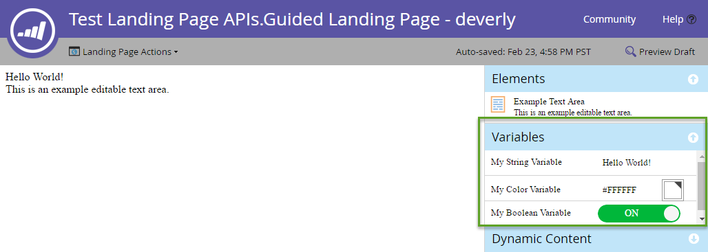

# 登陸頁面

[登陸頁面端點參考](https://developer.adobe.com/marketo-apis/api/asset/#tag/Landing-Pages)

登陸頁面是Marketo託管的網頁。

## 查詢

如同其他大部分資產，登入頁面可依名稱[ ](https://developer.adobe.com/marketo-apis/api/asset/#tag/Landing-Pages/operation/getLandingPageByNameUsingGET)、[依識別碼](https://developer.adobe.com/marketo-apis/api/asset/#tag/Landing-Pages/operation/getLandingPageByIdUsingGET)和[瀏覽](https://developer.adobe.com/marketo-apis/api/asset/#tag/Landing-Pages/operation/browseLandingPagesUsingGET)查詢。 這些查詢將只會傳回中繼資料，而且登入頁面的內容區段清單必須依登入頁面的ID單獨查詢。

查詢登入頁面的內容將傳回登入頁面中可用的內容區段清單。 區段必須存在於頁面的內容清單中才能更新內容：

```
GET /rest/asset/v1/landingPage/{id}/content.json
```

```json
{
    "success": true,
    "warnings": [],
    "errors": [],
    "requestId": "6307#154ea1689d7",
    "result": [
        {
            "id": "67",
            "type": "Form",
            "index": 1,
            "content": {
                "content": "189",
                "contentType": "Form",
                "contentUrl": "https://app-devlocal1.marketo.com/#FO189A1ZN13LA1"
            },
            "formattingOptions": {
                "zIndex": 15,
                "left": "359px",
                "top": "122px"
            }
        }
    ]
}
```

引導式與自由表單範本的結果將會不同，因為引導式登入頁面會隨附一組由範本定義的區段，而自由表單頁面不會隨附預先定義的區段，且必須在編輯前新增其內容。  請注意，「content」屬性的格式視「type」屬性而異，且欄位是靜態還是動態。

## 建立和更新

[登入頁面是透過參考回範本所建立](https://developer.adobe.com/marketo-apis/api/asset/#tag/Landing-Pages/operation/createLandingPageUsingPOST)。 建立所需的欄位只有名稱、範本（範本的ID）以及放置頁面的資料夾。 如需可填入的其他中繼資料，請參閱端點參考。

[登入頁面內容](https://developer.adobe.com/marketo-apis/api/asset/#tag/Landing-Page-Content)端點的有效內容型別為： rtf、HTML、表單、影像、矩形、程式碼片段。

```
POST rest/asset/v1/landingPages.json
```

```
Content-Type: application/x-www-form-urlencoded
```

```
name=createLandingPage&folder={"type": "Folder", "id": 11}&template=1&description=this is a test&workspace=default&title=test create&keywords=awesome&formPrefill=false
```

```json
{
    "success": true,
    "warnings": [],
    "errors": [],
    "requestId": "7a39#154cf7922c6",
    "result": [
        {
            "id": 27,
            "name": "createLandingPage",
            "description": "this is a test",
            "createdAt": "2016-05-20T18:41:43Z+0000",
            "updatedAt": "2016-05-20T18:41:43Z+0000",
            "folder": {
                "type": "Folder",
                "value": 11,
                "folderName": "Landing Pages"
            },
            "workspace": "Default",
            "status": "draft",
            "template": 1,
            "title": "test create",
            "keywords": "awesome",
            "robots": "index, nofollow",
            "formPrefill": false,
            "mobileEnabled": false,
            "URL": "https://app-devlocal1.marketo.com/lp/622-LME-718/createLandingPage.html",
            "computedUrl": "https://app-devlocal1.marketo.com/#LP27B2"
        }
    ]
}
```

可以使用[更新登陸頁面中繼資料端點](https://developer.adobe.com/marketo-apis/api/asset/#tag/Landing-Pages/operation/updateLandingPageUsingPOST)來更新登陸頁面中繼資料。

## 核准

登陸頁面會遵循標準草稿核准模式，其中可能有草稿版本和/或核准版本。 每當將更新套用至頁面時，都會先將更新套用至草稿版本，而且只有在頁面獲得核准後才會即時顯示。

## 刪除

若要刪除登入頁面，該頁面必須先停止使用、未被任何其他Marketo資產參照，以及未核准。 使用[刪除登陸頁面](https://developer.adobe.com/marketo-apis/api/asset/#tag/Landing-Pages/operation/deleteLandingPageByIdUsingPOST)端點個別刪除頁面。 無法透過此API刪除內嵌社交按鈕的登陸頁面。 

## 原地複製

Marketo提供複製登入頁面的簡單方法。 這是application/x-www-url-formencodedPOST要求。

`id`路徑引數指定要複製的來源登陸頁面識別碼。

`name`引數是用來指定新登陸頁面的名稱。

`folder`引數是用來指定建立新登陸頁面的父資料夾。 這是內嵌JSON物件的形式，包含`id`和`type`。

`template`引數是用來指定來源登入頁面範本ID。

選用的`description`引數可用來說明新的登陸頁面。

```
POST /rest/asset/v1/landingPage/{id}/clone.json
```

```
Content-Type: application/x-www-form-urlencoded
```

```
name=MyNewLandingPage&folder={"type":"Program","id":1119}&template=57
```

```json
{
    "success": true,
    "errors": [],
    "requestId": "1078d#1683e4881c6",
    "warnings": [],
    "result": [
        {
            "id": 3291,
            "name": "MyNewLandingPage",
            "createdAt": "2019-01-11T18:59:25Z+0000",
            "updatedAt": "2019-01-11T18:59:25Z+0000",
            "folder": {
                "type": "Program",
                "value": 1119,
                "folderName": "DefaultProgramWithGuidedLP"
            },
            "workspace": "Default",
            "status": "draft",
            "template": 57,
            "robots": "index, nofollow",
            "formPrefill": false,
            "mobileEnabled": false,
            "URL": "http://na-abm.marketo.com/lp/284-RPR-133/DefaultProgramWithGuidedLPPerkutoTestLP-Clone-1.html",
            "computedUrl": "https://app-abm.marketo.com/#LP3291A1LA1"
        }
    ]
}
```

## 管理內容區段

內容區段會根據其索引屬性排序，最終根據使用者端顯示時套用的任何CSS規則進行編排。 內容區段會與對應的[新增](https://developer.adobe.com/marketo-apis/api/asset/#tag/Landing-Page-Content/operation/addLandingPageContentUsingPOST)、[更新](https://developer.adobe.com/marketo-apis/api/asset/#tag/Landing-Page-Content/operation/updateLandingPageContentUsingPOST)和[刪除](https://developer.adobe.com/marketo-apis/api/asset/#tag/Landing-Page-Content/operation/removeLandingPageContentUsingPOST)登陸頁面內容區段端點一起包含和管理，並可使用[取得登陸頁面內容](https://developer.adobe.com/marketo-apis/api/asset/#tag/Landing-Page-Content/operation/getLandingPageContentUsingGET)進行查詢。 每個區段都有一個型別和一個值引數。 型別會決定應該放入值的內容。  對於這些端點，資料以x-www-form-urlencodedPOST傳遞，而不是以JSON格式傳遞。

**區段型別**

| 類型 | 值 |
|--- |--- |
| 動態內容 | 區段的ID。 |
| 表單 | 表單的ID。 |
| HTML | 文字HTML內容。 |
| 影像 | 影像資產的識別碼。 |
| 矩形 | 空白。 |
| RTF | 文字HTML內容。  只能包含RTF元素。 |
| 程式碼片段 | 程式碼片段的ID。 |
| 社交按鈕 | ID  社交按鈕。 |
| 影片 | 視訊的ID。 |

對於自由格式頁面，必須新增所有需要的內容區段，並將嵌入到ID為`mktoContent`的div元素中。 對於引導式頁面，預先定義的元素清單可能會出現在[取得登陸頁面內容](https://developer.adobe.com/marketo-apis/api/asset/#tag/Landing-Page-Content/operation/getLandingPageContentUsingGET)端點的清單中。 可透過其各自的端點新增更多內容或更新其[內容](https://developer.adobe.com/marketo-apis/api/asset/#tag/Landing-Page-Content/operation/updateLandingPageContentUsingPOST)。

### 動態內容

若要建立「動態內容」區段，該區段必須已存在於登入頁面的內容清單中。 然後，必須使用[更新登入頁面內容區段](https://developer.adobe.com/marketo-apis/api/asset/#tag/Landing-Page-Content/operation/updateLandingPageContentUsingPOST)端點將型別設定為&#39;DynamicContent&#39;。 當區段設為動態內容時，會在內容區段中建立基礎動態區段，這些區段都會繼承轉換元素的基本型別。 每個動態區段也會繼承已轉換區段的內容。

```
GET /rest/asset/v1/landingPage/{id}/dynamicContent/RVMtNDg=.json
```

```json
{
  "success": true,
  "warnings": [],
  "errors": [],
  "requestId": "46e#1560fa169d9",
  "result": [
    {
      "createdAt": "2016-07-21",
      "updatedAt": "2016-07-21",
      "segmentation": 1007,
      "segments": [
        {
          "segmentId": 1018,
          "segmentName": "Default",
          "type": "RichText",
          "content": "\n\t\t\t\t\t\t\tAlice was beginning to get very tired of sitting by her sister on the bank, and having nothing to do: once or twice she had peeped into the book her sister was reading, but it had no pictures or conversations in it.\n\t\t\t\t\t\t"
        },
        {
          "segmentId": 1017,
          "segmentName": "New Segment",
          "type": "RichText",
          "content": "\n\t\t\t\t\t\t\tAlice was beginning to get very tired of sitting by her sister on the bank, and having nothing to do: once or twice she had peeped into the book her sister was reading, but it had no pictures or conversations in it.\n\t\t\t\t\t\t"
        }
      ]
    }
  ]
}
```

[每個個別區段的內容](https://developer.adobe.com/marketo-apis/api/asset/#tag/Landing-Page-Content/operation/updateLandingPageDynamicContentUsingPOST)會根據區段ID進行更新。

```
POST /rest/asset/v1/landingPage/{id}/dynamicContent/{dynamicContentId}.json
```

```
Content-Type: application/x-www-form-urlencoded
```

```
segment=New Segment&value=New Content
```

```json
 {
  "success": true,
  "warnings": [],
  "errors": [],
  "requestId": "7516#14e08fe7cbbc",
  "result": [
    {
      "id": 1012
    }
  ]
}
```

## 變數

引導式登入頁面中匯入的功能之一是可編輯的變數。  變數包含登陸頁面上元素的值。  您可以使用登入頁面編輯器輕鬆修改變數，如下所示：



變數在引導模式登入頁面範本的`<head>`元素中定義為中繼標籤。 可用的變數型別有三種：字串、顏色和布林值。  以下是三個變數定義的範例：

```html
<head>
  <meta charset="utf-8">
  <meta class="mktoString" mktoName="My String Variable" id="stringVar" default="Hello World!">
  <meta class="mktoColor" mktoName="My Color Variable" id="colorVar" default="#ffffff">
  <meta class="mktoBoolean" mktoName="My Boolean Variable" id="boolVar" default="true">
</head>
```

如需詳細資訊，請參閱[建立引導式登陸頁面範本](https://experienceleague.adobe.com/en/docs/marketo/using/product-docs/demand-generation/landing-pages/landing-page-templates/create-a-guided-landing-page-template)檔案中的「可編輯變數」一節。

### 查詢

將登陸頁面ID傳遞至「取得登陸頁面變數」端點，擷取引導式登陸頁面的變數。

```
GET /rest/asset/v1/landingPage/{id}/variables.json
```

```json
{
    "success": true,
    "warnings": [],
    "errors": [],
    "requestId": "10843#15a6d7e5fa1",
    "result": [
        {
            "id": "stringVar",
            "value": "Hello World!",
            "type": "string"
        },
        {
            "id": "colorVar",
            "value": "#FFFFFF",
            "type": "color"
        },
        {
            "id": "boolVar",
            "value": "true",
            "type": "boolean"
        }
    ]
}
```

在  此範例中，引導式登陸頁面包含3個變數：stringVar、colorVar、boolVar。

### 更新

將登陸頁面ID、變數ID和變數值傳遞至「更新登陸頁面變數」端點，以更新引導式登陸頁面的變數。

```
POST /rest/asset/v1/landingPage/{id}/variable/{variableId}.json?value={newValue}
```

```json
{
    "success": true,
    "warnings": [],
    "errors": [],
    "requestId": "2b07#15a6db77da3",
    "result": [
        {
            "id": "stringVar",
            "value": "Hello Brave New World!",
            "type": "String"
        }
    ]
}
```

## 預覽登陸頁面

Marketo提供[取得登陸頁面完整內容](https://developer.adobe.com/marketo-apis/api/asset/#tag/Landing-Pages/operation/getLandingPageFullContentUsingGET)端點，以擷取登陸頁面的即時預覽，如同在瀏覽器中呈現一樣。 有一個必要的引數，`id`路徑引數，是您要預覽之登入頁面的ID。 還有兩個額外的選用查詢引數：

- segmentation：接受包含segmentationId和segmentId屬性的JSON物件陣列。 設定後，會將您視為符合這些區段的潛在客戶來預覽登陸頁面。
- 銷售機會ID：  接受潛在客戶的整數ID。 設定後，會預覽登入頁面，就像是由指定的潛在客戶檢視一樣。

```
GET /rest/asset/v1/landingPage/{id}/fullContent.json?leadId=1001&segmentation=[{"segmentationId":1030,"segmentId":1103}]
```

```json
{
  "success": true,
  "errors": [],
  "requestId": "119ab#17692849f1e",
  "warnings": [],
  "result": [
    {
      "id": 1023,
      "content": "<!DOCTYPE html>\n<html>\n <head>\n <meta charset=\"utf-8\">\n \n \n <meta name=\"robots\" content=\"index, nofollow\">\n <title></title>\n <style>\n body {background:#FFFFFF} \n #myConditionalDisplayArea {\n display: true;\n }\n </style>\n <link rel=\"shortcut icon\" href=\"/favicon.ico\" type=\"image/x-icon\" >\n<link rel=\"icon\" href=\"/favicon.ico\" type=\"image/x-icon\" >\n\n\n<style>.mktoGen.mktoImg {display:inline-block; line-height:0;}</style>\n </head>\n <body id=\"bodyId\">\n \n Hello Brave New World!\n <div class=\"mktoText\" id=\"exampleText\"><div>This is an example editable text area.</div>\n<div>Lead Full Name = Hanna Crawford</div>\n<div><br /></div>\n <script type=\"text/javascript\" src=\"//munchkin.marketo.net//munchkin.js\"></script><script>Munchkin.init('123-ABC-456', {customName: 'Test-Landing-Page-APIs_Guided-Landing-Page---deverly', PURL_VISIT_TOKEN, wsInfo: 'j1RR'});</script>\n<div id=\"mktoClickBlockingDiv\"></div>\n </body>\n</html>\n"
    }
  ]
}
```
