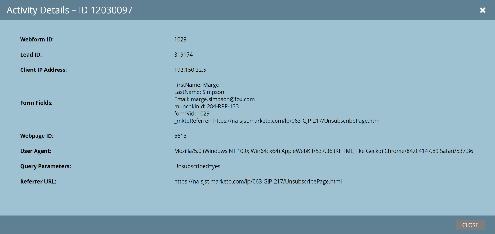

# 銷售機會

[潛在客戶端點參考](https://developer.adobe.com/marketo-apis/api/mapi/#tag/Leads)

Marketo Lead的API提供了一組針對潛在客戶記錄的簡單CRUD應用程式功能，以及修改潛在客戶在靜態清單和程式中的成員資格，以及啟動潛在客戶的Smart Campaign處理能力。

## 說明

Leads API的一項重要功能是Describe方法。 使用「說明銷售機會」可透過REST API擷取可用於互動的欄位完整清單，以及每個欄位的中繼資料：

* 資料類型
* REST API名稱
* 長度（如果適用）
* 唯讀
* 易記標籤

說明是判斷欄位是否可供使用的主要信任來源，以及有關這些欄位的中繼資料。

### 請求

```
GET /rest/v1/leads/describe.json
```

### 回應

```json
{  
   "requestId":"37ca#1475b74e276",
   "success":true,
   "result":[  
      {  
         "id":2,
         "displayName":"Company Name",
         "dataType":"string",
         "length":255,
         "rest":{  
            "name":"company",
            "readOnly":false
         },
         "soap":{  
            "name":"Company",
            "readOnly":false
         }
      }
}
```

一般而言，回應在結果陣列中包含一組更大的欄位，但我們出於示範目的而略過這些欄位。 結果陣列中的每個專案都對應到潛在客戶記錄上的可用欄位，並且至少會有id、displayName和資料型別。 特定欄位可能存在rest和soap子物件，也可能不存在，其存在將指示該欄位是否可以在REST或SOAP API中使用。 `readOnly`屬性會透過對應的API (REST或SOAP)指出欄位是否為唯讀。 length屬性指出欄位的最大長度（如果存在）。 dataType屬性指出欄位的資料型別。

## 查詢

銷售機會擷取有兩個主要方法：依ID取得銷售機會，以及依篩選型別取得銷售機會。 依ID取得銷售機會，會以單一銷售機會ID作為路徑引數，並傳回單一銷售機會記錄。

您可以選擇傳入欄位引數，其中包含要傳回的逗號分隔欄位名稱清單。 若此要求中未包含欄位引數，則會傳回下列預設欄位： `email`、`updatedAt`、`createdAt`、`lastName`、`firstName`以及`id`。 請求欄位清單時，如果請求了特定欄位但未傳回，則值會隱含為空值。

### 請求

```
GET /rest/v1/lead/{id}.json
```

### 回應

```json
{
   "requestId": "10226#14d3049e51b",
   "success": true,
   "result": [
      {
         "id": 318581,
         "updatedAt":"2015-05-07T11:47:30-08:00"
         "lastName": "Doe",
         "email": "jdoe@marketo.com",
         "createdAt": "2015-05-01T16:47:30-08:00",
         "firstName": "John"
      }
   ]
}
```

對於此方法，結果陣列的第一個位置始終會有單一記錄。

依篩選器型別取得銷售機會將傳回相同型別的記錄，但每頁最多可傳回300筆記錄。 它需要`filterType`和`filterValues`查詢引數。

`filterType`接受任何自訂欄位，或大部分常用的欄位。 呼叫`Describe2`端點以取得允許在`filterType`中使用之可搜尋欄位的完整清單。 依自訂欄位搜尋時，僅支援下列資料型別： `string`、`email`、`integer`。 您可以使用上述的Describe方法取得欄位詳細資訊（說明、型別等）。

`filterValues`接受最多300個逗號分隔格式的值。 通話會搜尋潛在客戶欄位符合其中一個所包含`filterValues`的記錄。 如果符合潛在客戶篩選器的潛在客戶數量大於1,000，則會傳回錯誤：「1003，有太多結果符合篩選器」。

如果GET請求的總長度超過8KB，則會傳回HTTP錯誤：「414， URI太長」（根據RFC 7231）。 暫行解決方法是將GET變更為POST、新增_method=GET引數，並將查詢字串放入要求內文中。

### 請求

```
GET /rest/v1/leads.json?filterType=id&filterValues=318581,318592
```

### 回應

```json
{
    "requestId": "12951#15699db5c97",
    "result": [
        {
            "id": 318581,
            "updatedAt": "2016-05-17T22:11:45Z",
            "lastName": "Lincoln",
            "email": "abe@usa.gov",
            "createdAt": "2015-03-17T00:18:40Z",
            "firstName": "Abraham"
        },
        {
            "id": 318592,
            "updatedAt": "2016-05-17T22:20:51Z",
            "lastName": "Washington",
            "email": "george@usa.gov",
            "createdAt": "2015-04-06T16:29:21Z",
            "firstName": "George"
        }
    ],
    "success": true
}
```

此呼叫會搜尋符合`filterValues`中所包含識別碼的記錄，並傳回任何符合的記錄。

如果找不到記錄，回應會指出成功，但結果陣列將是空的。

### 回應

```json
{
"requestId": "177a1#1578b643357",
"result": [],
"success": true
}
```

「依ID取得銷售機會」和「依篩選型別取得銷售機會」也接受欄位查詢引數，此引數接受以逗號分隔的API欄位清單。 如果包括這個，則回應中的每個記錄都將包括那些列出的欄位。  如果省略，則會傳回預設欄位集： `id`、`email`、`updatedAt`、`createdAt`、`firstName`和`lastName`。

## ADOBEECID

Adobe Experience Cloud對象共用功能啟用時，會進行Cookie同步程式，將Adobe Experience Cloud ID (ECID)與Marketo銷售機會建立關聯。  上述潛在客戶擷取方法可用來擷取關聯的ECID值。  請在欄位引數中指定`ecids`，以執行此操作。 例如 `&fields=email,firstName,lastName,ecids`。

## 建立和更新

除了擷取銷售機會資料，您還可以透過API建立、更新和刪除銷售機會記錄。 建立和更新銷售機會會與請求中定義的作業型別共用相同的端點，最多可同時建立或更新300筆記錄。

>[!NOTE]
>
> 不支援使用[同步銷售機會](https://developer.adobe.com/marketo-apis/api/mapi/#tag/Leads/operation/syncLeadUsingPOST)端點更新公司欄位。 請改用[同步處理公司](https://developer.adobe.com/marketo-apis/api/mapi/#tag/Companies/operation/syncCompaniesUsingPOST)端點。

>[!NOTE]
>
> 在人員記錄上建立或更新電子郵件值時，電子郵件位址列位僅支援ASCII字元。

### 請求

```
POST /rest/v1/leads.json
```

### 內文

```json
{  
   "action":"createOnly",
   "lookupField":"email",
   "input":[  
      {  
         "email":"kjashaedd-1@klooblept.com",
         "firstName":"Kataldar-1",
         "postalCode":"04828"
      },
      {  
         "email":"kjashaedd-2@klooblept.com",
         "firstName":"Kataldar-2",
         "postalCode":"04828"
      },
      {  
         "email":"kjashaedd-3@klooblept.com",
         "firstName":"Kataldar-3",
         "postalCode":"04828"
      }
   ]
}
```

### 回應

```json
{  
   "requestId":"e42b#14272d07d78",
   "success":true,
   "result":[  
      {  
         "id":50,
         "status":"created"
      },
      {  
         "id":51,
         "status":"created"
      },
      {  
         "id":52,
         "status":"created"
      }
   ]
}
```

在此請求中，您會看到兩個重要欄位，`action`和`lookupField`。  `action`指定要求的作業型別，可以是`createOrUpdate`、`createOnly`、`updateOnly`或`createDuplicate`。 如果省略，動作會預設為`createOrUpdate`。  `lookupField`引數指定當動作為`createOrUpdate`或`updateOnly`時要使用的金鑰。 若省略`lookupField`，預設金鑰為`email`。

依預設，會使用預設分割區。 您可以選擇指定`partitionName`引數，這只有在動作為`createOnly`或`createOrUpdate`時才有效。 若要讓`partitionName`做為其他重複資料刪除條件，它必須是自訂重複資料刪除規則中來源型別的一部分。 在更新作業期間，如果指定的資料分割中不存在潛在客戶，則會傳回錯誤。 如果僅限API的使用者沒有存取指定之分割區的許可權，則會傳回錯誤。

使用`updateOnly`動作時，`id`欄位只能包含為引數，因為`id`是系統管理的唯一索引鍵。

要求也必須有`input`引數，這是潛在客戶記錄的陣列。 每個潛在客戶記錄都是一個JSON物件，具有任意數量的潛在客戶欄位。 記錄中包含的索引鍵對該記錄而言應該是唯一的，並且所有JSON字串都應該使用UTF-8編碼。 `externalCompanyId`欄位可用來將潛在客戶記錄連結至公司記錄。 `externalSalesPersonId`欄位可用來將潛在客戶記錄連結至銷售人員記錄。

注意：並行或連續快速執行潛在客戶更新插入請求時，如果在首次傳回之前使用相同的值執行後續呼叫，則在使用相同的索引鍵值發出多個請求時，可能會導致重複記錄。 您可以視情況使用`createOnly`或`updateOnly`，或將呼叫排入佇列並等候您的呼叫返回，然後再使用相同的金鑰進行後續的更新插入呼叫，來避免這種情況。

## 欄位

潛在客戶物件包含標準欄位和選擇性自訂欄位。 標準欄位會顯示在每個Marketo Engage訂閱中，而自訂欄位則由使用者視需要建立。 每個欄位定義都由一組描述該欄位的屬性組成。 屬性的範例為顯示名稱、API名稱和dataType。 這些屬性統稱為中繼資料。

下列端點可讓您查詢、建立及更新潛在客戶物件上的欄位。 這些API要求擁有的API使用者必須具備讀寫結構描述標準欄位或讀寫結構描述自訂欄位許可權之一或兩者的角色。

## 查詢欄位

查詢潛在客戶欄位很簡單。 您可以依API名稱查詢單一銷售機會欄位，或查詢所有銷售機會欄位集。 視使用的角色許可權而定，可擷取標準欄位和自訂欄位。 也會擷取隱藏欄位。

## 依名稱

「依名稱取得銷售機會欄位」端點會擷取銷售機會物件上單一欄位的中繼資料。 必要的fieldApiName路徑引數會指定欄位的API名稱。 回應類似於Describe Lead端點，但包含其他中繼資料，例如isCustom屬性，其代表欄位是否為自訂欄位。

### 請求

```
GET /rest/v1/leads/schema/fields/{fieldApiName}.json
```

### 回應

```json
{
    "requestId": "cd97#1793ee0fec4",
    "result": [
        {
            "displayName": "Email Address",
            "name": "email",
            "description": null,
            "dataType": "email",
            "length": 255,
            "isHidden": false,
            "isHtmlEncodingInEmail": true,
            "isSensitive": true,
            "isCustom": false
        }
    ],
    "success": true
}
```

## 瀏覽

Get Lead Fields端點會擷取Lead物件上所有欄位的中繼資料，包括 依預設，最多會傳回300筆記錄。 您可以使用`batchSize`查詢引數來減少此數目。 如果`moreResult`屬性為true，則表示有更多結果可用。 繼續呼叫此端點，直到`moreResult`屬性傳回false，這表示沒有可用的結果。 從此API傳回的`nextPageToken`應一律重複用於此呼叫的下一個反複專案。

### 請求

```
GET /rest/v1/leads/schema/fields.json
```

### 回應（已截斷）

```json
{
    "requestId": "142c3#1793eb976d8",
    "result": [
        {
            "displayName": "Salutation",
            "name": "salutation",
            "description": null,
            "dataType": "string",
            "length": 255,
            "isHidden": false,
            "isHtmlEncodingInEmail": true,
            "isSensitive": true,
            "isCustom": false
        },
        {
            "displayName": "First Name",
            "name": "firstName",
            "description": null,
            "dataType": "string",
            "length": 255,
            "isHidden": false,
            "isHtmlEncodingInEmail": true,
            "isSensitive": true,
            "isCustom": false
        },
        {
            "displayName": "Middle Name",
            "name": "middleName",
            "description": null,
            "dataType": "string",
            "length": 255,
            "isHidden": false,
            "isHtmlEncodingInEmail": true,
            "isSensitive": true,
            "isCustom": false
        },
        {
            "displayName": "Last Name",
            "name": "lastName",
            "description": null,
            "dataType": "string",
            "length": 255,
            "isHidden": false,
            "isHtmlEncodingInEmail": true,
            "isSensitive": true,
            "isCustom": false
        },
        {
            "displayName": "Date of Birth",
            "name": "dateOfBirth",
            "description": null,
            "dataType": "date",
            "isHidden": false,
            "isHtmlEncodingInEmail": false,
            "isSensitive": true,
            "isCustom": false
        },
        {
            "displayName": "Email Address",
            "name": "email",
            "description": null,
            "dataType": "email",
            "length": 255,
            "isHidden": false,
            "isHtmlEncodingInEmail": true,
            "isSensitive": true,
            "isCustom": false
        },
        {
            "displayName": "Phone Number",
            "name": "phone",
            "description": null,
            "dataType": "phone",
            "length": 255,
            "isHidden": false,
            "isHtmlEncodingInEmail": true,
            "isSensitive": true,
            "isCustom": false
        },
        {
            "displayName": "Mobile Phone Number",
            "name": "mobilePhone",
            "description": null,
            "dataType": "phone",
            "length": 255,
            "isHidden": false,
            "isHtmlEncodingInEmail": true,
            "isSensitive": true,
            "isCustom": false
        },
        {
            "displayName": "Fax Number",
            "name": "fax",
            "description": null,
            "dataType": "phone",
            "length": 255,
            "isHidden": false,
            "isHtmlEncodingInEmail": true,
            "isSensitive": true,
            "isCustom": false
        },
        {
            "displayName": "Job Title",
            "name": "title",
            "description": null,
            "dataType": "string",
            "length": 255,
            "isHidden": false,
            "isHtmlEncodingInEmail": true,
            "isSensitive": true,
            "isCustom": false
        },
        {
            "displayName": "Unsubscribed",
            "name": "unsubscribed",
            "description": null,
            "dataType": "boolean",
            "isHidden": false,
            "isHtmlEncodingInEmail": false,
            "isSensitive": true,
            "isCustom": false
        },
        ...
    ],
    "success": true,
    "moreResult": false
}
```

## 建立欄位

「建立銷售機會欄位」端點會在銷售機會物件上建立一或多個自訂欄位。 此端點提供的功能與Marketo EngageUI中可用的功能相當。 您可以使用此端點建立最多100個自訂欄位。
請仔細考量您在使用API的Marketo Engage生產執行個體中建立的每個欄位。  欄位一旦建立就不能再刪除（只能隱藏）。 未使用欄位數量激增是壞做法，會增加執行個體的雜亂。

必要的輸入引數是潛在客戶欄位物件的陣列。 每個物件包含一或多個屬性。 必要屬性為`displayName`、`name`和`dataType`，分別對應至欄位的UI顯示名稱、欄位的API名稱以及欄位型別。  您可以選擇指定`description`、`isHidden`、`isHtmlEncodingInEmail`和`isSensitive`。

有一些規則與名稱和`displayName`命名相關。 name屬性必須是唯一的、以字母開頭，並且僅包含字母、數字或底線。 `displayName`必須是唯一的，而且不能包含特殊字元。  常見的命名慣例是將駝峰式大小寫套用至`displayName`以產生名稱。 例如，「我的自訂欄位」的`displayName`會產生「myCustomField」的名稱。

### 請求

```
POST /rest/v1/leads/schema/fields.json
```


### 內文

```json
{
  "input": [
      {
        "displayName": "Acme Access Code",
        "name": "acmeAccessCode",
        "description": "Acme Direct Mail Integration",
        "dataType": "string"
      },
      {
        "displayName": "Acme Mail Date",
        "name": "acmeMailDate",
        "description": "Acme Direct Mail Integration",
        "dataType": "string"
      }
  ]
}
```


### 回應

```json
{
    "requestId": "d9f1#17943666811",
    "result": [
        {
            "name": "acmeAccessCode",
            "status": "created"
        },
        {
            "name": "acmeMailDate",
            "status": "created"
        }
    ],
    "success": true
}
```

## 更新欄位

「更新潛在客戶欄位」端點會更新潛在客戶物件上的單一自訂欄位。 大部分情況下，使用Marketo EngageUI執行的欄位更新作業可使用API達成。 下表總結了幾項差異。

<table>
<tbody>
<tr>
<td style="width: 26.5306%;" rowspan="2"><strong>屬性</strong></td>
<td style="width: 35%;" colspan="2"><strong>標準欄位</strong></td>
<td style="width: 38.2654%;" colspan="2"><strong>自訂欄位</strong></td>
</tr>
<tr>
<td style="width: 17.449%;"><strong>可透過API更新嗎？</strong></td>
<td style="width: 17.551%;"><strong>可透過UI更新嗎？</strong></td>
<td style="width: 19.3878%;"><strong>可透過API更新嗎？</strong></td>
<td style="width: 18.8776%;"><strong>可透過UI更新嗎？</strong></td>
</tr>
<tr>
<td style="width: 26.5306%;">資料型別</td>
<td style="width: 17.449%;">no</td>
<td style="width: 17.551%;">no</td>
<td style="width: 19.3878%;">no</td>
<td style="width: 18.8776%;">是</td>
</tr>
<tr>
<td style="width: 26.5306%;">說明</td>
<td style="width: 17.449%;">是</td>
<td style="width: 17.551%;">是</td>
<td style="width: 19.3878%;">是</td>
<td style="width: 18.8776%;">是</td>
</tr>
<tr>
<td style="width: 26.5306%;">顯示名稱</td>
<td style="width: 17.449%;">no</td>
<td style="width: 17.551%;">no</td>
<td style="width: 19.3878%;">是</td>
<td style="width: 18.8776%;">是</td>
</tr>
<tr>
<td style="width: 26.5306%;">isCustom</td>
<td style="width: 17.449%;">no</td>
<td style="width: 17.551%;">no</td>
<td style="width: 19.3878%;">no</td>
<td style="width: 18.8776%;">no</td>
</tr>
<tr>
<td style="width: 26.5306%;">ishidden</td>
<td style="width: 17.449%;">no</td>
<td style="width: 17.551%;">是</td>
<td style="width: 19.3878%;">是（若由API建立）</td>
<td style="width: 18.8776%;">是</td>
</tr>
<tr>
<td style="width: 26.5306%;">isHtmlEncodingInEmail</td>
<td style="width: 17.449%;">是</td>
<td style="width: 17.551%;">是</td>
<td style="width: 19.3878%;">是</td>
<td style="width: 18.8776%;">是</td>
</tr>
<tr>
<td style="width: 26.5306%;">isSensitive</td>
<td style="width: 17.449%;">是</td>
<td style="width: 17.551%;">是</td>
<td style="width: 19.3878%;">是</td>
<td style="width: 18.8776%;">是</td>
</tr>
<tr>
<td style="width: 26.5306%;">length</td>
<td style="width: 17.449%;">no</td>
<td style="width: 17.551%;">no</td>
<td style="width: 19.3878%;">no</td>
<td style="width: 18.8776%;">no</td>
</tr>
<tr>
<td style="width: 26.5306%;">名稱</td>
<td style="width: 17.449%;">no</td>
<td style="width: 17.551%;">no</td>
<td style="width: 19.3878%;">no</td>
<td style="width: 18.8776%;">no</td>
</tr>
</tbody>
</table>

必要的`fieldApiName`路徑引數指定要更新的欄位的API名稱。 必要的輸入引數是包含單一銷售機會欄位物件的陣列。  欄位物件包含一或多個屬性。

### 請求

```
POST /rest/v1/leads/schema/fields/{fieldApiName}.json
```

### 內文

```json
{
  "input": [
      {
        "displayName": "Acme Access Code",
        "description": "Acme Direct Mail Integration",
        "isHtmlEncodingInEmail": true
      }
  ]
}
```

### 回應

```json
{
    "requestId": "9f57#1794324f44c",
    "result": [
        {
            "name": "acmeAccessCode",
            "status": "updated"
        }
    ],
    "success": true
}
```

## 將銷售機會推送至Marketo

推播銷售機會是同步銷售機會至Marketo的替代方法，其主要設計旨在允許比標準同步銷售機會更大的觸發能力(類似於Marketo表單的使用方式)。 除了同步銷售機會欄位之外，此端點還可根據傳遞至端點的Cookie值，允許銷售機會關聯。 若要這麼做，請傳遞透過點進Marketo電子郵件產生的`mkt_tok`值，或在呼叫中傳遞程式名稱。 此端點也會建立與Marketo中的方案及/或行銷活動相關聯的單一可觸發活動。 這允許在歸因於特定促銷活動或方案的潛在客戶擷取事件上觸發，以從Marketo內啟動關聯的工作流程。

Push Lead介面與Sync Leads非常類似。 所有相同的主要金鑰都有效，且欄位使用相同的API名稱（沒有動作引數，因為這永遠是更新插入作業）。 `programName`和輸入引數為必要項，而`lookupField`、`source`和`reason`引數為選用項。 輸入引數是lead物件的陣列。 產生的活動會歸因於對應的已命名方案。 `source`和`reason`引數是任意字串欄位，可新增至請求，以將這些值內嵌在產生的活動中。 這些可作為對應觸發程式(潛在客戶被推送至Marketo)和篩選器(潛在客戶被推送至Marketo)中的限制。

有關匿名活動的備註。 如果您想要將先前的匿名活動與新建立的銷售機會建立關聯，則請勿在銷售機會物件中指定Cookie屬性，並在推播銷售機會之後呼叫Associate Lead 。 如果您想建立沒有活動歷史記錄的新銷售機會，則只需在銷售機會物件中指定Cookie屬性即可。

### 請求

```
POST /rest/v1/leads/push.json
```

### 內文

```json
{
    "programName": "Big Blue Thing Product Launch",
    "source": "Cool Sales Site",
    "reason": "Downloaded pricing sheet",
    "lookupField": "email",
    "input": [
        {
             "email": "Theresa.May@westminister.gov.uk",
             "country": "united kingdom",
             "firstName": "Theresa",
             "website": "www.brexit.com",
             "leadScore": 45,
             "marketoSocialFacebookProfileURL": "http://www.facebook.com/id/23434456",
             "jobTitle": "Prime Minister"
         },
         {
             "email": "Justin.Trudeau@ottowa.gov.ca",
             "country": "canada",
             "firstName": "Justin",
             "website": "www.take-off-eh.com",
             "leadScore": 92,
             "marketoSocialFacebookProfileURL": "http://www.facebook.com/id/42434",
             "jobTitle": "Sonny"
         }
     ]
}
```

### 回應

```json
{
    "requestId": "939079529805",
    "success": true,
    "warnings": [],
    "result": [
       {
           "id": 483894,
           "status": "created"
       },
       {
           "id": 1087425,
           "status": "updated"
       },
       {
           "id": 3525,
           "reasons": [
                    {
                        "code": "501",
                        "message": "Bad stuff happened"
                    }
           ]
       }
    ]
}
```

若要傳遞`mkt_tok`引數，請在輸入引數中的潛在客戶記錄中，將值指派給mktToken成員，如下所示。

### 內文

```json
{
  "programName": "Big Blue Thing Product Launch",
  "source": "Cool Sales Site",
  "reason": "Downloaded pricing sheet",
  "lookupField": "mktToken",
  "input" : [
     {
       "mktToken" : "<tokenValue>",
       "firstName" : "Thelma"
     },
     {
       "mktToken" : "<tokenValue>",
       "firstName" : "Louise"
     }
   ]
}
```

## 提交表單

提交表單是將銷售機會同步至Marketo的替代方法，其設計旨在提供等同於Marketo表單提交的功能。 這允許在歸因於特定促銷活動或方案的潛在客戶擷取事件上觸發，以從Marketo內啟動關聯的工作流程。

「提交表單」端點支援下列功能：

* 使用電子郵件欄位作為主索引鍵來更新插入潛在客戶記錄
* 建立與方案及/或行銷活動相關聯的「填寫表格」活動
* 允許根據Cookie值關聯潛在客戶
* 執行表單欄位驗證

提交表單會遵循標準潛在客戶資料庫模式。 單一物件記錄會傳入POST請求JSON內文的所需輸入成員。 必要的`formId`成員包含目標Marketo表單識別碼。

選用的`programId`可用於指定要新增銷售機會的方案，和/或指定要新增方案成員自訂欄位的方案。 若已提供`programId`，則潛在客戶會新增至方案，而表單中呈現的任何方案成員欄位也會一併新增。 請注意，指定的程式必須與表單位於相同的工作區。 如果表單不包含方案成員自訂欄位且未提供`programId`，則潛在客戶不會新增至方案。 如果表單位在程式中，但未提供`programId`，則當表單中出現一或多個程式成員自訂欄位時，會使用該程式。

在輸入記錄中，`leadFormFields`物件是必要的。 此物件包含一或多個名稱/值組，這些名稱/值組對應至要填入的表單欄位。  所有指定的欄位都必須在指定的表單中定義。 此名稱是欄位的REST API名稱。 請注意，`email`欄位為必填。

`visitorData`成員物件是選用的，且包含對應至頁面瀏覽資料（包括`pageURL`、`queryString`、`leadClientIpAddress`和`userAgentString`）的名稱/值組。 可用來填入其他活動欄位，以用於篩選和觸發目的。

Cookie成員字串是選用字串，可讓您將Munchkin Cookie與Marketo中的個人記錄建立關聯。 建立新銷售機會時，任何先前的匿名活動都會與該銷售機會相關聯，除非Cookie值先前已與其他已知記錄相關聯。 如果先前已關聯Cookie值，則會針對記錄追蹤新活動，但舊活動不會移離現有的已知記錄。 若要建立沒有活動歷史記錄的新銷售機會，只需略過Cookie成員即可。

新潛在客戶會在表單所在的工作區的主要分割區中建立。

### 請求

```
POST /rest/v1/leads/submitForm.json
```

### 標頭

```
Content-Type: application/json
```

### 內文

```json
{
  "formId": 1029,
  "input": [
    {
      "leadFormFields": {
        "firstName": "Marge",
        "lastName": "Simpson",
        "email": "marge.simpson@fox.com",
        "pMCFField": "PMCF value"
      },
      "visitorData": {
        "pageURL": "https://na-sjst.marketo.com/lp/063-GJP-217/UnsubscribePage.html",
        "queryString": "Unsubscribed=yes",
        "leadClientIpAddress": "192.150.22.5",
        "userAgentString": "Mozilla/5.0 (Windows NT 10.0; Win64; x64) AppleWebKit/537.36 (KHTML, like Gecko) Chrome/84.0.4147.89 Safari/537.36"
      },
      "cookie": "id:063-GJP-217&token:_mch-marketo.com-1594662481190-60776"
    }
  ]
}
```

### 回應

```json
{
  "requestId": "10667#173bc585ca5",
  "result": [
    {
      "id": 319174,
      "status": "updated"
    }
  ],
  "success": true
}
```

我們在這裡可以從Marketo EngageUI中看到對應的「填寫表單」活動詳細資料：



## 合併

有時候，您必須合併重複記錄，Marketo會透過合併銷售機會API協助執行此操作。 合併潛在客戶將會結合其活動記錄、方案、行銷活動、清單成員資格和CRM資訊，並將其所有欄位值合併為單一記錄。 合併銷售機會以銷售機會ID作為路徑引數，單一`leadId`作為查詢引數，或`leadIds`引數中逗號分隔的ID清單。

### 請求

```
POST /rest/v1/leads/{id}/merge.json?leadId=1324
```

### 回應

```json
{  
   "requestId":"e42b#14272d07d78",
   "success":true
}
```

在path引數中指定的銷售機會是成功銷售機會，因此，如果合併的記錄之間有任何欄位衝突，將會取得來自成功者的值，除非成功記錄中的欄位為空且失敗記錄中的對應欄位為空白。 在`leadId`或`leadIds`引數中指定的潛在客戶是失敗的潛在客戶。

如果您有啟用SFDC-sync的訂閱，則您也可以在請求中使用`mergeInCRM`引數。 如果設為true，系統也會在CRM中執行對應的合併。 如果兩個潛在客戶都在SFDC中，且一個是CRM潛在客戶，另一個是CRM聯絡人，則獲勝者會是CRM聯絡人（無論將哪個潛在客戶指定為獲勝者）。 如果其中一個潛在客戶在SFDC，而另一個僅在Marketo，則成功者為SFDC潛在客戶（無論將哪個潛在客戶指定為成功者）。

## 關聯網頁活動

透過銷售機會追蹤(Munchkin)，Marketo會記錄您網站和Marketo登陸頁面訪客的網路活動。 這些活動（造訪和點按）會使用對應至潛在客戶瀏覽器中設定的「_mkto_trk」Cookie的鍵值進行記錄，而Marketo會使用此鍵來追蹤相同人員的活動。 通常當潛在客戶從Marketo電子郵件點進或填寫Marketo表單時，就會發生與潛在客戶記錄的關聯，但有時關聯可由不同型別的事件觸發，而您可以使用「關聯潛在客戶」端點來執行。 端點會將已知的潛在客戶記錄的ID當做路徑引數，並在Cookie查詢引數中採用「_mkto_trk」Cookie值。

### 請求

```
POST /rest/v1/leads/{id}/associate.json?cookie=id:287-GTJ-838%26token:_mch-marketo.com-1396310362214-46169
```

### 回應

```json
{  
   "requestId":"e42b#14272d07d78",
   "success":true
}
```

如果Cookie已與已知潛在客戶記錄相關聯，則在不同潛在客戶記錄上使用此API會導致根據該記錄記錄記錄新網站活動，但不會將任何現有網站活動移動到新記錄。
會籍

您也可以根據靜態清單或計畫中的成員資格來擷取潛在客戶記錄。 此外，您可以擷取潛在客戶所屬的所有靜態清單、方案或智慧行銷活動。

回應結構和選用引數與「依篩選型別取得銷售機會」的相同，不過filterType和filterValues不能與此API搭配使用。
若要透過Marketo UI存取清單ID，請導覽至清單。 清單`id`位於靜態清單`https://app-****.marketo.com/#ST1001A1`的URL中。 在此範例中，1001是清單的`id`。

### 請求

```
GET /rest/v1/list/{listId}/leads.json?batchSize=3
```

### 回應

```json
{ 
   "requestId":"e42b#14272d07d78",
   "success":true,
   "nextPageToken":
"PS5VL5WD4UOWGOUCJR6VY7JQO2KUXL7BGBYXL4XH4BYZVPYSFBAONP4V4KQKN4SSBS55U4LEMAKE6===",
    "result":[
       {
            "id":50,  
            "email":"kjashaedd@klooblept.com",
            "firstName":"Kataldar",
             "postalCode":"04828"
       },
       {
           "id":2343,
           "email":"kjashaedd@klooblept.com",
           "firstName":"Kataldar",
           "postalCode":"04828" 
       },
      {
           "id":88498,
           "email":"kjashaedd@klooblept.com", 
           "firstName":"Kataldar",
         "postalCode":"04828"
         }
    ]
}
```

Get Lists by Lead Id端點取得潛在客戶記錄`id`路徑引數，並傳回該潛在客戶所屬的所有靜態清單記錄。

### 請求

```
GET /rest/v1/leads/{id}/listMembership.json?batchSize=3
```

### 回應

```json
{
    "requestId": "1184b#1706f0ec23f",
    "result": [
        {
            "listId": 3379,
            "createdAt": "2016-05-17T19:32:44Z",
            "updatedAt": "2016-05-17T19:32:44Z"
        },
        {
            "listId": 2792,
            "createdAt": "2009-05-19T18:29:15Z",
            "updatedAt": "2009-05-19T18:29:15Z"
        },
        {
            "listId": 42,
            "createdAt": "2009-04-22T19:24:22Z",
            "updatedAt": "2009-04-22T19:24:22Z"
        }
    ],
    "success": true,
    "nextPageToken": "BFRV7OMVSNJWDVKVTUFS3XHT4E======",
    "moreResult": true
}
```

## 計畫

可以類似清單的方式擷取方案會籍。 呼叫Get Leads by Program Id端點並傳遞`programId`路徑引數時，可以使用相同的選用要求引數。

您可以選擇傳入欄位引數，其中包含要傳回的逗號分隔欄位名稱清單。 若此要求中未包含欄位引數，則會傳回下列預設欄位： `email`、`updatedAt`、`createdAt`、`lastName`、`firstName`、`membership`以及`id`。 請求欄位清單時，如果請求了特定欄位但未傳回，則值會隱含為空值。

回應結構非常類似，因為結果陣列中的每個專案都是潛在客戶，只是每個記錄也有一個名為「membership」的子物件。 此成員資格物件包含有關潛在客戶與通話中指示之方案的關係的資料，一律顯示其`progressionStatus`、`acquiredBy`、`reachedSuccess`和`membershipDate`。 如果父級方案也是參與方案，則成員資格將有成員`stream`、`nurtureCadence`和`isExhausted`，以表示其在參與方案中的位置和活動。

### 請求

```
GET /rest/v1/leads/programs/{programId}.json?batchSize=3
```

### 回應

```json
{
    "requestId": "13ad4#1727b748a17",
    "result": [
        {
            "id": 319141,
            "firstName": "Meera",
            "lastName": "Reed",
            "email": "mree@housestark.com",
            "updatedAt": "2020-04-21T16:27:14Z",
            "createdAt": "2020-04-21T16:27:14Z",
            "membership": {
                "id": 1127,
                "progressionStatus": "Visited",
                "progressionStatusType": "Visited",
                "isExhausted": false,
                "acquiredBy": true,
                "reachedSuccess": false,
                "membershipDate": "2020-04-21T16:27:16Z",
                "updatedAt": "2020-04-21T16:27:16Z"
            }
        },
        {
            "id": 319142,
            "firstName": "Jon",
            "lastName": "Umber",
            "email": "jumb@housestark.com",
            "updatedAt": "2020-04-21T16:27:14Z",
            "createdAt": "2020-04-21T16:27:14Z",
            "membership": {
                "id": 1127,
                "progressionStatus": "Visited",
                "progressionStatusType": "Visited",
                "isExhausted": false,
                "acquiredBy": true,
                "reachedSuccess": false,
                "membershipDate": "2020-04-21T16:27:16Z",
                "updatedAt": "2020-04-21T16:27:16Z"
            }
        },
        {
            "id": 319143,
            "firstName": "Lyanna",
            "lastName": "Mormont",
            "email": "lmor@housestark.com",
            "updatedAt": "2020-04-21T16:27:14Z",
            "createdAt": "2020-04-21T16:27:14Z",
            "membership": {
                "id": 1127,
                "progressionStatus": "Visited",
                "progressionStatusType": "Visited",
                "isExhausted": false,
                "acquiredBy": true,
                "reachedSuccess": false,
                "membershipDate": "2020-04-21T16:27:16Z",
                "updatedAt": "2020-04-21T16:27:16Z"
            }
        }
    ],
    "success": true,
    "nextPageToken": "SW3PTMBVFCNHSHJGZ7LQH3ZWNUOHKADJZ3MOQ2LOZZVNO3WEIUPDKPRTTHBSMW756KOCWURTOF2XS==="
}
```

「依銷售機會ID取得方案」端點採用銷售機會記錄ID路徑引數，並傳回該銷售機會所屬的所有方案記錄。 選用的`filterType`和`filterValues`引數可讓您篩選程式ID。

### 請求

```
GET /rest/v1/leads/{id}/programMembership.json
```

### 回應

```json
{
    "requestId": "12e84#1706f13a379",
    "result": [
        {
            "id": 1044,
            "progressionStatus": "Sent",
            "isExhausted": false,
            "acquiredBy": false,
            "reachedSuccess": false,
            "membershipDate": "2016-05-27T19:50:29Z",
            "updatedAt": "2016-05-27T19:50:29Z"
        }
    ],
    "success": true,
    "moreResult": false
}
```

## Smart Campaign

「依銷售機會ID取得智慧型促銷活動」端點採用銷售機會記錄ID路徑引數，並傳回該銷售機會所屬的所有智慧型促銷活動記錄。

### 請求

```
GET /rest/v1/leads/{id}/smartCampaignMembership.json?batchSize=3
```

### 回應

```json
{
    "requestId": "e7b0#1706f163632",
    "result": [
        {
            "smartCampaignId": 3746,
            "createdAt": "2018-06-01T18:00:04Z",
            "updatedAt": "2018-06-01T18:00:06Z"
        },
        {
            "smartCampaignId": 3678,
            "createdAt": "2015-04-06T18:37:30Z",
            "updatedAt": "2015-04-06T18:37:41Z"
        },
        {
            "smartCampaignId": 3680,
            "createdAt": "2015-04-06T18:37:30Z",
            "updatedAt": "2015-04-06T18:37:40Z"
        }
    ],
    "success": true,
    "nextPageToken": "TNGAH3NKDUFDHNXUVGTNBXJCQM======",
    "moreResult": true
}
```

## 刪除

使用「刪除銷售機會」端點可直接移除銷售機會。  使用內文中的id屬性來指定要刪除的銷售機會id。  每個請求的最大銷售機會為300個。  使用Content-Type： application/json標頭。

### 請求

```
POST /rest/v1/leads/delete.json
```

### 內文

```json
{
   "input":[
      {
         "id": 235
      },
      {
         "id":766
      }
   ]
}
```

### 回應

```json
{
  "requestId":"3608#16664333670",
  "result":[
    {
      "id":235,
      "status":"deleted"
    },
    {
      "id":766,
      "status":"deleted"
    }
  ],
  "success":true
}
```

## 關係

* 透過潛在客戶記錄上的externalCompanyId欄位公司
* 透過潛在客戶記錄上的externalSalesPersonId欄位進行SalesPerson
* 透過計畫會員資格的計畫
* 透過清單成員資格清單
* 透過活動中潛在客戶ID欄位進行的活動
* 透過潛在客戶記錄上的個別區段欄位進行細分
* 透過leadPartitionId對潛在客戶記錄進行分割

## 逾時

潛在客戶端點具有30s逾時，除非以下說明：

* 同步處理銷售機會：90秒
* 關聯銷售機會：60秒
* 合併銷售機會：180秒
* 更新潛在客戶分割： 60秒
* 將銷售機會推送至Marketo：90年代
* 依篩選器型別取得銷售機會： 60秒
* 依清單ID取得銷售機會：60秒
