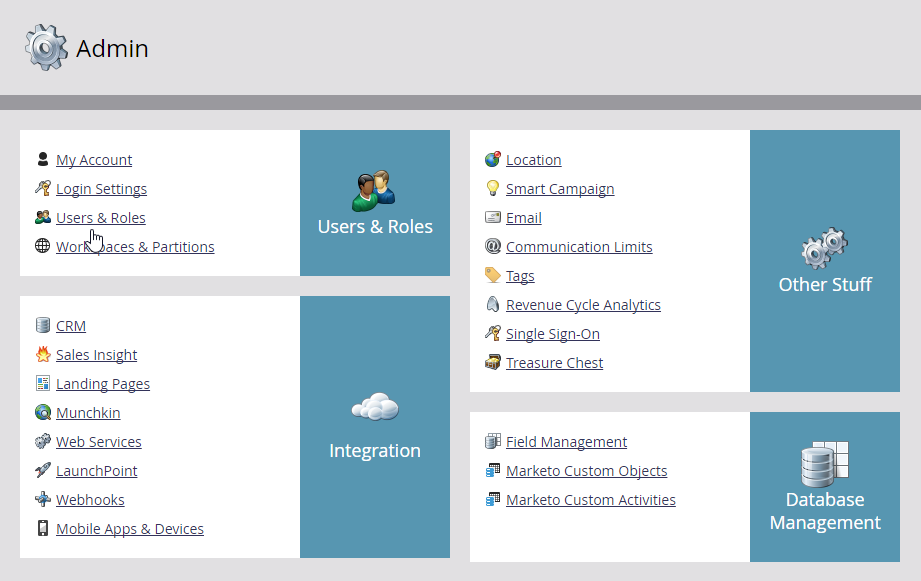
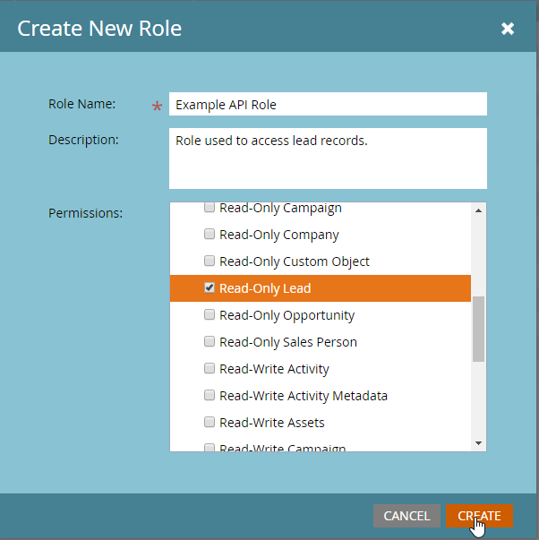
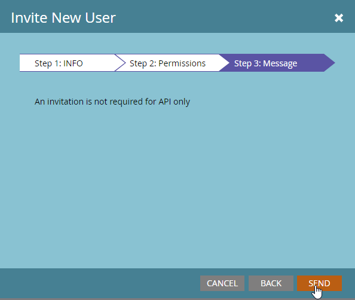
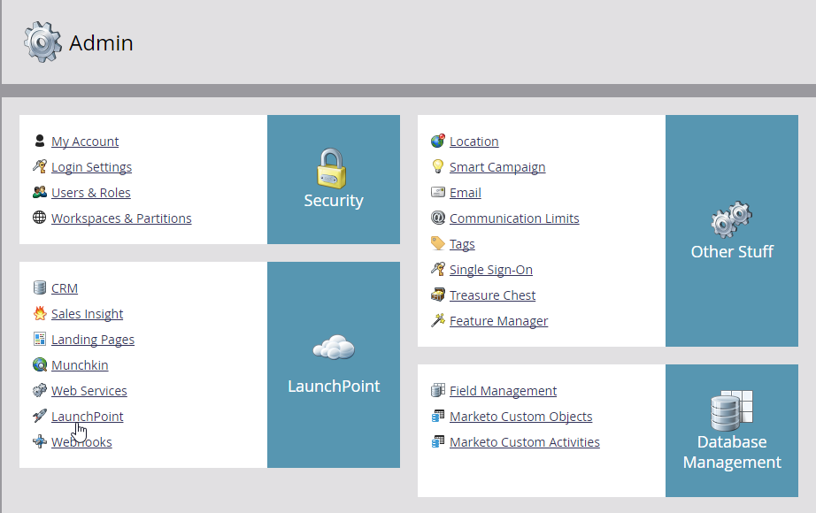
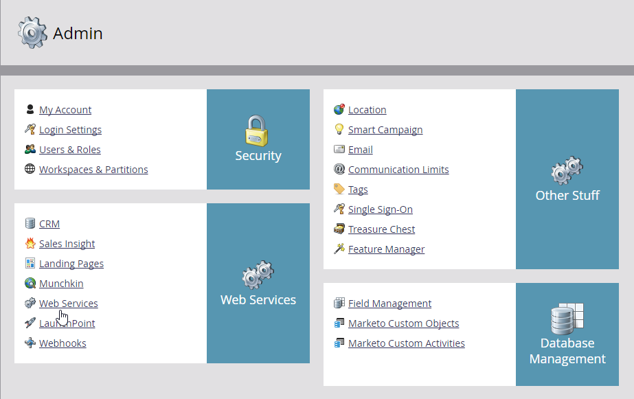

# REST API

Marketo公開REST API，允許從遠端執行系統的許多功能。 從建立程式到大量潛在客戶匯入，有許多選項可讓您對Marketo執行個體進行微調控制。

這些API通常分為兩大類： [潛在客戶資料庫](https://developer.adobe.com/marketo-apis/api/mapi/)和[資產](https://developer.adobe.com/marketo-apis/api/asset/)。 潛在客戶資料庫API可擷取Marketo個人記錄及相關物件型別（例如商機和公司）並與其互動。 資產API可與行銷宣傳品和工作流程相關記錄互動。

- **每日配額：**&#x200B;訂閱每天會配置50,000個API呼叫（這會在每日中午12:00CST重設）。 您可以透過帳戶管理員增加每日配額。
- **速率限制：**&#x200B;每個執行個體的API存取限製為每20秒100次呼叫。
- **並行限制：**  最多十個同時進行的API呼叫。

標準呼叫的大小限製為8KB的URI長度，而內文大小為1MB，不過大量API的內文可以是10MB。 如果您的呼叫發生錯誤，API通常仍會傳回狀態代碼200，但JSON回應將包含值為`false`的「success」成員，以及「errors」成員中的錯誤陣列。 錯誤詳細資訊[在此](error-codes.md)。

## 快速入門

下列步驟需要您Marketo執行個體的管理員許可權。

第一次致電Marketo時，您將擷取潛在客戶記錄。 若要開始使用Marketo，您必須取得API認證，才能對執行個體進行已驗證呼叫。 登入您的執行個體並移至&#x200B;**[!UICONTROL Admin]** -> **[!UICONTROL Users and Roles]**。



按一下「**[!UICONTROL Roles]**」標籤，然後按一下「新增角色」，並至少將「唯讀銷售機會」（或「唯讀人員」）許可權指派給Access API群組中的角色。 請務必提供描述性名稱，然後按一下&#x200B;**[!UICONTROL Create]**。



現在返回[!UICONTROL Users]標籤，然後按一下&#x200B;**[!UICONTROL Invite New User]**。 提供使用者描述性名稱（表示其為API使用者）和電子郵件地址，然後按一下&#x200B;**[!UICONTROL Next]**。


然後，核取[!UICONTROL API Only]選項並授與您建立的API角色給您的使用者，然後按一下&#x200B;**[!UICONTROL Next]**。


若要完成使用者建立程式，請按一下&#x200B;**[!UICONTROL Send]**。



接著，前往[!UICONTROL Admin]功能表並按一下&#x200B;**[!UICONTROL LaunchPoint]**。



按一下&#x200B;**[!UICONTROL New]**&#x200B;功能表並選取&#x200B;**[!UICONTROL New Service]**。 提供描述性服務名稱，並從[!UICONTROL Service]下拉式功能表中選取&#x200B;**[!UICONTROL Custom]**。 提供說明，然後從[!UICONTROL API Only User]下拉式功能表中選取您的新使用者，並按一下&#x200B;**[!UICONTROL Create]**。


按一下您新服務的&#x200B;**[!UICONTROL View Details]**&#x200B;以存取使用者端識別碼和使用者端密碼。 現在，您可以按一下&#x200B;**[!UICONTROL Get Token]**&#x200B;按鈕來產生一小時有效的存取權杖。 暫時將代號儲存在備註中。


接下來，前往&#x200B;**[!UICONTROL Admin]**&#x200B;功能表，然後前往&#x200B;**[!UICONTROL Web Services]**。



在REST API方塊中尋找[!UICONTROL Endpoint]並暫時儲存在備註中。


開啟新的瀏覽器標籤並輸入下列內容，使用適當的資訊呼叫[依篩選型別取得銷售機會](https://developer.adobe.com/marketo-apis/api/mapi/#tag/Leads/operation/getLeadsByFilterUsingGET)：

```
<Your Endpoint URL>/rest/v1/leads.json?access_token=<Your Access Token>&filterType=email&filterValues=<Your Email Address>
```

如果您的資料庫中沒有潛在客戶記錄包含您的電子郵件地址，請將其取代為您知道存在的記錄。 按一下URL列中的Enter鍵，您應該會得到類似以下內容的JSON回應：

```json
{
    "requestId":"c493#1511ca2b184",
    "result":[
       {
           "id":1,
           "updatedAt":"2015-08-24T20:17:23Z",
           "lastName":"Elkington",
           "email":"developerfeedback@marketo.com",
           "createdAt":"2013-02-19T23:17:04Z",
           "firstName":"Kenneth"
        }
    ],
    "success":true
}
```

## API 使用情況

每個API使用者會在API使用報告中個別報告，因此依使用者分割網站服務可讓您輕鬆說明每個整合的使用情況。 如果對您執行個體的API呼叫數量超過限制，並導致後續呼叫失敗，使用此作法可讓您計算每個服務的數量，並讓您評估如何解決問題。 前往「**[!UICONTROL Admin]** -> **[!UICONTROL Integration]** > **[!UICONTROL Web Services]**」並按一下過去七天的通話次數，以檢視您的使用情形。
