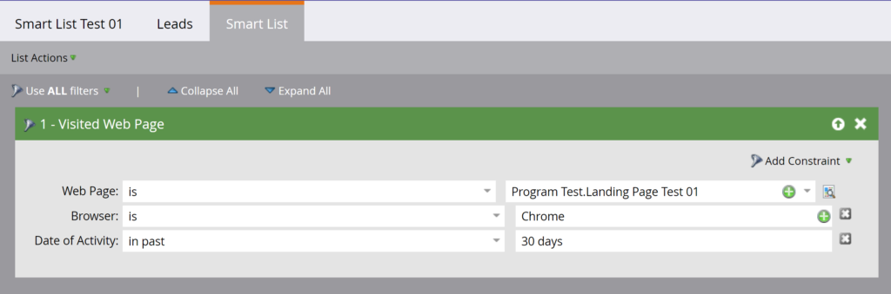

# 智慧清單

[智慧清單端點參考](https://developer.adobe.com/marketo-apis/api/asset/#tag/Smart-Lists)

Marketo提供了一組REST API，可用於對智慧列示執行作業。 這些API遵循資產API的標準介面模式，提供查詢、刪除和複製選項。

注意：這些API僅支援使用者建立的智慧列示。 無法用於[內建/系統智慧列示](https://experienceleague.adobe.com/zh-hant/docs/marketo/using/product-docs/core-marketo-concepts/smart-lists-and-static-lists/using-smart-lists/use-built-in-system-smart-lists)。

## 查詢

查詢智慧列示會依循[的標準查詢型別（依識別碼](https://developer.adobe.com/marketo-apis/api/asset/#tag/Smart-Lists/operation/getSmartListByIdUsingGET)、[依名稱](https://developer.adobe.com/marketo-apis/api/asset/#tag/Smart-Lists/operation/getSmartListByNameUsingGET)和[瀏覽](https://developer.adobe.com/marketo-apis/api/asset/#tag/Smart-Lists/operation/getSmartListsUsingGET)）。

### 依Id

[依ID](https://developer.adobe.com/marketo-apis/api/asset/#tag/Smart-Lists/operation/getSmartListByIdUsingGET)進行查詢，會以單一智慧列示`id`作為路徑引數，並傳回單一智慧列示記錄。 您可以選擇傳遞`includeRules`布林值引數，在回應中包含智慧列示規則。



```
GET /rest/asset/v1/smartList/{id}.json?includeRules=true
```

```json
{
    "success": true,
    "errors": [],
    "requestId": "6efc#16c8967a21f",
    "warnings": [],
    "result": [
        {
            "id": 4363,
            "name": "Smart List Test 01",
            "createdAt": "2019-06-03T23:01:13Z+0000",
            "updatedAt": "2019-06-04T17:37:45Z+0000",
            "url": "https://app-sjqe.marketo.com/#SL4363A1LA1",
            "folder": {
                "id": 1041,
                "type": "Program"
            },
            "workspace": "Default",
            "rules": {
                "filterMatchType": "all",
                "triggers": [],
                "filters": [
                    {
                        "id": 459,
                        "name": "Visited Web Page",
                        "ruleTypeId": 1,
                        "ruleType": "Activity",
                        "operator": "occurs",
                        "conditions": [
                            {
                                "activityAttributeId": 1,
                                "activityAttributeName": "Web Page",
                                "operator": "is",
                                "values": [
                                    "Program Test.Landing Page Test 01"
                                ],
                                "isPrimary": true
                            },
                            {
                                "activityAttributeId": 6,
                                "activityAttributeName": "Browser",
                                "operator": "is",
                                "values": [
                                    "Chrome"
                                ],
                                "isPrimary": false
                            },
                            {
                                "activityAttributeId": -101,
                                "activityAttributeName": "Date of Activity",
                                "operator": "in past",
                                "values": [
                                    "30 days"
                                ],
                                "isPrimary": false
                            }
                        ]
                    }
                ]
            }
        }
    ]
}
```

### 依智慧行銷活動Id

[依智慧行銷活動ID查詢](https://developer.adobe.com/marketo-apis/api/asset/#tag/Smart-Campaigns/operation/getSmartListBySmartCampaignIdUsingGET)會以單一智慧行銷活動`id`作為路徑引數，並傳回單一智慧清單記錄。 您可以選擇傳遞`includeRules`布林值引數，在回應中包含智慧列示規則。

```
GET /rest/asset/v1/smartCampaign/{smartCampaignId}/smartList.json
```

```json
{
    "success": true,
    "errors": [],
    "requestId": "6efc#16c8967a21f",
    "warnings": [],
    "result": [
        {
            "id": 4363,
            "name": "Smart List Test 01",
            "createdAt": "2019-06-03T23:01:13Z+0000",
            "updatedAt": "2019-06-04T17:37:45Z+0000",
            "url": "https://app-sjqe.marketo.com/#SL4363A1LA1",
            "folder": {
                "id": 1041,
                "type": "Program"
            },
            "workspace": "Default"
         }
    ]
}
```

### 依計畫ID

[依程式ID](https://developer.adobe.com/marketo-apis/api/asset/#tag/Programs/operation/getSmartListByProgramIdUsingGET)查詢，會以單一電子郵件程式`id`作為路徑引數，並傳回單一智慧清單記錄。 您可以選擇傳遞`includeRules`布林值引數，在回應中包含智慧列示規則。

```
GET /rest/asset/v1/program/{programId}/smartList.json
```

```json
{
    "success": true,
    "errors": [],
    "requestId": "6efc#16c8967a21f",
    "warnings": [],
    "result": [
        {
            "id": 4363,
            "name": "Smart List Test 01",
            "createdAt": "2019-06-03T23:01:13Z+0000",
            "updatedAt": "2019-06-04T17:37:45Z+0000",
            "url": "https://app-sjqe.marketo.com/#SL4363A1LA1",
            "folder": {
                "id": 1041,
                "type": "Program"
            },
            "workspace": "Default"
         }
    ]
}
```

### 依名稱

[依名稱查詢](https://developer.adobe.com/marketo-apis/api/asset/#tag/Smart-Lists/operation/getSmartListByNameUsingGET)將智慧清單`name`作為引數並傳回單一智慧清單記錄。  會針對執行個體中的所有智慧列示名稱執行完全相符的字串，並傳回符合該名稱的智慧列示結果。

```
GET /rest/asset/v1/smartList/byName.json?name=2018 Leads
```

```json
{
    "success": true,
    "errors": [],
    "requestId": "115d7#16423bc13b4",
    "result": [
        {
            "id": 283988,
            "name": "2018 Leads",
            "createdAt": "2008-10-07T15:20:39Z+0000",
            "updatedAt": "2010-04-13T15:34:32Z+0000",
            "url": "https://app-abm.marketo.com/#SL283988A1",
            "folder": {
                "id": 31,
                "type": "Folder"
            },
            "workspace": "Default"
        }
    ]
}
```

### 瀏覽

智慧列示也可以以批次[&#128279;](https://developer.adobe.com/marketo-apis/api/asset/#tag/Smart-Lists/operation/getSmartListsUsingGET)擷取。 `folder`引數是用來指定執行查詢的父資料夾。 其格式為包含`id`和`type`的JSON物件。 如同其他大量資產擷取端點，`offset`和`maxReturn`是可用於分頁的選用引數。 選用的`earliestUpdatedAt`和`latestUpdatedAt`日期時間引數可用來依據UpdatedAt日期範圍篩選結果。

```
GET /rest/asset/v1/smartLists.json?folder={"id":31,"type":"Folder"}
```

```json
{
    "success": true,
    "errors": [],
    "requestId": "9aa4#16423c0e969",
    "result": [
        {
            "id": 283988,
            "name": "2018 Leads",
            "createdAt": "2008-10-07T15:20:39Z+0000",
            "updatedAt": "2010-04-13T15:34:32Z+0000",
            "url": "https://app-abm.marketo.com/#SL283988A1",
            "folder": {
                "id": 31,
                "type": "Folder"
            },
            "workspace": "Default"
        },
        {
            "id": 299697,
            "name": "Active Prospects",
            "createdAt": "2008-10-17T02:09:49Z+0000",
            "updatedAt": "2010-03-27T18:27:46Z+0000",
            "url": "https://app-abm.marketo.com/#SL299697A1",
            "folder": {
                "id": 31,
                "type": "Folder"
            },
            "workspace": "Default"
        },
        {
            "id": 400517,
            "name": "Leads by Score",
            "createdAt": "2009-01-07T18:52:52Z+0000",
            "updatedAt": "2010-04-13T15:36:09Z+0000",
            "url": "https://app-abm.marketo.com/#SL400517A1",
            "folder": {
                "id": 31,
                "type": "Folder"
            },
            "workspace": "Default"
        }
    ]
}
```

## 原地複製

[複製智慧列示](https://developer.adobe.com/marketo-apis/api/asset/#tag/Smart-Lists/operation/cloneSmartListUsingPOST)是以application/x-www-form-urlencodedPOST執行。 在`id`路徑引數中指定要複製的智慧清單。 `folder`引數是用來指定要在其下建立智慧列示的父資料夾，並格式化為包含ID和型別的JSON物件。 父資料夾必須是程式或智慧清單資料夾。 `name`引數是用來命名新的智慧清單，而且必須是唯一的。 可選擇使用`description`引數描述智慧列示。

```
POST /rest/asset/v1/smartList/{id}/clone.json
```

```
Content-Type: application/x-www-form-urlencoded
```

```
folder={"id":31,"type":"Folder"}&name=2018 Leads Qualified
```

```json
{
    "success": true,
    "errors": [],
    "requestId": "a672#16423d755ed",
    "result": [
        {
            "id": 788645,
            "name": "2018 Leads Qualified",
            "createdAt": "2018-06-21T19:34:32Z+0000",
            "updatedAt": "2018-06-21T19:34:32Z+0000",
            "url": "https://app-abm.marketo.com/#SL788645A1",
            "folder": {
                "id": 31,
                "type": "Folder"
            },
            "workspace": "Default"
        }
    ]
}
```

## 刪除

[刪除智慧列示](https://developer.adobe.com/marketo-apis/api/asset/#tag/Smart-Lists/operation/deleteSmartListByIdUsingPOST)會以單一智慧列示`id`作為路徑引數。

```
POST /rest/asset/v1/smartList/{id}/delete.json
```

```json
{
    "success": true,
    "errors": [],
    "requestId": "8f5#16423dd0fbe",
    "result": [
        {
            "id": 788645
        }
    ]
}
```
