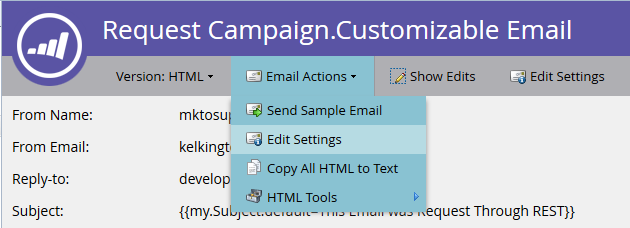
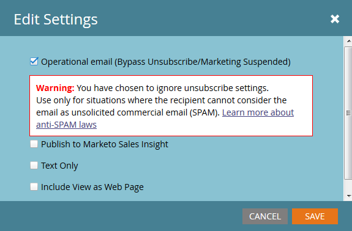
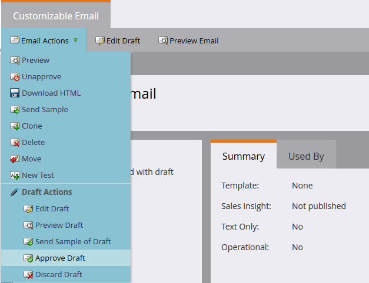
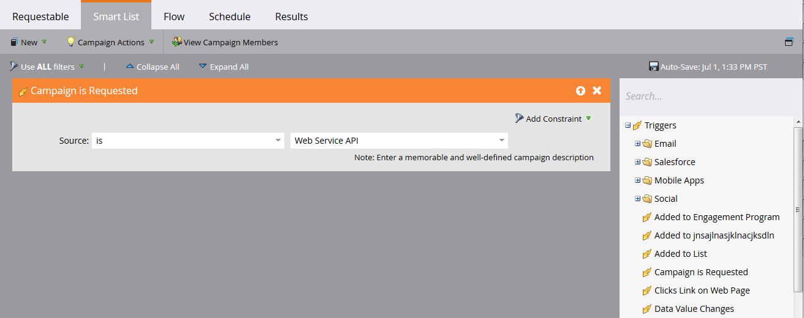
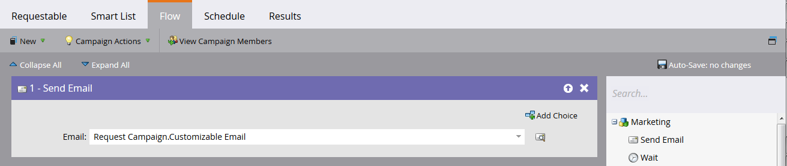
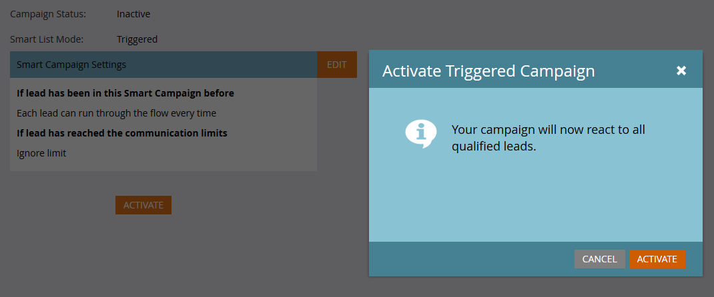
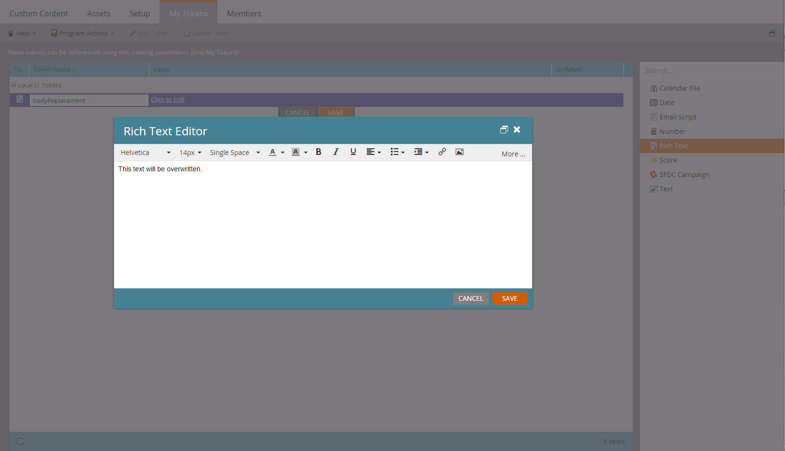
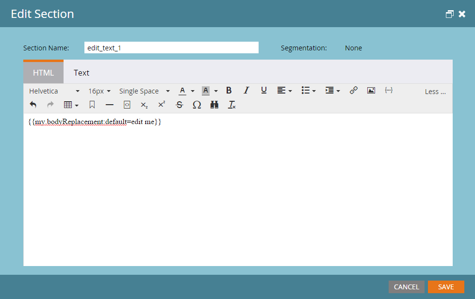

# 異動電子郵件

Marketo API的常見使用案例是透過[請求行銷活動](https://developer.adobe.com/marketo-apis/api/mapi/#tag/Campaigns/operation/triggerCampaignUsingPOST) API呼叫，觸發傳送異動電子郵件給特定記錄。 Marketo有一些設定需求，需要透過Marketo REST API執行必要的呼叫。

- 收件者必須在Marketo中擁有記錄
- 您的Marketo執行個體中必須已建立和核准交易式電子郵件。
- 必須有具有「已請求行銷活動，1」的有效觸發行銷活動。 Source：網站服務API」，設定為傳送電子郵件

首先[建立並核准您的電子郵件](https://experienceleague.adobe.com/docs/marketo/using/home.html?lang=zh-Hant)。 如果電子郵件確實是交易式的，您可能必須將其設定為可操作的，但請確保其符合操作性法律資格。 這可透過「電子郵件動作>電子郵件設定」下的「編輯」畫面進行設定：





核准，我們就能建立行銷活動：



如果您是建立行銷活動的新手，請參閱[建立新的Smart Campaign](https://experienceleague.adobe.com/docs/marketo/using/product-docs/core-marketo-concepts/smart-campaigns/creating-a-smart-campaign/create-a-new-smart-campaign.html?lang=zh-Hant)文章。 在您建立行銷活動後，我們必須完成這些步驟。 使用Campaign is Requested觸發器設定智慧清單：



現在，我們必須設定流程以將「傳送電子郵件」步驟指向電子郵件：



啟用之前，您必須在「排程」標籤中決定某些設定。 如果此特定電子郵件只應傳送至指定記錄一次，則保留資格設定。 不過，如果要求他們多次收到電子郵件，則您想要將其調整為每次或其中一個可用步調：

現在我們已準備好啟動：



## 傳送API呼叫

**注意：**&#x200B;在下方的Java範例中，我們使用[minimal-json套件](https://github.com/ralfstx/minimal-json)處理程式碼中的JSON表現。

透過API傳送交易式電子郵件的第一個部分，是確保您的Marketo執行個體中存在具有對應電子郵件地址的記錄，並且我們有權存取其銷售機會ID。 出於本文目的，我們假設電子郵件地址已在Marketo中，且我們僅必須擷取記錄ID。 為此，我們使用[依篩選器型別取得銷售機會](https://developer.adobe.com/marketo-apis/api/mapi/#tag/Leads/operation/getLeadsByFilterUsingGET)呼叫。 讓我們來看一下要求促銷活動的主要方法：

```java
package dev.marketo.blog_request_campaign;

import com.eclipsesource.json.JsonArray;

public class App
{
    public static void main( String[] args )
    {
        //Create an instance of Auth so that we can authenticate with our Marketo instance
        Leads leadsRequest = new Leads(auth).setFilterType("email").addFilterValue("requestCampaign.test@marketo.com");

        //Create and parameterize an instance of Leads
        //Set your email filterValue appropriately
        Leads leadsRequest = new Leads(auth).setFilterType("email").addFilterValue("test.requestCamapign@example.com");

        //Get the inner results array of the response
        JsonArray leadsResult = leadsRequest.getData().get("result").asArray();

        //Get the id of the record indexed at 0
        int lead = leadsResult.get(0).asObject().get("id").asInt();

        //Set the ID of your campaign from Marketo
        int campaignId = 0;
        RequestCampaign rc = new RequestCampaign(auth, campaignId).addLead(lead);

        //Send the request to Marketo
        rc.postData();
    }
}
```

若要從leadsRequest的JsonObject回應取得這些結果，我們必須編寫一些程式碼。 若要擷取Array中的第一個結果，我們必須從JsonObject中擷取Array，並取得在0索引的物件：

```java
JsonArray leadsResult = leadsRequest.getData().get("result").asArray();
int leadId = leadsResult.get(0).asObject().get("id").asInt();
```

從現在開始，我們只需進行「請求行銷活動」呼叫。 為此，所需的引數為請求URL中的ID，以及包含一個成員「id」的JSON物件陣列。 讓我們來看看相關的程式碼：

```java
package dev.marketo.blog_request_campaign;
import java.io.IOException;
import java.io.InputStream;
import java.io.InputStreamReader;
import java.io.OutputStreamWriter;
import java.io.Reader;
import java.net.MalformedURLException;
import java.net.URL;
import java.util.ArrayList;
import javax.net.ssl.HttpsURLConnection;
import com.eclipsesource.json.JsonArray;
import com.eclipsesource.json.JsonObject;

public class RequestCampaign {
    private String endpoint;
    private Auth auth;
    public ArrayList leads = new ArrayList();
    public ArrayList tokens = new ArrayList();

    public RequestCampaign(Auth auth, int campaignId) {
        this.auth = auth;
        this.endpoint = this.auth.marketoInstance + "/rest/v1/campaigns/" + campaignId + "/trigger.json";
    }
    public RequestCampaign setLeads(ArrayList leads) {
        this.leads = leads;
        return this;
    }
    public RequestCampaign addLead(int lead){
        leads.add(lead);
        return this;
    }
    public RequestCampaign setTokens(ArrayList tokens) {
        this.tokens = tokens;
        return this;
    }
    public RequestCampaign addToken(String tokenKey, String val){
        JsonObject jo = new JsonObject().add("name", tokenKey);
        jo.add("value", val);
        tokens.add(jo);
        return this;
    }
    public JsonObject postData(){
        JsonObject result = null;
        try {
            JsonObject requestBody = buildRequest(); //builds the Json Request Body
            System.out.println("Executing RequestCampaign call\n" + "Endpoint: " + endpoint + "\nRequest Body:\n"  + requestBody);
            URL url = new URL(endpoint);
            HttpsURLConnection urlConn = (HttpsURLConnection) url.openConnection(); //Return a URL connection and cast to HttpsURLConnection
            urlConn.setRequestMethod("POST");
            urlConn.setRequestProperty("Content-type", "application/json");
            urlConn.setRequestProperty("accept", "text/json");
            urlConn.setDoOutput(true);
            OutputStreamWriter wr = new OutputStreamWriter(urlConn.getOutputStream());
            wr.write(requestBody.toString());
            wr.flush();
            InputStream inStream = urlConn.getInputStream(); //get the inputStream from the URL connection
            Reader reader = new InputStreamReader(inStream);
            result = JsonObject.readFrom(reader); //Read from the stream into a JsonObject
            System.out.println("Result:\n" + result);
        } catch (MalformedURLException e) {
            e.printStackTrace();
        } catch (IOException e) {
            e.printStackTrace();
        }
        return result;
    }

    private JsonObject buildRequest(){
        JsonObject requestBody = new JsonObject(); //Create a new JsonObject for the Request Body
        JsonObject input = new JsonObject();
        JsonArray leadsArray = new JsonArray();
        for (int lead : leads) {
            JsonObject jo = new JsonObject().add("id", lead);
            leadsArray.add(jo);
        }
        input.add("leads", leadsArray);
        JsonArray tokensArray = new JsonArray();
        for (JsonObject jo : tokens) {
            tokensArray.add(jo);
        }
        input.add("tokens", tokensArray);
        requestBody.add("input", input);
        return requestBody;
    }

}
```

此類別有一個接受驗證的建構函式，以及促銷活動的ID。 透過傳遞包含記錄的ID的`ArrayList<Integer>`給setLeads，或使用addLead （取一個整數並將其附加到leads屬性中的現有ArrayList），將潛在客戶新增到物件。 若要觸發API呼叫以將潛在客戶記錄傳遞至促銷活動，必須呼叫postData，其會傳回包含來自請求的回應資料的JsonObject。 呼叫要求促銷活動時，Marketo中的目標觸發程式促銷活動會處理每個傳遞至呼叫的潛在客戶，並傳送先前建立的電子郵件。 恭喜，您已透過Marketo REST API觸發電子郵件。 請留意第2部分，我們將透過「請求行銷活動」以動態方式自訂電子郵件內容。

### 建立電子郵件

若要自訂我們的內容，我們必須先在Marketo中設定[程式](https://experienceleague.adobe.com/docs/marketo/using/product-docs/core-marketo-concepts/programs/creating-programs/create-a-program.html?lang=zh-Hant)和[電子郵件](https://experienceleague.adobe.com/docs/marketo/using/home.html?lang=zh-Hant)。 若要產生自訂內容，我們必須在程式中建立權杖，然後將它們放入要傳送的電子郵件中。 為了簡單起見，在此範例中，我們僅使用一個權杖，但您可以取代電子郵件、寄件者電子郵件、寄件者姓名、回覆或電子郵件中任何內容的任何數量權杖。 所以讓我們建立一個Token Rich Text作為取代，並將其稱為「bodyReplacement」。 RTF可讓我們使用想要輸入的任意HTML來取代權杖中的任何內容。



Token在空白時無法儲存，因此請在此插入一些預留位置文字。 現在必須將代號插入電子郵件中：



此Token現在可透過「請求行銷活動」呼叫進行取代。 此代號可以很簡單，只需一行文字，但必須根據每封電子郵件進行取代，也可以包含電子郵件的幾乎整個版面。

### 代碼

```java
package dev.marketo.blog_request_campaign;

import com.eclipsesource.json.JsonArray;

public class App
{
    public static void main( String[] args )
    {
        //Create an instance of Auth so that we can authenticate with our Marketo instance
        Auth auth = new Auth("Client ID - CHANGE ME", "Client Secret - CHANGE ME", "Host - CHANGE ME");

        //Create and parameterize an instance of Leads
        Leads leadsRequest = new Leads(auth).setFilterType("email").addFilterValue("requestCampaign.test@marketo.com");

        //get the inner results array of the response
        JsonArray leadsResult = leadsRequest.getData().get("result").asArray();

        //get the id of the record indexed at 0
        int lead = leadsResult.get(0).asObject().get("id").asInt();

        //Set the ID of our campaign from Marketo
        int campaignId = 1578;
        RequestCampaign rc = new RequestCampaign(auth, campaignId).addLead(lead);

        //Create the content of the token here, and add it to the request
        String bodyReplacement = "<div class=\"replacedContent\"><p>This content has been replaced</p></div>";
        rc.addToken("{{my.bodyReplacement}}", bodyReplacement);
        rc.postData();
    }
}
```

如果程式碼看起來很熟悉，那是因為它只有上述主要方法的另外兩行。 這次我們要在bodyReplacement變數中建立權杖的內容，然後使用addToken方法將其新增至請求。 addToken會取得索引鍵和值，然後建立JsonObject表示法並將其新增至內部Token陣列。 然後在postData方法期間將其序列化，並建立如下所示的主體：

```json
{
    "input":
    {
        "leads": [
            {
                "id": 1
            }
        ],
        "tokens": [
            {
                "name": "{{my.bodyReplacement}}",
                "value": "<div class=\"replacedContent\"><p>This content has been replaced</p></div>"
            }
        ]
    }
}
```

結合之後，我們的主控台輸出如下所示：

```bash
Token is empty or expired. Trying new authentication
Trying to authenticate with ...
Got Authentication Response: {"access_token":"19d51b9a-ff60-4222-bbd5-be8b206f1d40:st","token_type":"bearer","expires_in":3565,"scope":"apiuser@mktosupport.com"}
Executing RequestCampaign call
Endpoint: .../rest/v1/campaigns/1578/trigger.json
Request Body:
{"input":{"leads":[{"id":1}],"tokens":[{"name":"{{my.bodyReplacement}}","value":"<div class=\"replacedContent\"><p>This content has been replaced</p></div>"}]}}
Result:
{"requestId":"1e8d#14eadc5143d","result":[{"id":1578}],"success":true}
```

## 正在結束

此方法可透過多種方式擴充，可變更個別版面區段內或外部電子郵件中的內容，讓自訂值可傳遞至任務或有趣的時刻。 在程式中可以使用代號的任何地方，都可以使用此方法自訂。 [排程行銷活動](https://developer.adobe.com/marketo-apis/api/mapi/#tag/Campaigns/operation/scheduleCampaignUsingPOST)呼叫也有類似的功能，可讓您處理整個批次行銷活動中的權杖。 這些無法根據潛在客戶進行自訂，但可用於在廣泛的潛在客戶群中自訂內容。
