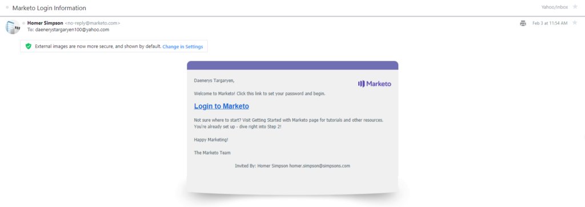

# User Management

[使用者管理端點參考](https://developer.adobe.com/marketo-apis/api/user/)

Marketo提供了一組「使用者管理」端點，可讓您對Marketo中的使用者記錄執行CRUD操作。 使用者是透過傳送邀請給使用者來建立，接著使用者會設定密碼，並首次獲得Marketo存取權。

不同於其他Marketo REST API，使用「使用者管理API」時：

- 您必須使用HTTP標頭方法來傳送存取權杖以進行驗證。 您無法傳遞存取權杖作為查詢字串引數。 有關驗證的詳細資訊為[這裡](authentication.md)。
- 建立REST API之[自訂服務](https://experienceleague.adobe.com/en/docs/marketo/using/product-docs/administration/additional-integrations/create-a-custom-service-for-use-with-rest-api)的使用者角色時，您必須從兩個不同的群組選取角色許可權：
   1. 來自[存取管理員](https://experienceleague.adobe.com/en/docs/marketo/using/product-docs/administration/users-and-roles/descriptions-of-role-permissions)群組的「存取使用者」許可權
   1. [Access API](https://experienceleague.adobe.com/en/docs/marketo/using/product-docs/administration/users-and-roles/descriptions-of-role-permissions)群組中的「Access User Management Api」
- 回應主體不包含「success」布林值屬性，指出呼叫的成功或失敗。 您必須改為評估HTTP回應狀態代碼。 如果呼叫成功，則會傳回200狀態代碼。 如果呼叫失敗，會傳回非200層級的狀態代碼，且回應內文包含標準「錯誤」陣列，其中包含錯誤代碼和描述性錯誤訊息。
- 日期時間字串的格式為`yyyyMMdd'T'HH:mm:ss.SSS't'+|-hhmm`。 這適用於下列屬性： `createdAt`、`updatedAt`、`expiresAt`。
- 使用者管理API端點未像其他端點一樣以「/rest」為前置詞。

## 查詢

使用者管理的查詢支援包括擷取所有使用者、角色和工作區的功能。 此外，您也可以依使用者ID擷取單一使用者記錄，或依使用者ID擷取角色/工作區記錄。

### 使用者（依ID）

[依ID](https://developer.adobe.com/marketo-apis/api/user/#tag/User-Management/operation/getUserUsingGET)取得使用者(Get User by ID)端點採用單一`userid`路徑引數，並傳回已接受其邀請之使用者的單一使用者記錄。

```
GET /userservice/management/v1/users/{userid}/user.json
```

```json
{
  "userid": "jamie@houselannister.com",
  "firstName": "Jamie",
  "lastName": "Lannister",
  "emailAddress": "jamie@lannister.com",
  "optedIn": false,
  "failedLogins": 0,
  "failedDeviceCode": 0,
  "isLocked": false,
  "lockedReason": null,
  "id": 0,
  "apiOnly": false,
  "userRoleWorkspaces": [
    {
      "accessRoleId": 1,
      "accessRoleName": "Admin",
      "workspaceId": 0,
      "workspaceName": "AllZones"
    },
    {
      "accessRoleId": 2,
      "accessRoleName":
      "Standard User",
      "workspaceId": 1008,
      "workspaceName": "World"
    }
  ],
  "expiresAt": "2020-12-31T08:00:00.000t+0000",
  "lastLoginAt": "2020-02-05T01:02:23.000t+0000"
}
```

### 依識別碼邀請的使用者

[依ID](https://developer.adobe.com/marketo-apis/api/user/#tag/User-Management/operation/getInvitedUserUsingGET)取得受邀的使用者端點接受單一`userid`路徑引數，並傳回「擱置中」使用者的單一使用者記錄（尚未接受其邀請）。

```
GET /userservice/management/v1/users/{userid}/invite.json
```

```json
{
    "id": 25112,
    "firstName": "Jamie",
    "lastName": "Lannister",
    "emailAddress": "jamie@lannister.com",
    "userId": "jamie@lannister.com",
    "subscriptionId": 3381,
    "status": "pending",
    "expiresAt": "20200807T20:49:54.0t+0000",
    "createdAt": "20200731T20:49:54.0t+0000",
    "updatedAt": "20200731T20:49:54.0t+0000"
}
```

### 依Id區分的角色和工作區

[依ID](https://developer.adobe.com/marketo-apis/api/user/#tag/User-Management/operation/getUserRolesAndWorkspacesUsingGET)取得角色和工作區端點採用單一`userid`路徑引數，並傳回使用者角色和工作區記錄的清單。 回應包含一個物件的陣列，其中含有指定使用者的角色和工作區ID與名稱。

```
GET /userservice/management/v1/users/{userid}/roles.json
```

```json
[
  {
    "accessRoleId": 1,
    "accessRoleName": "Admin",
    "workspaceId": 0,
    "workspaceName": "AllZones"
  },
  {
    "accessRoleId": 2,
    "accessRoleName": "Standard User",
    "workspaceId": 1008,
    "workspaceName": "World"
  }
]
```

### 瀏覽使用者

[Get Users](https://developer.adobe.com/marketo-apis/api/user/#tag/User-Management/operation/getUsersUsingGET)端點傳回所有使用者記錄的清單。 選用的`pageSize`引數是整數，它指定要傳回的最大專案數。 預設值為20。 最大值為200。 選用的`pageOffset`引數是整數，指定從何處開始擷取專案。 可與`pageSize`搭配使用。 預設值為0。

```
GET /userservice/management/v1/users/allusers.json
```

```json
[
  {
    "userid": "jamie@lannister.com",
    "firstName": "Jamie",
    "lastName": "Lannister",
    "emailAddress": "jamie@houselannister.com",
    "id": 6785,
    "apiOnly": false
  },
  {
    "userid": "jeoffery@housebaratheon.com",
    "firstName": "Jeoffery",
    "lastName": "Baratheon",
    "emailAddress": "jeoffery@housebaratheon.com",
    "id": 7718,
    "apiOnly": false
  },
  {
    "userid": "rickon@housestark.com",
    "firstName": "Rickon",
    "lastName": "Stark",
    "emailAddress": "rickon@housestark.com",
    "id": 8612,
    "apiOnly": false
  }
]
```

>[!NOTE]
>
>在上述程式碼範例中，顯示的`userid`適用於已移轉至Adobe IMS的客戶。 尚未移轉的客戶會在`userid`欄位中看到一般電子郵件地址。

### 瀏覽角色

[Get Roles](https://developer.adobe.com/marketo-apis/api/user/#tag/User-Management/operation/getRolesUsingGET)端點傳回所有角色記錄的清單。

```
GET /userservice/management/v1/users/roles.json
```

```json
[
    {
        "id": 1,
        "name": "Admin",
        "description": "All permissions",
        "type": "system",
        "hidden": false,
        "onlyAllZones": true,
        "createdAt": "20100327T18:27:42.0t+0000",
        "updatedAt": "20100327T18:27:42.0t+0000"
    },
    {
        "id": 2,
        "name": "Standard User",
        "description": "All permissions except Admin",
        "type": "system",
        "hidden": false,
        "onlyAllZones": false,
        "createdAt": "20100327T18:27:42.0t+0000",
        "updatedAt": "20180423T02:33:29.0t+0000"
    },
    {
        "id": 24,
        "name": "RTP Launcher",
        "description": "Role required for launcher in RTP",
        "type": "system",
        "hidden": false,
        "onlyAllZones": false,
        "createdAt": "20151024T01:45:40.0t+0000",
        "updatedAt": "20171024T23:41:24.0t+0000"
    },
    {
        "id": 25,
        "name": "RTP Editor",
        "description": "Role required for editor in RTP",
        "type": "system",
        "hidden": false,
        "onlyAllZones": false,
        "createdAt": "20151024T01:45:40.0t+0000",
        "updatedAt": "20171024T23:41:24.0t+0000"
    },
    {
        "id": 101,
        "name": "Analytics User",
        "description": "Has access to Analytics",
        "type": "custom",
        "hidden": false,
        "onlyAllZones": false,
        "createdAt": "20100327T18:27:42.0t+0000",
        "updatedAt": "20180423T02:33:29.0t+0000"
    },
    {
        "id": 102,
        "name": "Marketing User",
        "description": "All permissions except Admin",
        "type": "custom",
        "hidden": false,
        "onlyAllZones": false,
        "createdAt": "20100327T18:27:42.0t+0000",
        "updatedAt": "20100327T18:27:42.0t+0000"
    },
    {
        "id": 103,
        "name": "Web Designer",
        "description": "Has access to Design Studio except approval permission",
        "type": "custom",
        "hidden": false,
        "onlyAllZones": false,
        "createdAt": "20100327T18:27:42.0t+0000",
        "updatedAt": "20180423T02:33:29.0t+0000"
    }
]
```

### 瀏覽工作區

[Get Workspaces](https://developer.adobe.com/marketo-apis/api/user/#tag/User-Management/operation/getWorkspacesUsingGET)端點傳回所有工作區記錄的清單。

```
GET /userservice/management/v1/users/workspaces.json
```

```json
[
  {
    "id": 1,
    "name": "Default",
    "description": "Initial workspace for Marketing Activities, Design Studio, and so on.",
    "globalViz": 0,
    "status": "active",
    "currencyInfo": null,
    "createdAt": "20160910T23:08:05.0t+0000",
    "updatedAt": "20160910T23:08:05.0t+0000"
  },
  {
    "id": 1008,
    "name": "World",
    "description": "",
    "globalViz": 0,
    "status": "active",
    "currencyInfo": null,
    "createdAt": "20181119T21:59:36.0t+0000",
    "updatedAt": "20181119T21:59:36.0t+0000"
  },
  {
    "id": 1009,
    "name": "Reproduction - US English - All Leads",
    "description": "A Workspace for recreating customer-reported problems.",
    "globalViz": 1,
    "status": "active",
    "currencyInfo": null,
    "createdAt": "20190129T23:36:37.0t+0000",
    "updatedAt": "20190129T23:36:37.0t+0000"
  },
  {
    "id": 1010,
    "name": "US",
    "description": "United States - Qualified Leads",
    "globalViz": 0,
    "status": "active",
    "currencyInfo": null,
    "createdAt": "20190322T15:55:40.0t+0000",
    "updatedAt": "20190322T15:55:40.0t+0000"
  }
]
```

## 邀請使用者

在[Adobe IMS整合訂閱](https://experienceleague.adobe.com/en/docs/marketo/using/product-docs/administration/marketo-with-adobe-identity/adobe-identity-management-overview)上，此端點僅支援[僅限API的使用者](https://experienceleague.adobe.com/en/docs/marketo/using/product-docs/administration/users-and-roles/create-an-api-only-user)的邀請。 若要邀請[標準使用者](https://experienceleague.adobe.com/en/docs/marketo/using/product-docs/administration/users-and-roles/managing-marketo-users)，請改用[Adobe User Management API](https://developer.adobe.com/umapi/)。

[邀請使用者](https://developer.adobe.com/marketo-apis/api/user/#tag/User-Management/operation/inviteUserUsingPOST)端點會傳送「歡迎使用Marketo」電子郵件邀請給新使用者。 電子郵件內文包含「登入Marketo」連結，可讓使用者首次存取Marketo。 若要接受邀請，電子郵件收件者請按一下「登入Marketo」連結、建立密碼，然後取得Marketo的存取權。 在接受程式完成之前，邀請處於「擱置中」狀態，使用者記錄可能無法編輯。 未決的邀請會在傳送七天後過期。 如需管理使用者的詳細資訊，請參閱[這裡](https://experienceleague.adobe.com/en/docs/marketo/using/product-docs/administration/users-and-roles/managing-marketo-users)。

引數以`application/json`格式傳入要求內文。

需要下列引數：  `emailAddress`，`firstName`，`lastName, userRoleWorkspaces`。 `userRoleWorkspaces`引數是包含`accessRoleId`和`workspaceId`屬性的物件陣列。

`userid`引數是用於使用者登入目的的唯一使用者識別碼字串值，必須格式化為電子郵件地址。 如果未在要求中提供，`userid`的值預設為`emailAddress`引數中提供的值。

布林值`apiOnly`引數指定使用者是否為[僅限API的使用者](https://experienceleague.adobe.com/en/docs/marketo/using/product-docs/administration/users-and-roles/create-an-api-only-user)。 `expiresAt`引數指定使用者登入到期的時間，並使用W3C ISO-8601格式（不含毫秒）格式化。 若未於要求中提供，表示使用者永不過期。 `reason`引數是說明使用者邀請原因的字串。

如果成功，端點會傳回「true」值，否則會傳回錯誤訊息。

```
POST /userservice/management/v1/users/invite.json
```

```
Content-Type: application/json
```

```json
{
  "emailAddress": "daenerys@housetargaryen.com",
  "firstName": "Daenerys",
  "lastName": "Targaryen",
  "expiresAt": "2020-12-31T23:59:59-05:00",
  "reason": "Keeper of dragons",
  "userRoleWorkspaces": [
    {
      "accessRoleId": 1,
      "workspaceId": 0
    }
  ]
}
```

```
true
```

以下是傳送給新使用者的「歡迎使用Marketo」電子郵件邀請範例。 電子郵件主旨列為「Marketo登入資訊」，寄件者為與[REST API自訂服務](https://experienceleague.adobe.com/en/docs/marketo/using/product-docs/administration/additional-integrations/create-a-custom-service-for-use-with-rest-api)相關聯的僅限API使用者的電子郵件地址，而收件者則是透過firstName、lastName及emailAddress引數指定的收件者。



使用者透過輸入兩次密碼並按一下「建立密碼」按鈕來接受電子郵件邀請。 之後，她便第一次獲得Marketo的存取權。

## 更新使用者

更新對使用者的支援包括更新使用者屬性或刪除使用者的功能。 只有已接受其邀請的使用者才能更新。 屬性會以application/json格式傳遞為請求內文的引數。

### 更新使用者屬性

在[Adobe IMS整合訂閱](https://experienceleague.adobe.com/en/docs/marketo/using/product-docs/administration/marketo-with-adobe-identity/adobe-identity-management-overview)上，此端點僅支援更新[僅限API的使用者](https://experienceleague.adobe.com/en/docs/marketo/using/product-docs/administration/users-and-roles/create-an-api-only-user)的屬性。 若要更新[標準使用者](https://experienceleague.adobe.com/en/docs/marketo/using/product-docs/administration/users-and-roles/managing-marketo-users)的屬性，請改用[Adobe使用者管理API](https://developer.adobe.com/umapi/)。

[更新使用者屬性](https://developer.adobe.com/marketo-apis/api/user/#tag/User-Management/operation/updateUserAttributeUsingPOST)端點採用單一`userid`路徑引數並傳回單一使用者記錄。 要求內文包含一或多個要更新的使用者屬性： `emailAddress`、`firstName`、`lastName`、`expiresAt`。

```
POST /userservice/management/v1/users/{userid}/update.json
```

```
Content-Type: application/json
```

```json
{
  "firstName": "JAMIE",
  "lastName": "LANISTER",
  "expiresAt": "20211231T08:00:00.000t+0000"
}
```

```json
{
  "userid": "jamie@houselannister.com",
  "firstName": "JAMIE",
  "lastName": "LANISTER",
  "emailAddress": "jamie@houselannister.com",
  "optedIn": false,
  "failedLogins": 0,
  "failedDeviceCode": 0,
  "isLocked": false,
  "lockedReason": null,
  "id": 0,
  "apiOnly": false,
  "userRoleWorkspaces": [
    {
      "accessRoleId": 1,
      "accessRoleName": "Admin",
      "workspaceId": 0,
      "workspaceName": "AllZones"
    },
    {
      "accessRoleId": 2,
      "accessRoleName":
      "Standard User",
      "workspaceId": 1008,
      "workspaceName": "World"
    }
  ],
  "expiresAt": "2021-12-31T08:00:00.000t+0000"
  "lastLoginAt": "2020-02-05T01:02:23.000t+0000"
}
```

#### 刪除使用者

在[Adobe IMS整合訂閱](https://experienceleague.adobe.com/en/docs/marketo/using/product-docs/administration/marketo-with-adobe-identity/adobe-identity-management-overview)上，此端點僅支援刪除[僅限API的使用者](https://experienceleague.adobe.com/en/docs/marketo/using/product-docs/administration/users-and-roles/create-an-api-only-user)。 若要刪除[標準使用者](https://experienceleague.adobe.com/en/docs/marketo/using/product-docs/administration/users-and-roles/managing-marketo-users)，請改用[Adobe使用者管理API](https://developer.adobe.com/umapi/)。

[Delete User](https://developer.adobe.com/marketo-apis/api/user/#tag/User-Management/operation/deleteUserUsingPOST)端點採用單一`userid`路徑引數，並從執行個體中刪除對應的使用者。 這是破壞性刪除，無法回覆。 如果成功，會傳回200狀態碼，否則會傳回錯誤訊息。

```
POST /userservice/management/v1/users/{userid}/delete.json
```

#### 刪除受邀使用者

[刪除受邀使用者](https://developer.adobe.com/marketo-apis/api/user/#tag/User-Management/operation/deleteInvitedUserUsingPOST)端點取得單一`userid`路徑引數，並從執行個體中刪除對應的「擱置」使用者（使用者尚未接受其邀請）。 這是破壞性刪除，無法回覆。 如果成功，會傳回200狀態碼，否則會傳回錯誤訊息。

```
POST /userservice/management/v1/users/{userid}/invite/delete.json
```

## 更新角色

對角色的更新支援包括新增和刪除角色的功能。 屬性會以application/json格式傳遞為請求內文的引數。

## 新增角色

[新增角色](https://developer.adobe.com/marketo-apis/api/user/#tag/User-Management/operation/addRolesUsingPOST)端點採用單一`userid`路徑引數，並將一或多個使用者角色新增至對應的使用者。 請求內文包含一或多個物件的清單，每個物件都包含  `accessRoleId`和`workspaceId`屬性。 如果成功，則會傳回指定使用者的`accessRoleId/workspaceId`配對完整清單。

```
POST /userservice/management/v1/users/{userid}/roles/create.json
```

```
Content-Type: application/json
```

```json
[
  {
    "accessRoleId": 2,
    "workspaceId": 1008
  }
]
```

```json
[
  {
    "accessRoleId": 1,
    "accessRoleName": "Admin",
    "workspaceId": 0,
    "workspaceName": "AllZones"
  },
  {
    "accessRoleId": 2,
    "accessRoleName": "Standard User",
    "workspaceId": 1008,
    "workspaceName": "World"
  }
]
```

## 刪除角色

[刪除角色](https://developer.adobe.com/marketo-apis/api/user/#tag/User-Management/operation/deleteRolesUsingPOST)端點採用單一`userid`路徑引數，並從對應的使用者中刪除一或多個使用者角色。 請求內文包含一或多個物件的清單，每個物件都包含  `accessRoleId`和`workspaceId`屬性。 如果成功，則會傳回指定使用者的accessRoleId/workspaceId配對的其餘清單。

```
POST /userservice/management/v1/users/{userid}/roles/delete.json
```

```
Content-Type: application/json
```

```json
[
  {
    "accessRoleId": 2,
    "workspaceId": 1008
  }
]
```

```json
[
  {
    "accessRoleId": 1,
    "accessRoleName": "Admin",
    "workspaceId": 0,
    "workspaceName": "AllZones"
  }
]
```
