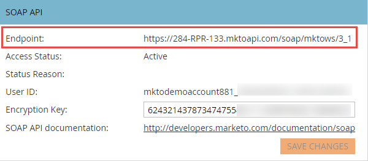
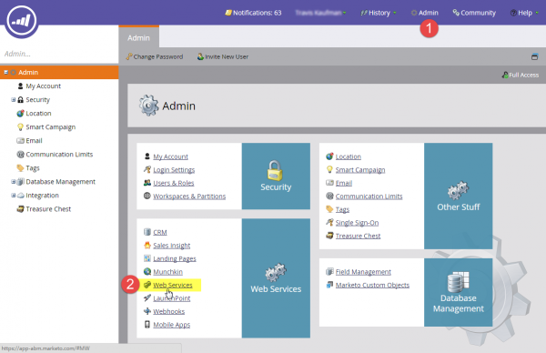
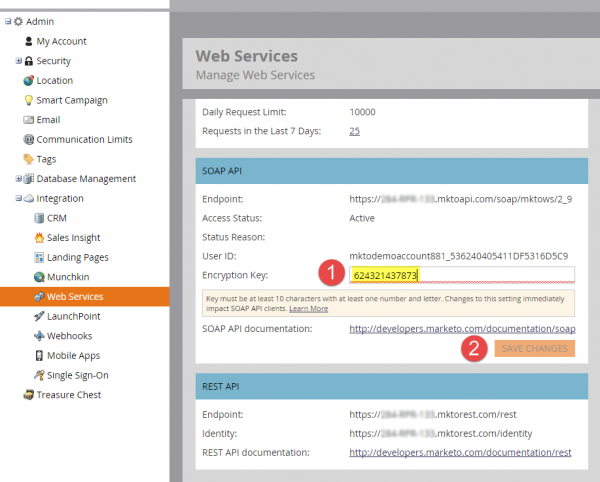

# SOAP API

SOAP API即將淘汰，自2025年10月31日起不再提供。 所有新的開發應使用Marketo [REST API](../rest-api/rest-api.md)完成，而現有服務應於該日期前移轉，以避免服務中斷。 如果您有使用SOAP API的服務，請參閱SOAP API [移轉指南](./migration.md)以瞭解如何移轉的資訊。

## SOAP WSDL

若要擷取SOAP WSDL檔案，請從&#x200B;**[!UICONTROL Admin]** > **[!UICONTROL Integration]** > **[!UICONTROL Web Services]**&#x200B;功能表取得您的SOAP API端點。

您的WSDL URL為：

`<SOAP API Endpoint> + ?WSDL`

請勿使用WSDL中定義的端點。 每個Marketo例項都有不重複的端點，可從中進行呼叫。

## 限制

- **每日配額：**&#x200B;大部分的訂閱每天皆會配置10,000個API呼叫（這會在每日中午12:00CST重設）。 您可以透過帳戶管理員增加每日配額。
- **速率限制：**&#x200B;每個執行個體的API存取限製為每20秒100次呼叫。
- **並行限制：**  最多十個同時進行的API呼叫。

我們建議批次大小不要超過300。 不支援較大尺寸，可能會導致逾時，並且在極端情況下會進行節流。

## Marketo中的SOAP API設定

1. 移至&#x200B;**[!UICONTROL Admin]**&#x200B;區段並按一下&#x200B;**[!UICONTROL Web Services]**。

1. 設定適當的[!UICONTROL Encryption Key]，按一下&#x200B;**[!UICONTROL Save Changes]**&#x200B;並使用SOAP API [!UICONTROL Endpoint]、[!UICONTROL User ID]和[!UICONTROL Encryption Key]值，為每個SOAP API呼叫產生正確的[驗證簽章](authentication-signature.md)。

