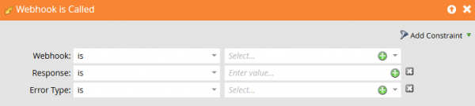

# 錯誤次數

此頁面列出Marketo中Webhook的錯誤回應代碼。

1000和1001由Marketo產生，2xx到5xx是從Marketo webhook呼叫的系統傳回的錯誤。

為了讓Marketo將值對應回欄位，webhook回應程式碼必須為2xx型別。 如果webhook的意圖是透過回應變更Marketo潛在客戶記錄中的值，則呼叫的Web服務必須傳回2xx，所有其他回應代碼都會導致webhook被忽略以更新潛在客戶記錄值。

| 回應代碼 | 說明 |
| --- | --- |
| 1000 | 這表示「呼叫Webhook」流程動作正存放於批次行銷活動中。 Webhook只能從觸發行銷活動觸發。 |
| 1001 | 這表示Web服務發出空的回應主體。 |

## 擷取Webhook錯誤

來自Webhook的錯誤可由以下動作攔截和處理 [!UICONTROL Webhook is Called] 觸發器：

* Response - Response是要求已接收的常值回應裝載。
* 錯誤型別 — 這對應至HTTP狀態訊息的理由短語。

這些可用來處理和回應可預測的錯誤和例外。 視您要整合的服務而定，可能會自動復原某些類別的錯誤，同時可建立警示以通知使用者發生意外的錯誤。
