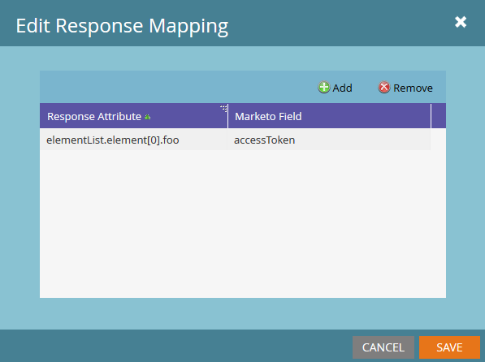
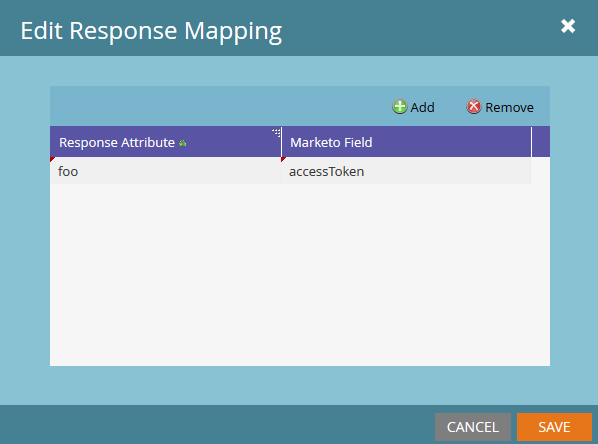

# 回應對應

Marketo可以翻譯Webhook從兩種內容型別收到的資料，並將這些值傳回潛在客戶欄位：JSON和XML。 Marketo欄位引數一律使用 [SOAP API名稱](../rest-api/fields.md) 欄位的。 每個Webhook可以有不限數量的回應對應，按一下 [!UICONTROL Edit] Webhook的「回應對應」窗格中的按鈕：



「回應對應」是透過「回應屬性」、XML或JSON檔案中所需屬性的路徑，以及「Marketo欄位」的配對所建立，該欄位指定了「銷售機會」欄位，該欄位具有從「回應屬性」寫入的值。

屬性的索引鍵必須包含英數字元、破折號(-)、底線(_)、冒號(：)和空白字元，才能透過Marketo回應對應加以存取。

## JSON對應

JSON屬性可使用點標籤法和陣列標籤法存取。 Marketo中的陣列標籤法不接受字串作為輸入，僅接受整數。 若要從JSON檔案擷取資料，回應型別必須設為JSON：

```json
{ "foo":"bar"}
```

若要存取 `foo` 在回應對應中，使用 `name` 屬性的，因為它位在JSON物件的第一層， `foo`. 以下是Marketo中的外觀：



以下是更複雜的陣列範例：

```json
{
    "profileId" : 1234,
    "firstName" : "Jane",
    "lastName" : "Doe",
    "orders" : [
        {
            "orderId" : 5678,
            "orderDate" : "2015-01-01",
            "orderProductId" : "4982"
        },
        {
            "orderId" : 5678,
            "orderDate" : "2014-05-07",
            "orderProductId" : "4982"
        }
    ]
}
```

我們想從訂單陣列的第一個元素存取orderDate。 若要存取此屬性，請使用下列專案： `orders[0].orderDate`

## XML對應

可以從XML檔案中的個別元素存取值。 這會使用與JSON對應類似的點標籤法。 讓我們來看這個簡單的範例：

```xml
<?xml version="1.0" encoding="UTF-8"?>
<example>
    <foo>bar</foo>
</example>
```

若要在此存取foo屬性，請使用下列專案： `example.foo`

在存取之前，必須先參考範例元素 `foo`. 若要存取屬性，必須在對應中參考階層中的所有元素。 含陣列的XML檔案則更為複雜。 使用下列範例：

```xml
<?xml version="1.0" encoding="UTF-8"?>
<elementList>
    <element>
        <foo>baz</foo>
    </element>
    <element>
        <foo>bar</foo>
    </element>
    <element>
        <foo>bar</foo>
    </element>
</elementList>
```

檔案由父陣列組成 `elementList`，具有子系，包含一個屬性的元素： `foo`. 出於Marketo回應對應的目的，陣列參考為 `elementList.element`，因此可透過以下方式存取elementList的子項： `elementList.element[i]`. 若要從elementList的第一個子系取得foo的值，我們會使用此回應屬性： `elementList.element[0].foo` 這會將「baz」值傳回至我們的指定欄位。 嘗試存取同時包含唯一和非唯一元素名稱的元素內的屬性會導致未定義的行為。 每個元素都必須是單一屬性或陣列，型別不能混合使用。

## 型別

將屬性對應到欄位時，您必須確保webhook回應中的型別與目標欄位相容。 例如，如果回應中的值為字串，而選取的欄位為型別整數，則不會寫入值。 閱讀關於 [欄位型別](../rest-api/field-types.md).
