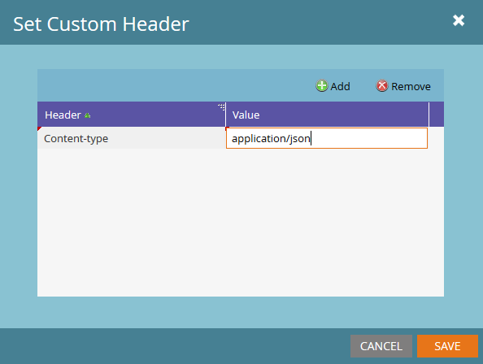

# Webhooks

Marketo允許使用Webhook與協力廠商Web服務通訊。 Webhook支援使用GET或POST HTTP動詞來推送或擷取特定URL的資料。 如需應用程式內建立Webhook以及如何將其新增到Smart Campaigns的詳細指示，請參閱下列文章：

- [建立Webhook](https://experienceleague.adobe.com/en/docs/marketo/using/product-docs/administration/additional-integrations/create-a-webhook)
- [呼叫Webhook](https://experienceleague.adobe.com/en/docs/marketo/using/product-docs/core-marketo-concepts/smart-campaigns/flow-actions/call-webhook)
- [在智慧行銷活動中使用Webhook](https://experienceleague.adobe.com/en/docs/marketo/using/product-docs/core-marketo-concepts/smart-campaigns/flow-actions/use-a-webhook-in-a-smart-campaign)

每個單獨的webhook都有以下屬性：

- [!UICONTROL URL] — 輸入您用來將要求提交至Web服務的URL。
- [!UICONTROL Request Type] - HTTP方法。
- [!UICONTROL Payload Template] — 如果您想要在POST內文中傳輸資訊，請輸入範本。 使用支援HTTP POST的任何資料格式，包括XML、JSON或SOAP。 序列化格式必須在字串周圍加上雙引號。 若要在範本中插入權杖，請按一下&#x200B;**[!UICONTROL Insert Token]**。  字串型別的權杖會自動以雙引號括住。
- [!UICONTROL Request Token Encoding] — 如果權杖值包含特殊字元（例如&amp;符號、&#39;&amp;&#39;），請指出您請求的格式（JSON或表單/URL）。 必須為主體選擇正確的編碼，以確保Webhook正確與Web服務通訊。
- [!UICONTROL Response Type] — 選取您從服務收到的回應格式（JSON或XML）。 必須選取正確的回應型別，才能將回應的屬性對應回Marketo中的潛在客戶欄位
- [!UICONTROL Custom Headers] — 透過[!UICONTROL Webhooks Actions] -> [!UICONTROL Set Custom Header]存取，此功能表允許將任意數量的自訂索引鍵值配對新增為HTTP標題。

可以使用[回應對應](response-mappings.md)，將資料從Web服務回應寫入潛在客戶

## 權杖

Webhook中的所有傳出欄位（URL、範本和自訂標題）都會在流程步驟的相同內容中填入權杖的內容。 也就是說，銷售機會和系統代號永遠都可使用，而觸發器、促銷活動和方案代號則可在各自的範圍中使用。 請參閱權杖相關文章：

- [Token概述](https://experienceleague.adobe.com/en/docs/marketo/using/product-docs/demand-generation/landing-pages/personalizing-landing-pages/tokens-overview)
- [系統權杖字彙表](https://experienceleague.adobe.com/en/docs/marketo/using/product-docs/email-marketing/general/using-tokens/system-tokens-glossary)
- [有趣時刻的Token](https://experienceleague.adobe.com/en/docs/marketo/using/product-docs/marketo-sales-insight/msi-for-salesforce/features/tabs-in-the-msi-panel/interesting-moments/trigger-tokens-for-interesting-moments)

常見的情況是，方案或行銷活動明確對應至協力廠商資源。 ID可在程式層級設定為`My Token`，然後作為Token傳遞至Webhook要求。

## 自訂標頭

Webhook允許使用任意數量的自訂標題欄位與傳出請求一起傳送。 可透過&#x200B;**[!UICONTROL Webhooks Actions]** > **[!UICONTROL Set Custom Header]**&#x200B;新增這些專案。 每個標頭都會記錄為一個簡單的索引鍵/值組。 Token可用於此區域。

## 提示

- 呼叫Webhook流程步驟僅在觸發行銷活動中有效。
- 只有在Web服務以2xx HTTP回應代碼回應時，才會透過回應對應進行更新。 其他型別的程式碼將不會導致記錄的更新。
- 您可以使用Web服務，從內部或外部服務執行自訂資料擴充、驗證或標準化。
- Webhook執行時間取決於所用服務的回應時間，並可能導致較長的行銷活動執行延遲。 即使服務只需要50毫秒執行，當執行100,000次時也就是1.5小時。
- Marketo在終止呼叫（亦即逾時）之前，最多會等待指定的服務呼叫30秒。
- URL欄位中內嵌的字元會以寫入方式傳遞，例如&#39;&amp;&#39;會以&#39;&amp;&#39;傳送，&#39;%26&#39;會以&#39;%26&#39;傳送
   - 如果收件者伺服器收到字元時，該字元應為百分比編碼，則應明確傳遞為代表該字元的字串
